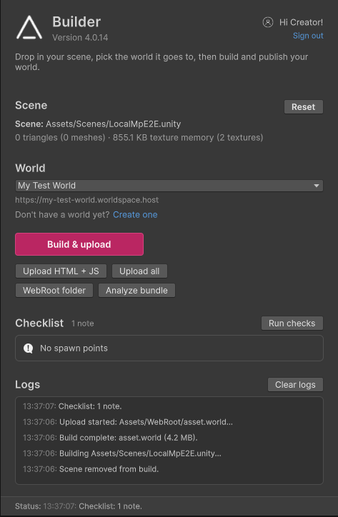

# The Builder Window

The Builder builds and publishes your world without leaving Unity. Open it via `Creator SDK/Builder`, or **Open Builder** in the Setup panel; the window docks next to the Inspector. For the whole route from a scene to a live world, see [Publishing Your World](publishing.md).

## Opening & Signing In

While you're signed out, the header shows **Sign in** and a short code.

1. Click **Sign in**. It opens https://altvr.app/link in your browser with the code filled in (or open that page yourself and type the code).
2. Sign in to your SideQuest account there and approve the code.
3. The window checks for the approval every few seconds, then greets you by name.

An expired code is replaced with a new one automatically, for up to an hour. After that the window stops checking and shows "Code expired. Click Sign in for a new one."; clicking **Sign in**, or just clicking into the window, starts again. `Sign out` in the header switches accounts.

Building works while signed out; the world list and every upload action require signing in.

## Building a World (Scene Mode)

Drop a `.unity` scene file onto the drop area to enter Scene mode. The selected scene path is shown in place of the drop area and remembered between sessions; **Reset** clears it. Under it, the scene's size at a glance: its triangle and mesh count and its texture memory, read from the scene's assets without opening it.

Pick a destination from the **World** dropdown — its hosting URL (for example `https://my-world.worldspace.host`) appears underneath, and the last-used world is reselected automatically. No world yet? Click **Create one** to name and create one right in the window.

| Button | Action |
|--------|--------|
| Build | Builds the scene into `Assets/WebRoot` as `asset.world`, a single platform-agnostic bundle that every platform loads |
| Build & upload | Same button with **Upload after building** ticked (and signed in): uploads to the selected world when the build finishes |
| Upload HTML + JS | Uploads just the web files — fast iteration on scripts without rebuilding |
| Upload all | Uploads `asset.world` plus the web files |
| WebRoot folder | Highlights the `Assets/WebRoot` output folder in the Project window |
| Analyze bundle | Opens the Bundle Analyzer: the AssetBundle contents and estimated size of the currently open scene (the scene must be saved to disk) |

The **Upload after building** toggle is remembered per project.

!> **Only two web files are uploaded:** `index.html` and `script.js` from `Assets/WebRoot`. A world has one script file, served as both `script.js` and `bullshcript.js` (its older name); the Builder uploads `bullshcript.js` only when there's no `script.js`. Play mode serves the whole folder, so a stylesheet, image or extra script next to them works in the editor but is missing once the world is published. Upload any other files on altvr.app instead: open your world, **Edit world**, then **Assets** (`.css`, `.js`, `.json`, `.html`, `.png`, `.jpg`, `.webp`, `.ico`, `.mp3`, `.ogg` and `.wav`, up to 50 MB each). They're served next to your page by file name, top level only and lower-cased, so keep the files in `Assets/WebRoot` flat with lower-case names and the same links work in Play mode and once published. See [Publishing Your World](publishing.md).

**Upload all** also tidies up after in-world graph edits: once a freshly built `asset.world` has uploaded, any Visual Scripting edits made in the app and since synced into this project are dropped from the world, so the graphs in your build win. It skips that step, and says why in the logs, if part of the upload failed or the `asset.world` it sent isn't the one just built from this scene.

## The Build Checklist

When the Builder opens on a scene, on **Re-check**, before every build and before **Upload all**, the Builder checks the scene and lists what it finds. It checks the scene the Builder is set to build, not whatever is open, and leaves the open scenes and their dirty state alone.

| Check | What it looks for |
|---|---|
| Project setup | Everything the Setup panel marks Required is done. Missing build support blocks the build; anything else is a warning, with a button to open Setup. |
| One scene per project | The project has no other scenes. Every scene shares the one page, `Assets/WebRoot/index.html`, so the snippets and page scripts for other scenes would be published with this world. |
| Visual Scripting node support | Graphs only use nodes the app can run: every graph asset in the project, every graph on a prefab, and every graph in this scene, including subgraphs and state graphs inside them. Blocks the build. |
| Convex mesh colliders | No large static floor or wall has **Convex** ticked. |
| Tags, Layers | Objects only use Unity's built-in tags and layers and the SDK's (see [Tags](tags.md) and [Layers](layers.md)). The fix renames old `__BA_` tags or moves objects to Untagged / Default. |
| Missing scripts, Visual Scripting graphs | No component's script is missing, and every Script Machine and State Machine has its graph. |
| Cameras and audio listeners | No scene camera draws to the screen and there's no Audio Listener: the player brings both. |
| Materials | No empty material slots (a particle system's trail material counts while trails are on), broken shaders, or shaders made for the Built-in pipeline, Unity's own or custom ones such as surface shaders (they render pink in URP). |
| Scene size | About 1,000,000 triangles and 1,024 MB of textures at most: a comfortable budget for a whole space on Quest. |
| Android textures, Audio | Textures at most 2048 px and compressed on Android; audio clips over 10 seconds not kept uncompressed in memory. |
| Object IDs | No two objects in the scene share a BSObjectId: players match synced objects, seats and attachments by it (see [Multiplayer](../multiplayer/overview.md#bsobjectid)). The fix gives each copy after the first a new ID. |
| Seats, Grab handles, Scene settings, Spawn points, Teleporters | The [Easy Prefabs](easy-prefabs.md) components are set up correctly: seats have a clickable collider on the UI or Menu layer, grab handles are on the Grabbable layer with their own collider, there's at most one Scene Settings component, there's an active spawn point, and teleporters have a trigger and a destination outside it. |
| Seat and vehicle attachments | Every Attached Object that puts the player on an object (**Avatar Attach To**) has **Attachment Type** Physics and **Joint Avatar** ticked; otherwise attaching seats no one. The fix sets both. |

Checks only report. A **Fix** button changes things only when clicked, with undo; **Fix All** runs every fix that doesn't ask first; **Select** shows what an issue is about. Passed checks fold into one "other checks passed" row; hover a row to see what it checks.

- **Notes and warnings** are listed in the confirmation, whose button becomes **Build anyway** (or **Upload anyway**).
- **Errors marked "blocks the build"** stop it; other errors can be built past.

## Build Confirmation & Logs

A confirmation dialog summarizes every build and upload before it runs — the build mode, the scene file and the destination world, plus anything the checklist found. **Cancel** backs out without building.

The **Logs** pane at the bottom of the window streams build and upload progress; the status bar mirrors the latest entry, and a progress bar appears above it during uploads. **Clear logs** empties the pane.
