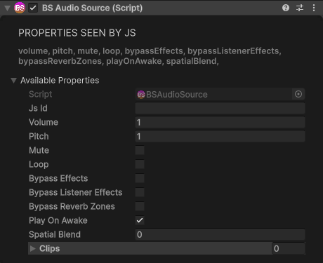

# Audio Components

## AudioSource

Plays audio in 3D space.

<div class="docs-tabs">

```js
const audio = obj.AddComponent(new BS.AudioSource({
    volume: 1,              // 0 to 1
    pitch: 1,               // Playback speed
    mute: false,
    loop: false,
    playOnAwake: true,
    bypassEffects: false,
    bypassListenerEffects: false,
    bypassReverbZones: false,
    spatialBlend: 1         // 0 = 2D, 1 = 3D
}));
```



</div>

**Methods:**

```js
audio.Play();
audio.PlayOneShot(0);  // Play clip by index
audio.PlayOneShotFromUrl("https://example.com/sound.mp3");
```
