# Geometry Primitives

Simple shape components for quick prototyping. A shape builds the object's mesh and nothing else: add a [BS.Material](rendering.md#material) to make it visible, and a collider (see [Physics](physics.md)) to make it solid or clickable.

Changing a property rebuilds the mesh, so shapes can be resized from a script:

```js
const box = await obj.AddComponent(new BS.Box({ width: 1, height: 1, depth: 1 }));
await obj.AddComponent(new BS.Material({ color: new BS.Vector4(0.2, 0.6, 1, 1) }));
box.width = 2;   // the mesh is rebuilt
```

Sizes are in metres; angles (`thetaStart`, `thetaLength`, `phiStart`, `phiLength`, `arc`) are in radians. The examples below show each shape's defaults.

## Box

<div class="docs-tabs">

```js
await obj.AddComponent(new BS.Box({
    width: 1,
    height: 1,
    depth: 1,
    widthSegments: 1,
    heightSegments: 1,
    depthSegments: 1
}));
```

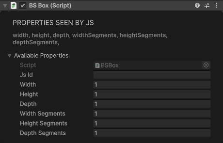

</div>

## Sphere

<div class="docs-tabs">

```js
await obj.AddComponent(new BS.Sphere({
    radius: 1,
    widthSegments: 16,
    heightSegments: 16,
    phiStart: 0,
    phiLength: Math.PI * 2,   // sweep around the vertical axis
    thetaStart: 0,
    thetaLength: Math.PI      // sweep from top to bottom; Math.PI / 2 gives a dome
}));
```

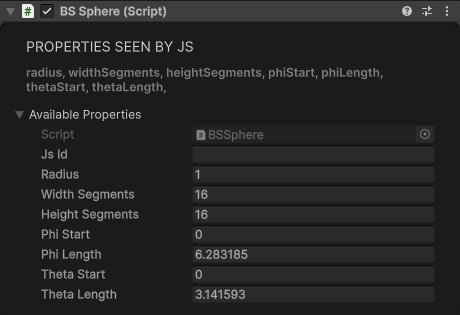

</div>

`thetaLength` is capped at π. A `widthSegments` of 2 or less becomes 32 and a `heightSegments` of 1 becomes 16, since those would build no triangles.

## Plane

The plane stands upright in the object's X/Y plane and faces −Z: it's seen from the side the object's blue axis points away from.

<div class="docs-tabs">

```js
await obj.AddComponent(new BS.Plane({
    width: 1,
    height: 1,
    widthSegments: 1,
    heightSegments: 1
}));
```

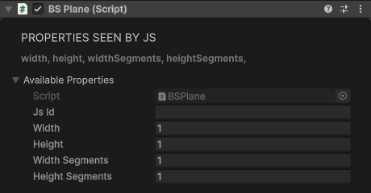

</div>

## Cylinder

Upright along Y. `thetaStart` is measured around the Y axis from −Z.

<div class="docs-tabs">

```js
await obj.AddComponent(new BS.Cylinder({
    radiusTop: 1,
    radiusBottom: 1,
    height: 1,
    radialSegments: 32,
    heightSegments: 1,
    openEnded: false,         // true leaves off the end caps
    thetaStart: 0,
    thetaLength: Math.PI * 2
}));
```

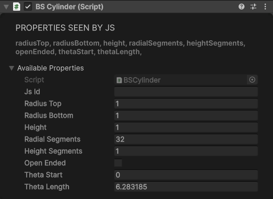

</div>

## Cone

<div class="docs-tabs">

```js
await obj.AddComponent(new BS.Cone({
    radius: 1,                // radius of the base
    height: 1,
    radialSegments: 32,
    heightSegments: 1,
    openEnded: false,
    thetaStart: 0,
    thetaLength: Math.PI * 2
}));
```

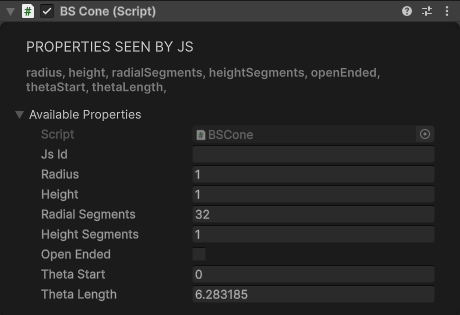

</div>

## Circle

A flat disc.

<div class="docs-tabs">

```js
await obj.AddComponent(new BS.Circle({
    radius: 1,
    segments: 16,
    thetaStart: 0,
    thetaLength: Math.PI * 2  // less makes a pie slice
}));
```

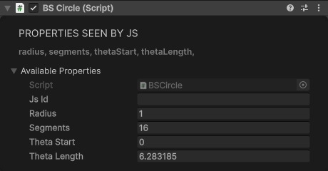

</div>

## Torus

A ring, lying in the object's X/Y plane. `radius` is the overall outer radius, tube included, and `tube` is the radius of the tube itself: the tube's centre line runs at `radius - tube` from the middle, and the hole has a radius of `radius - 2 × tube`.

<div class="docs-tabs">

```js
await obj.AddComponent(new BS.Torus({
    radius: 0.5,              // default 1
    tube: 0.15,               // default 1
    radialSegments: 8,
    tubularSegments: 6,
    arc: Math.PI * 2          // less makes an open ring
}));
```

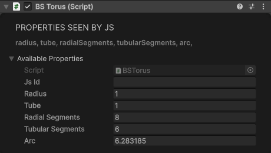

</div>

!> The defaults (`radius` 1, `tube` 1, 8 × 6 segments) close the hole up completely and give a coarse ball 2 m across. Always set `tube` well below `radius`, and raise `tubularSegments` for a smooth ring.

## TorusKnot

`radius` is the overall radius of the knot, tube included.

<div class="docs-tabs">

```js
await obj.AddComponent(new BS.TorusKnot({
    radius: 0.5,
    tube: 0.1,                // default 0.4, which leaves little of the knot to see
    tubularSegments: 64,
    radialSegments: 8,
    p: 2,                     // times it winds around its axis
    q: 3                      // times it winds through the hole
}));
```

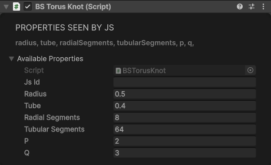

</div>

## Capsule

`height` is the capsule's total height and `radius` its overall width: the round ends have a radius of `radius / 2` (at most `height / 2`), and the straight part is whatever height is left. The defaults give a capsule 0.5 m wide and 1 m tall.

<div class="docs-tabs">

```js
await obj.AddComponent(new BS.Capsule({
    radius: 0.5,
    height: 1,
    radialSegments: 32,
    heightSegments: 1         // resolution of the round ends; 1 or less uses 8
}));
```

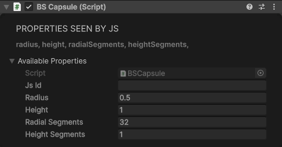

</div>

## Ring

Flat ring (annulus).

<div class="docs-tabs">

```js
await obj.AddComponent(new BS.Ring({
    innerRadius: 1,
    outerRadius: 2,
    thetaSegments: 32,
    phiSegments: 1,
    thetaStart: 0,
    thetaLength: Math.PI * 2
}));
```

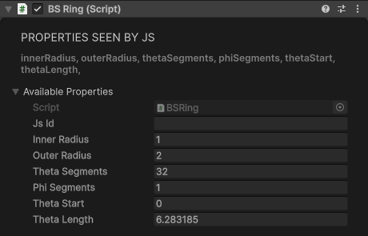

</div>

## Polyhedra

`Dodecahedron`, `Icosahedron`, `Octahedron`, and `Tetrahedron` share the same two parameters.

| Property | Type | Default | Description |
|----------|------|---------|-------------|
| `radius` | number | 0.5 | Radius of the solid |
| `detail` | number | 0 | Subdivision detail (0 = the raw solid; higher values round it towards a sphere) |

<div class="docs-tabs">

```js
await obj.AddComponent(new BS.Icosahedron({ radius: 0.5, detail: 0 }));
// Same constructor for BS.Dodecahedron, BS.Octahedron, BS.Tetrahedron
```

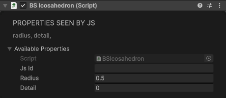

</div>

## Procedural Geometry

Shapes built from point data. The outlines and curves are JSON strings, so build them with `JSON.stringify`. A shape with no outline or curve builds no mesh, and malformed JSON logs a warning in the Unity Console and builds nothing.

**2D outlines (`shapePoints`)** are a list of pen commands, in metres:

```js
const outline = JSON.stringify({ commands: [
    { type: "M", x: 0, y: 0 },          // move to (starts a contour)
    { type: "L", x: 1, y: 0 },          // line to
    { type: "Q", x1: 1.2, y1: 0.5, x: 1, y: 1 },               // quadratic curve: control point, end
    { type: "C", x1: 0.8, y1: 1.3, x2: 0.2, y2: 1.3, x: 0, y: 1 }, // cubic curve: two control points, end
    { type: "Z" },                      // close the contour
    { type: "H" },                      // everything after this is a hole
    { type: "M", x: 0.3, y: 0.3 }, { type: "L", x: 0.7, y: 0.3 },
    { type: "L", x: 0.5, y: 0.6 }, { type: "Z" }
]});
```

The other commands are `S` (a smooth spline through consecutive `S` points, each with `x`, `y`) and `A` (an ellipse or arc around the centre `x`, `y`, with `radiusX`, `radiusY`, `startAngle`, `endAngle`, `clockwise` and `rotation`; an `endAngle` of 0 draws the full ellipse).

**3D curves (`curvePoints`)** are a path through points, or a chain of segments:

```js
// A smooth curve through the points ("CatmullRom", the default) or straight lines between them ("Line")
const curve = JSON.stringify({
    type: "CatmullRom",
    points: [ { x: 0, y: 0, z: 0 }, { x: 0, y: 1, z: 0.5 }, { x: 0, y: 2, z: 0 } ],
    closed: false,
    curveType: "centripetal",   // or "chordal", "catmullrom" (which uses tension, default 0.5)
    tension: 0.5
});

// Or joined segments: "Line" (v0 to v1), "Quadratic" (v0, control v1, v2), "Cubic" (v0, controls v1 v2, v3)
const path = JSON.stringify({ type: "Path", segments: [
    { type: "Line", v0: { x: 0, y: 0, z: 0 }, v1: { x: 0, y: 1, z: 0 } },
    { type: "Quadratic", v0: { x: 0, y: 1, z: 0 }, v1: { x: 0, y: 2, z: 0 }, v2: { x: 1, y: 2, z: 0 } }
]});
```

**Extrude**: a 2D outline given thickness, optionally along a curve.

| Property | Type | Default | Description |
|----------|------|---------|-------------|
| `shapePoints` | string | "" | The 2D outline and holes, as JSON |
| `curvePoints` | string | "" | Optional 3D path to extrude along, as JSON; empty extrudes straight along Z |
| `depth` | number | 1 | How far to extrude when there is no extrude path |
| `depthSegments` | number | 1 | Subdivisions along the extrusion |
| `segments` | number | 32 | How finely curves in the outline are sampled |

**Lathe**: revolves a 2D profile around the Y axis. In the profile, `x` is the distance from the axis and `y` the height.

| Property | Type | Default | Description |
|----------|------|---------|-------------|
| `shapePoints` | string | "" | The profile to revolve, as JSON |
| `segments` | number | 32 | How finely curves in the profile are sampled |
| `radialSegments` | number | 32 | Segments around the axis of revolution |
| `phiStart` | number | 0 | Start angle of the revolution |
| `phiLength` | number | 6.283185 | Swept angle (2π = full revolution; less leaves the solid open) |

**Tube**: a tube following a curve.

| Property | Type | Default | Description |
|----------|------|---------|-------------|
| `curvePoints` | string | "" | The 3D curve to sweep along, as JSON |
| `radius` | number | 0.5 | Radius of the tube cross-section |
| `tubularSegments` | number | 32 | Segments along the path |
| `radialSegments` | number | 32 | Segments around the cross-section |

**Shape**: a flat filled shape from a 2D outline.

| Property | Type | Default | Description |
|----------|------|---------|-------------|
| `shapePoints` | string | "" | The 2D outline and holes, as JSON |
| `segments` | number | 32 | How finely curves in the outline are sampled |

**Pillow** and **Horn**: parametric surfaces with the standard tessellation pair (see [Parametric Shapes](#parametric-shapes)).

| Property | Type | Default | Description |
|----------|------|---------|-------------|
| `stacks` | number | 5 | Tessellation in one direction |
| `slices` | number | 5 | Tessellation in the other |

<div class="docs-tabs">

```js
// curve and outline are the JSON strings from above
const tube = new BS.GameObject({ name: "Tube" });
const badge = new BS.GameObject({ name: "Badge" });
const vase = new BS.GameObject({ name: "Vase" });
const cushion = new BS.GameObject({ name: "Cushion" });

await tube.AddComponent(new BS.Tube({ curvePoints: curve, radius: 0.05 }));
await badge.AddComponent(new BS.Extrude({ shapePoints: outline, depth: 0.1 }));
await vase.AddComponent(new BS.Lathe({ shapePoints: JSON.stringify({ commands: [
    { type: "M", x: 0, y: 0 }, { type: "L", x: 0.3, y: 0 },
    { type: "Q", x1: 0.5, y1: 0.4, x: 0.15, y: 0.8 }, { type: "L", x: 0.2, y: 1 }
]}) }));
await cushion.AddComponent(new BS.Pillow({ stacks: 16, slices: 16 }));
```

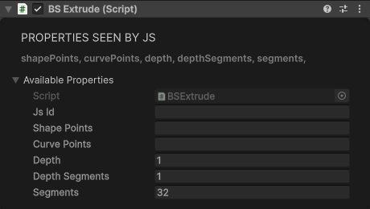
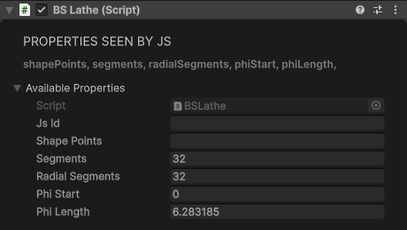
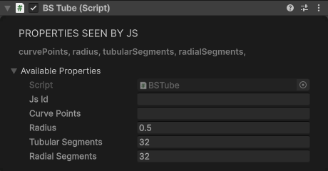
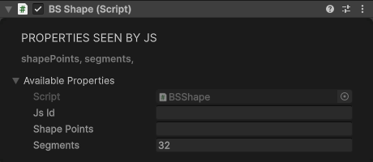

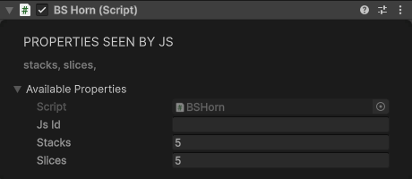

</div>

## Parametric Shapes

Mathematical surfaces, each scaled to fit about a 1 m cube. Each is a standalone component taking `stacks` and `slices` tessellation (default 5 × 5, which is coarse: 32 × 32 looks smooth), and each is also reachable through the `Geometry` component by enum value.

| Component | BS.ParametricGeometryType | Surface |
|-----------|---------------------------|---------|
| `BS.Klein` | `Klein` | Klein bottle |
| `BS.Apple` | `Apple` | Apple |
| `BS.Mobius` | `Mobius` | Möbius strip |
| `BS.Mobius3d` | `Mobius3d` | Solid Möbius |
| `BS.Catenoid` | `Catenoid` | Catenoid |
| `BS.Helicoid` | `Helicoid` | Helicoid |
| `BS.Fermet` | `Fermet` | Fermat spiral surface |
| `BS.Natica` | `Natica` | Natica shell |
| `BS.Scherk` | `Scherk` | Scherk surface |
| `BS.Snail` | `Snail` | Snail shell |
| `BS.Spiral` | `Spiral` | Spiral surface |
| `BS.Spring` | `Spring` | Spring/coil |
| `BS.Pillow`, `BS.Horn` | `Pillow`, `Horn` | See above |

<div class="docs-tabs">

```js
// As a standalone component: stacks/slices control tessellation
await obj.AddComponent(new BS.Klein({ stacks: 32, slices: 32 }));

// Or through the Geometry component by enum value
const snail = new BS.GameObject({ name: "Snail" });
await snail.AddComponent(new BS.Geometry({
    geometryType: BS.GeometryType.ParametricGeometry,
    parametricType: BS.ParametricGeometryType.Snail,
    stacks: 32,
    slices: 32
}));
```

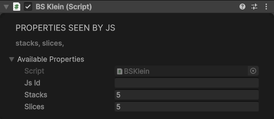
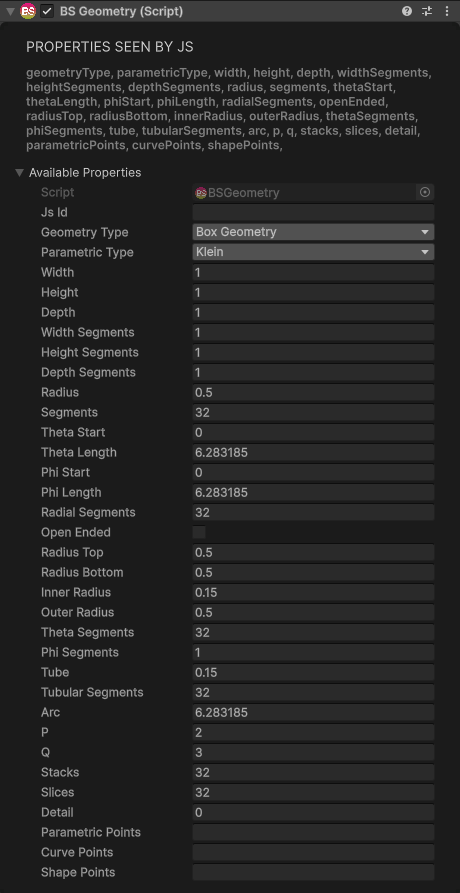

</div>

**Your own surface:** `BS.ParametricGeometryType.Custom` builds a surface from a grid of points you supply in `parametricPoints`, as JSON: `{"points": [{"x": …, "y": …, "z": …}, …]}`. It needs exactly `(stacks + 1) × (slices + 1)` points, row by row (`stacks + 1` rows of `slices + 1` points); with any other count, or none, nothing is built.

```js
const stacks = 8, slices = 8, points = [];
for (let i = 0; i <= stacks; i++) {
    for (let j = 0; j <= slices; j++) {
        const u = j / slices, v = i / stacks;
        points.push({ x: u - 0.5, y: 0.2 * Math.sin(u * Math.PI * 2), z: v - 0.5 });  // a wave
    }
}
await obj.AddComponent(new BS.Geometry({
    geometryType: BS.GeometryType.ParametricGeometry,
    parametricType: BS.ParametricGeometryType.Custom,
    stacks,
    slices,
    parametricPoints: JSON.stringify({ points })
}));
```

`BS.Geometry` can build every shape on this page (`geometryType` is a `BS.GeometryType`, such as `BoxGeometry` or `TorusGeometry`), with the same property names. Its own defaults differ from the standalone components': every shape fits a 1 m cube (`radius` 0.5, `tube` 0.15, `stacks` and `slices` 32).
