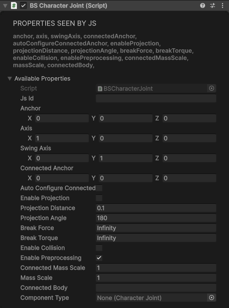
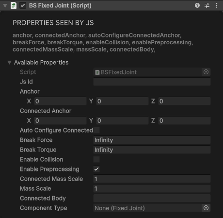
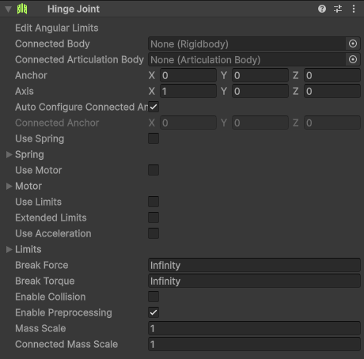
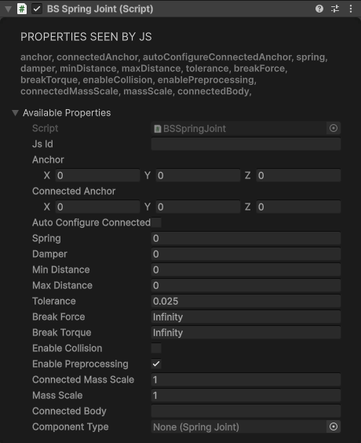
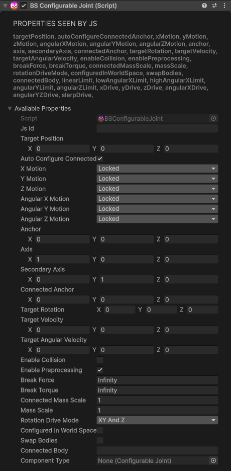

# Joint Components

A joint ties this object's Rigidbody to another Rigidbody, or to a fixed point in the world. Unity joints need a Rigidbody on their own object and add a plain one if there isn't one, so add a [BS.Rigidbody](physics.md#rigidbody) first when you want to set its mass or drag.

**Connecting two objects:** `connectedBody` is the `id` of the other object's `BS.Rigidbody`. Create that Rigidbody first and `await` it, so it exists when the joint looks for it. Leave `connectedBody` empty to hold the object to the world instead.

```js
const frame = new BS.GameObject({ name: "Frame" });
const frameRb = await frame.AddComponent(new BS.Rigidbody({ isKinematic: true }));

const door = new BS.GameObject({ name: "Door" });
await door.AddComponent(new BS.Rigidbody({ mass: 5 }));
await door.AddComponent(new BS.HingeJoint({ autoConfigureConnectedAnchor: true, connectedBody: frameRb.id }));
```

The examples below use `otherRb` (and similar names) for the other object's `BS.Rigidbody`.

In the Inspector, set the values on the Unity joint (Hinge Joint, Fixed Joint, …); the BS component makes it reachable from JavaScript.

## Common properties

Every joint has these:

| Property | Type | Default | Description |
|----------|------|---------|-------------|
| `connectedBody` | string | "" | The `id` of the other object's `BS.Rigidbody`; empty holds the object to the world |
| `anchor` | Vector3 | 0, 0, 0 | The joint's pivot, in this object's local space |
| `connectedAnchor` | Vector3 | 0, 0, 0 | The matching point, in the connected body's local space (world space when there's no `connectedBody`) |
| `autoConfigureConnectedAnchor` | boolean | false (true on ConfigurableJoint) | Work out `connectedAnchor` from where the objects are now |
| `breakForce` | number | Infinity | Force that breaks the joint |
| `breakTorque` | number | Infinity | Torque that breaks the joint |
| `enableCollision` | boolean | false | Let the two connected bodies collide with each other |
| `enablePreprocessing` | boolean | true | Unity's joint preprocessing (turn off if a joint jitters) |
| `massScale` | number | 1 | Scales this body's mass in the joint solver |
| `connectedMassScale` | number | 1 | Scales the connected body's mass in the joint solver |

!> With `autoConfigureConnectedAnchor` off (the default on every joint but ConfigurableJoint), the joint pulls the anchor to `connectedAnchor`. With no `connectedBody` that is a point in world space, `0, 0, 0` unless you set it, so the object jumps to the world origin. Turn `autoConfigureConnectedAnchor` on to keep objects where they are.

## CharacterJoint

A ball-and-socket joint for ragdoll limbs, turning about `axis` and `swingAxis`.

| Property | Type | Default | Description |
|----------|------|---------|-------------|
| `axis` | Vector3 | 1, 0, 0 | Twist axis |
| `swingAxis` | Vector3 | 0, 1, 0 | Swing axis |
| `enableProjection` | boolean | false | Snap the body back when it drifts too far from the joint |
| `projectionDistance` | number | 0.1 | Distance error before projection kicks in |
| `projectionAngle` | number | 180 | Angle error before projection kicks in |

The twist and swing limits aren't available from JavaScript; a joint created from a script uses Unity's defaults. Set them on the Character Joint in the Inspector.

<div class="docs-tabs">

```js
await obj.AddComponent(new BS.CharacterJoint({
    anchor: new BS.Vector3(0, 0.5, 0),
    axis: new BS.Vector3(1, 0, 0),
    swingAxis: new BS.Vector3(0, 1, 0),
    autoConfigureConnectedAnchor: true,
    connectedBody: upperArmRb.id
}));
```



</div>

## FixedJoint

Locks two objects together. It has only the [common properties](#common-properties).

<div class="docs-tabs">

```js
await obj.AddComponent(new BS.FixedJoint({
    autoConfigureConnectedAnchor: true,
    breakForce: 500,     // snaps apart under a hard enough knock
    connectedBody: otherRb.id
}));
```



</div>

## HingeJoint

Rotates around a single axis (like a door).

| Property | Type | Default | Description |
|----------|------|---------|-------------|
| `axis` | Vector3 | 1, 0, 0 | The hinge axis, in local space |
| `useLimits` | boolean | false | Keep the angle between `limits.min` and `limits.max` |
| `limits` | JointLimits | min -90, max 90 | `new BS.JointLimits({ min, max, bounciness, bounceMinVelocity, contactDistance })`; angles in degrees, the rest default to 0 |
| `useMotor` | boolean | false | Switches Unity's hinge motor on |
| `useSpring` | boolean | false | Switches Unity's hinge spring on |

The motor's speed and force and the spring's strength aren't available from JavaScript, and they start at zero, so `useMotor` and `useSpring` only do something on a hinge whose motor or spring you set up on the Hinge Joint in the Inspector.

<div class="docs-tabs">

```js
const frame = new BS.GameObject({ name: "Frame" });
const frameRb = await frame.AddComponent(new BS.Rigidbody({ isKinematic: true }));

const door = new BS.GameObject({ name: "Door", localPosition: new BS.Vector3(0.5, 1, 2) });
await door.AddComponent(new BS.Box({ width: 1, height: 2, depth: 0.05 }));
await door.AddComponent(new BS.BoxCollider({ size: new BS.Vector3(1, 2, 0.05) }));
await door.AddComponent(new BS.Rigidbody({ mass: 5 }));
await door.AddComponent(new BS.HingeJoint({
    anchor: new BS.Vector3(-0.5, 0, 0),     // the door's left edge
    axis: new BS.Vector3(0, 1, 0),          // swing around the vertical
    autoConfigureConnectedAnchor: true,
    useLimits: true,
    limits: new BS.JointLimits({ min: -90, max: 90 }),
    connectedBody: frameRb.id
}));
```



</div>

## SpringJoint

Elastic connection between objects.

| Property | Type | Default | Description |
|----------|------|---------|-------------|
| `spring` | number | 0 | Spring strength; at 0 the joint does nothing, so always set it |
| `damper` | number | 0 | How quickly the bouncing dies down |
| `minDistance` | number | 0 | Lower end of the slack range, in which the spring doesn't pull |
| `maxDistance` | number | 0 | Upper end of the slack range |
| `tolerance` | number | 0.025 | Error tolerance for the spring's rest length |

<div class="docs-tabs">

```js
await obj.AddComponent(new BS.SpringJoint({
    autoConfigureConnectedAnchor: true,
    spring: 10,
    damper: 0.2,
    minDistance: 0,
    maxDistance: 0.5,
    connectedBody: otherRb.id
}));
```



</div>

## ConfigurableJoint

Fully customizable joint with per-axis control. Every axis starts **Locked**, so a ConfigurableJoint with default settings holds the object rigidly; free or limit the axes you want to move.

| Property | Type | Default | Description |
|----------|------|---------|-------------|
| `xMotion`, `yMotion`, `zMotion` | number | `Locked` | Movement along each axis: a `BS.ConfigurableJointMotion`, `Locked` (0), `Limited` (1) or `Free` (2) |
| `angularXMotion`, `angularYMotion`, `angularZMotion` | number | `Locked` | Rotation around each axis, same values |
| `axis` | Vector3 | 1, 0, 0 | The joint's primary axis |
| `secondaryAxis` | Vector3 | 0, 1, 0 | The joint's secondary axis |
| `linearLimit` | SoftJointLimit | 0, 0, 0 | How far `Limited` axes may move |
| `lowAngularXLimit`, `highAngularXLimit` | SoftJointLimit | -20 / 70 | Rotation range around X, in degrees |
| `angularYLimit`, `angularZLimit` | SoftJointLimit | 30 | Rotation range around Y and Z, in degrees |
| `targetPosition`, `targetVelocity` | Vector3 | 0, 0, 0 | What the linear drives aim for |
| `targetRotation` | Quaternion | 0, 0, 0, 1 | What the angular drives aim for |
| `targetAngularVelocity` | Vector3 | 0, 0, 0 | Angular velocity the angular drives aim for |
| `xDrive`, `yDrive`, `zDrive` | JointDrive | 0, 0, max | Springs pushing towards `targetPosition` |
| `angularXDrive`, `angularYZDrive` | JointDrive | 0, 0, max | Springs turning towards `targetRotation` (with `rotationDriveMode` XYAndZ) |
| `slerpDrive` | JointDrive | 0, 0, max | Spring turning towards `targetRotation` (with `rotationDriveMode` Slerp) |
| `rotationDriveMode` | number | 0 | A `BS.RotationDriveMode`: `XYAndZ` (0) or `Slerp` (1) |
| `configuredInWorldSpace` | boolean | false | Targets are in world space instead of the joint's own space |
| `swapBodies` | boolean | false | Swap the roles of the two bodies |

Limits and drives are small value types:

- `new BS.SoftJointLimit(limit, bounciness, contactDistance)`.
- `new BS.JointDrive(positionSpring, positionDamper, maximumForce, useAcceleration)`. `useAcceleration` (`true`/`false`, default `false`) switches the drive to Unity's acceleration mode, which ignores the body's mass.

<div class="docs-tabs">

```js
// A drawer: slides up to 0.4 m along X, springs back shut
await drawer.AddComponent(new BS.ConfigurableJoint({
    xMotion: BS.ConfigurableJointMotion.Limited,
    linearLimit: new BS.SoftJointLimit(0.4, 0, 0),
    xDrive: new BS.JointDrive(50, 5, 1000),   // spring, damper, max force
    targetPosition: new BS.Vector3(0, 0, 0),
    connectedBody: cabinetRb.id
}));
```



</div>
