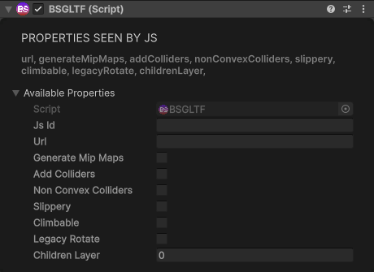
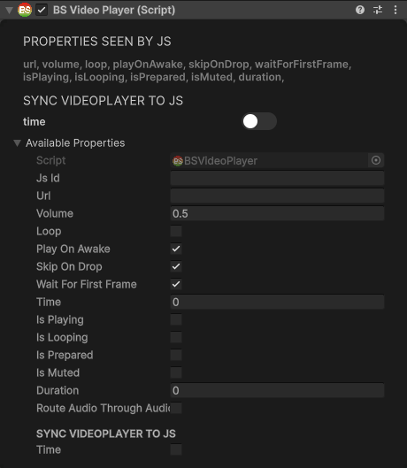
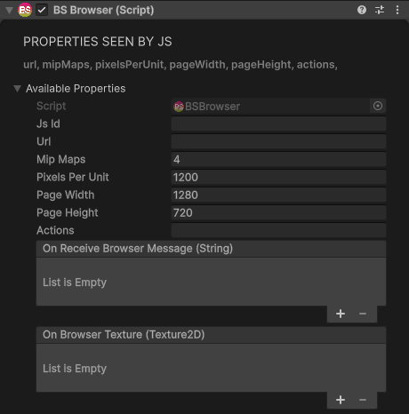
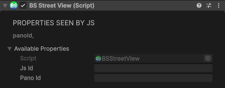
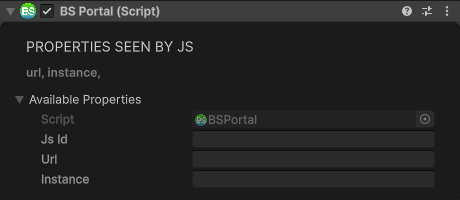

# Media & Content Components

## GLTF

Loads 3D models in glTF/GLB format.

<div class="docs-tabs">

```js
obj.AddComponent(new BS.GLTF({
    url: "https://example.com/model.glb",
    generateMipMaps: false,
    addColliders: false,        // Auto-generate colliders
    nonConvexColliders: false,  // Use mesh colliders
    slippery: false,            // Low friction
    climbable: false,           // VR climbing surface
    legacyRotate: false,
    childrenLayer: 0            // Layer for child objects
}));
```



</div>

## VideoPlayer

Plays video on a surface.

<div class="docs-tabs">

```js
const video = obj.AddComponent(new BS.VideoPlayer({
    url: "https://example.com/video.mp4",
    volume: 1,
    loop: true,
    playOnAwake: true,
    skipOnDrop: true,
    waitForFirstFrame: true
}));
```



</div>

**Properties:**

```js
video.time = 30;        // Seek to 30 seconds
video.isPlaying;        // Read current state
video.isLooping;
```

**Methods:**

```js
video.Play();
video.Pause();
video.Stop();
video.PlayToggle();   // Toggle between play and pause
video.MuteToggle();   // Toggle mute
```

## Browser

A web page on a flat panel in your world. Everything browsers can do (messages, textures, actions, the space's own browser) is in the [Browser](../browser/overview.md) section.

<div class="docs-tabs">

```js
const browser = obj.AddComponent(new BS.Browser({
    url: "https://example.com",
    pageWidth: 1280,        // pixels; drawn at 1300 pixels per metre
    pageHeight: 720,
    actions: ""             // JSON actions to run when it starts
}));
```



</div>

**Methods:**

```js
browser.ToggleInteraction(false);   // stop clicks and scrolling reaching the page (true turns them back on)
browser.RunActions(JSON.stringify({ actions: [{ actionType: "postmessage", strParam1: "hello" }] }));
```

`pageWidth` and `pageHeight` can change at any time; a browser created from a script starts at 1024 × 576. `mipMaps` and `pixelsPerUnit` aren't used. See [The BS Browser](../browser/bs-browser.md) for the action types, events and sizes.

## StreetView

Google Street View panorama viewer.

<div class="docs-tabs">

```js
obj.AddComponent(new BS.StreetView({
    panoId: "CAoSLEFGM..."  // Street View panorama ID
}));
```



</div>

## Portal

Creates a portal to another space.

<div class="docs-tabs">

```js
obj.AddComponent(new BS.Portal({
    url: "https://my-world.worldspace.host",
    instance: "instance-id"
}));
```



</div>
