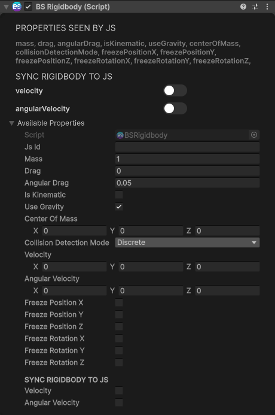
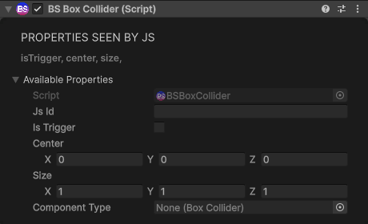
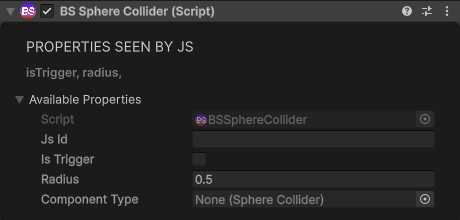
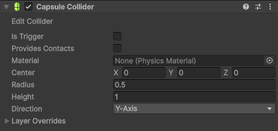
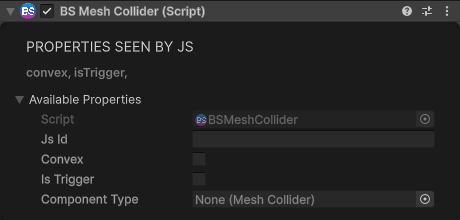
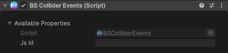
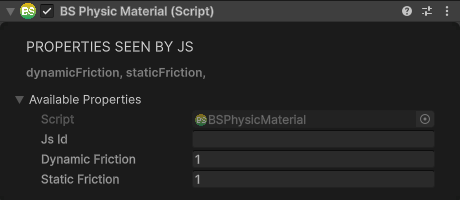
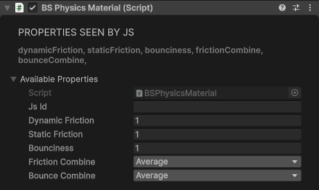

# Physics Components

## Rigidbody

Adds physics simulation to an object. It adds a Unity Rigidbody if the object doesn't have one.

| Property | Type | Default | Description |
|----------|------|---------|-------------|
| `mass` | number | 1 | Mass in kilograms |
| `drag` | number | 0 | Linear drag |
| `angularDrag` | number | 0.05 | Rotational drag |
| `useGravity` | boolean | true | Affected by gravity |
| `isKinematic` | boolean | false | Ignores forces; move it with `MovePosition`/`MoveRotation` |
| `centerOfMass` | Vector3 | 0, 0, 0 | Centre of mass, relative to the object |
| `collisionDetectionMode` | number | 0 | A `BS.CollisionDetectionMode`: `Discrete` (0), `Continuous` (1), `ContinuousDynamic` (2), `ContinuousSpeculative` (3) |
| `velocity` | Vector3 | 0, 0, 0 | Linear velocity |
| `angularVelocity` | Vector3 | 0, 0, 0 | Angular velocity |
| `freezePositionX/Y/Z` | boolean | false | Lock movement along an axis |
| `freezeRotationX/Y/Z` | boolean | false | Lock rotation around an axis |

<div class="docs-tabs">

```js
const rb = await obj.AddComponent(new BS.Rigidbody({
    mass: 1,
    drag: 0,
    angularDrag: 0.05,
    useGravity: true,
    isKinematic: false,
    collisionDetectionMode: BS.CollisionDetectionMode.Continuous,
    freezeRotationX: true,
    freezeRotationZ: true
}));
```



</div>

A Rigidbody created from a script always sets its centre of mass, so it sits at `centerOfMass` (the object's origin by default) rather than where Unity would work it out from the colliders. Call `rb.ResetCenterOfMass()` to hand it back to Unity. One added in the Inspector only sets it when **Center Of Mass** isn't zero.

**Methods:**

```js
// Apply forces (mode is a BS.ForceMode: Force, Acceleration, Impulse, VelocityChange)
rb.AddForce(new BS.Vector3(0, 10, 0), BS.ForceMode.Impulse);
rb.AddForceValues(0, 10, 0, BS.ForceMode.Force);
rb.AddRelativeForce(new BS.Vector3(0, 0, 10), BS.ForceMode.Force);
rb.AddForceAtPosition(new BS.Vector3(0, 5, 0), new BS.Vector3(0.5, 0, 0), BS.ForceMode.Impulse);

// Apply torque (rotation force)
rb.AddTorque(new BS.Vector3(0, 5, 0), BS.ForceMode.Force);
rb.AddTorqueValues(0, 5, 0, BS.ForceMode.Force);
rb.AddRelativeTorque(new BS.Vector3(0, 5, 0), BS.ForceMode.Force);

// Explosion force: force, centre, radius, upwards modifier, mode
rb.AddExplosionForce(100, new BS.Vector3(0, 0, 0), 10, 1, BS.ForceMode.Impulse);

// Kinematic movement
rb.MovePosition(new BS.Vector3(0, 5, 0));
rb.MoveRotation(new BS.Quaternion(0, 0, 0, 1));

// Sleep state
rb.Sleep();
rb.WakeUp();

// Reset
rb.ResetCenterOfMass();
rb.ResetInertiaTensor();
```

Each method returns a Promise that resolves once Unity has run it.

**Properties:** set any property from the table to change it:

```js
rb.velocity = new BS.Vector3(0, 5, 0);
rb.mass = 2;
rb.useGravity = false;
```

`rb.velocity` and `rb.angularVelocity` don't follow the physics by themselves: they hold what you last set. To read the live values, watch them, or ask once:

```js
rb.WatchProperties([BS.PN.velocity, BS.PN.angularVelocity]);  // kept up to date from now on
const v = await rb.GetProperty(BS.PN.velocity);                // a single fresh read
```

If the object already has a Rigidbody you set up in the Inspector, a BS Rigidbody added there keeps that Rigidbody's settings.

## BoxCollider

Box-shaped collision volume.

<div class="docs-tabs">

```js
await obj.AddComponent(new BS.BoxCollider({
    isTrigger: false,                      // Trigger mode (no physics response)
    center: new BS.Vector3(0, 0, 0),       // Offset from object center
    size: new BS.Vector3(1, 1, 1)          // Box dimensions (default: 1, 1, 1)
}));
```



</div>

## SphereCollider

Sphere-shaped collision volume, centred on the object.

<div class="docs-tabs">

```js
await obj.AddComponent(new BS.SphereCollider({
    isTrigger: false,
    radius: 0.5        // Sphere radius (default: 0.5)
}));
```



</div>

## CapsuleCollider

Capsule-shaped collision volume (cylinder with hemisphere ends), upright along the object's Y axis.

<div class="docs-tabs">

```js
await obj.AddComponent(new BS.CapsuleCollider({
    isTrigger: false,
    radius: 0.5,       // Capsule radius (default: 0.5)
    height: 2          // Total height including caps (default: 2)
}));
```



</div>

On the colliders above, set the values on the Unity collider in the Inspector; the BS component makes it reachable from JavaScript.

## MeshCollider

Uses the object's mesh for collision (more expensive).

<div class="docs-tabs">

```js
await obj.AddComponent(new BS.Box({ width: 2, height: 0.2, depth: 2 }));  // the shape first
await obj.AddComponent(new BS.MeshCollider({
    convex: true,      // default: false
    isTrigger: false   // default: false
}));
```



</div>

- It takes the object's mesh once, when it's added: add the shape (or model) first. If the shape changes later, the collider keeps the old mesh.
- A trigger must be convex: set `convex: true` with `isTrigger: true`.
- A non-convex mesh collider can't be on a moving Rigidbody (only on a kinematic one, or on static scenery).

## ColliderEvents

Sends the object's collisions and trigger contacts to your page as `collision-enter`, `collision-exit`, `trigger-enter` and `trigger-exit` events on the GameObject (see [GameObject Events](../javascript-api/gameobject-api.md#gameobject-events)).

<div class="docs-tabs">

```js
await obj.AddComponent(new BS.ColliderEvents());
obj.On("trigger-enter", (e) => console.log("Entered by", e.detail.name));
```



</div>

The object needs a collider, and Unity only reports a contact when at least one of the two objects has a Rigidbody. Players have one, so a trigger zone without a Rigidbody still sees players walk in, but two static objects never report touching.

## PhysicMaterial

Sets the surface friction of the object's collider. It never bounces, and against another surface the lower friction of the two wins, so a low value makes the object slippery against anything. Use [PhysicsMaterial](#physicsmaterial) for bounce or other combine rules.

| Property | Type | Default | Description |
|----------|------|---------|-------------|
| `dynamicFriction` | number | 1 | Friction while sliding |
| `staticFriction` | number | 1 | Friction at rest |

<div class="docs-tabs">

```js
await obj.AddComponent(new BS.PhysicMaterial({
    dynamicFriction: 0.1,
    staticFriction: 0.1
}));
```



</div>

## PhysicsMaterial

Full surface material: friction, bounce, and how the two combine between touching surfaces.

| Property | Type | Default | Description |
|----------|------|---------|-------------|
| `dynamicFriction` | number | 1 | Friction while the object is moving |
| `staticFriction` | number | 1 | Friction while the object is at rest |
| `bounciness` | number | 1 | How bouncy the surface is (0 = no bounce, 1 = no energy lost) |
| `frictionCombine` | number | 0 | How the friction of two touching surfaces combines: a `BS.PhysicsMaterialCombine` |
| `bounceCombine` | number | 0 | How the bounciness of two touching surfaces combines: a `BS.PhysicsMaterialCombine` |

`BS.PhysicsMaterialCombine` is `Average` (0), `Multiply` (1), `Minimum` (2) or `Maximum` (3).

<div class="docs-tabs">

```js
await obj.AddComponent(new BS.PhysicsMaterial({
    dynamicFriction: 0.4,
    staticFriction: 0.6,
    bounciness: 0.8,
    frictionCombine: BS.PhysicsMaterialCombine.Average,
    bounceCombine: BS.PhysicsMaterialCombine.Maximum
}));
```



</div>

Both materials go on the object's collider, so add the collider first. If the object has no collider but does have a mesh, they add a convex Mesh Collider for it; with neither they do nothing.
