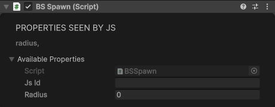
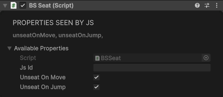
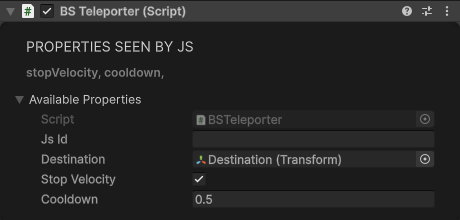
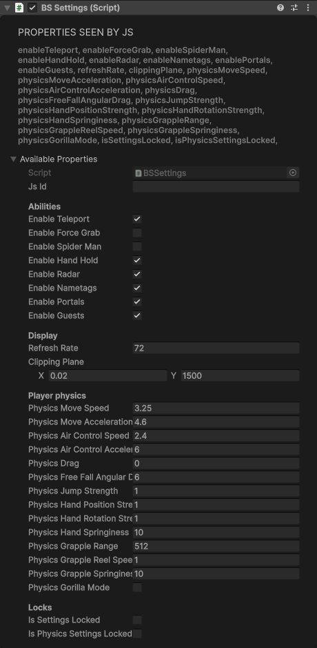

# Spawn, Seats & Settings

The components behind the **Player** prefabs in `GameObject > BS > Player`: where players arrive, seats, teleporters and the space's settings. [Easy Prefabs](../building-in-unity/easy-prefabs.md) covers placing and setting them up in Unity; this page is their JavaScript side.

They're usually placed in Unity. To reach one from your script, find its object and ask for the component:

```js
const scene = BS.Scene.GetInstance();
scene.On("unity-loaded", async () => {
    const seatObject = await scene.Find("SitPoint");
    const seat = seatObject.GetComponent(BS.CT.Seat);
    seat.unseatOnJump = false;
});
```

None of these components raise events of their own.

## Spawn

Where players arrive. When the space loads, one of the spawns in the scene is picked at random and the local player lands there, facing the spawn's Y rotation; see [Spawn Point and Spawn Range](../building-in-unity/easy-prefabs.md#spawn-point-and-spawn-range-bsspawn).

<div class="docs-tabs">

```js
const lobby = new BS.GameObject({
    name: "Lobby Spawn",
    localPosition: new BS.Vector3(0, 0, 5),
    localEulerAngles: new BS.Vector3(0, 180, 0)   // arrive facing back towards the origin
});
const spawn = await lobby.AddComponent(new BS.Spawn({ radius: 2 }));

// Send the local player there
spawn.Spawn();
```



</div>

| Property | Type | Default | What it does |
|---|---|---|---|
| `radius` | number | 0 | Players land at a random point within this many metres of the spawn, on the horizontal plane. 0 lands exactly on it. |

| Method | What it does |
|---|---|
| `Spawn()` | Teleports the local player to this spawn (within its `radius`), facing its Y rotation, with their movement stopped. |

Only spawns that are in the scene while the space loads take part in the arrival pick, so place your spawns in Unity. A spawn your script creates may come too late for it; call `Spawn()` on it to send the player there.

## Seat

Clicking a seat sits the local player on it, and moving or jumping stands them up; see [Seat](../building-in-unity/easy-prefabs.md#seat-bsseat). The player sits at the seat object's position, facing its forward.

<div class="docs-tabs">

```js
const chair = new BS.GameObject({
    name: "Chair",
    layer: BS.L.UI,                                  // only the UI and Menu layers can be clicked
    localPosition: new BS.Vector3(0, 0.45, 2),
    localEulerAngles: new BS.Vector3(0, 180, 0)      // sit facing the origin
});
// The collider first: the seat listens for clicks on the colliders it finds when it starts.
await chair.AddComponent(new BS.BoxCollider({ isTrigger: true, size: new BS.Vector3(0.5, 0.2, 0.5) }));
const seat = await chair.AddComponent(new BS.Seat({ unseatOnMove: false }));

seat.Sit();     // sit the local player down
seat.Stand();   // and stand them up again
```



</div>

| Property | Type | Default | What it does |
|---|---|---|---|
| `unseatOnMove` | boolean | true | Pushing the move stick (WASD on desktop) stands the player up. With it off, call `Stand()` to let them up. |
| `unseatOnJump` | boolean | true | Jumping stands the player up. |

| Method | What it does |
|---|---|
| `Sit()` | Sits the local player on this seat, as if they'd clicked it. |
| `Stand()` | Stands the local player up. |

A seat needs a collider to be clicked, on the **UI** or **Menu** layer: on the seat's object or a child, and there when the seat starts, so add it before the seat. The seat also adds a kinematic Rigidbody if it has none, so it stays where you put it. `Sit()` and `Stand()` work without a collider.

## Teleporter

Teleports the local player when they walk into the teleporter's trigger collider; see [Teleporter](../building-in-unity/easy-prefabs.md#teleporter-bsteleporter).

The landing point, the teleporter's **Destination**, can only be set in Unity, so create teleporters there. A teleporter created from a script has no destination and never teleports anyone. From a script you can change how one behaves, or switch it off:

<div class="docs-tabs">

```js
const gate = await scene.Find("Teleporter");
const teleporter = gate.GetComponent(BS.CT.Teleporter);

teleporter.cooldown = 2;           // fire at most every 2 seconds
teleporter.stopVelocity = false;   // keep the player's momentum through it

await gate.SetActive(false);       // switch it off; true turns it back on
```



</div>

| Property | Type | Default | What it does |
|---|---|---|---|
| `stopVelocity` | boolean | true | Stops the player's movement when they land. |
| `cooldown` | number | 0.5 | Seconds before the teleporter can fire again. |

It has no methods.

## Settings

Sets the space's settings: the players' abilities, the refresh rate and clipping planes, and player physics. They're the same settings `scene.SetSettings` sends, described on the [Scene Settings](../javascript-api/scene-settings.md) page; for placing one in Unity, see [Easy Prefabs](../building-in-unity/easy-prefabs.md#scene-settings-bssettings). Use one per space.

<div class="docs-tabs">

```js
const holder = new BS.GameObject({ name: "Space Settings" });
const settings = await holder.AddComponent(new BS.Settings({
    enableTeleport: false,
    enableSpiderMan: true,
    physicsJumpStrength: 2,
    isSettingsLocked: true      // nothing else may change the settings now
}));

settings.enableTeleport = true; // applies straight away: its own lock doesn't stop it
```



</div>

When it starts, it applies all of its values, so anything you don't set goes back to the default below. After that, each property you change is applied straight away. One placed in Unity applies its values again whenever the page reloads.

**Abilities and display**

| Property | Type | Default | Sets |
|---|---|---|---|
| `enableTeleport` | boolean | true | `EnableTeleport`: players can teleport |
| `enableForceGrab` | boolean | false | `EnableForceGrab`: players can grab objects from a distance |
| `enableSpiderMan` | boolean | false | `EnableSpiderMan`: players can use the grapple |
| `enableHandHold` | boolean | true | `EnableHandHold`: players can hold hands |
| `enableRadar` | boolean | true | `EnableRadar`: the radar is shown |
| `enableNametags` | boolean | true | `EnableNametags`: name tags show above players |
| `enablePortals` | boolean | true | `EnablePortals`: portals to other spaces are shown |
| `enableGuests` | boolean | true | `EnableGuests`: `false` turns away players who aren't signed in as the space loads |
| `refreshRate` | number | 72 | `RefreshRate`: the display refresh rate on Quest, e.g. 72, 90 or 120 |
| `clippingPlane` | Vector2 | (0.02, 1500) | `ClippingPlane`: the camera's near (`x`) and far (`y`) clipping planes, in metres |

**Player physics**

| Property | Type | Default | Sets |
|---|---|---|---|
| `physicsMoveSpeed` | number | 3.25 | `PhysicsMoveSpeed`: walking speed, in metres per second |
| `physicsMoveAcceleration` | number | 4.6 | `PhysicsMoveAcceleration`: how hard players push off to reach walking speed; below 2.2 is raised to 2.2 |
| `physicsAirControlSpeed` | number | 2.4 | `PhysicsAirControlSpeed`: how fast players can steer in the air, in metres per second |
| `physicsAirControlAcceleration` | number | 6 | `PhysicsAirControlAcceleration`: how quickly they steer in the air |
| `physicsDrag` | number | 0 | `PhysicsDrag`: drag on the player's body |
| `physicsFreeFallAngularDrag` | number | 6 | `PhysicsFreeFallAngularDrag`: angular drag while falling |
| `physicsJumpStrength` | number | 1 | `PhysicsJumpStrength`: jump strength multiplier |
| `physicsHandPositionStrength` | number | 1 | `PhysicsHandPositionStrength`: how strongly the hands follow the controllers' position |
| `physicsHandRotationStrength` | number | 1 | `PhysicsHandRotationStrength`: how strongly the hands follow the controllers' rotation |
| `physicsHandSpringiness` | number | 10 | `PhysicsHandSpringiness`: springiness of the hands |
| `physicsGrappleRange` | number | 512 | `PhysicsGrappleRange`: grapple range, in metres |
| `physicsGrappleReelSpeed` | number | 1 | `PhysicsGrappleReelSpeed`: grapple reel speed |
| `physicsGrappleSpringiness` | number | 10 | `PhysicsGrappleSpringiness`: grapple springiness |
| `physicsGorillaMode` | boolean | false | `PhysicsGorillaMode`: in VR, players move by pushing their hands against the floor and walls instead of with the sticks |

`enableHandHold`, `enableRadar`, `enablePortals` and `physicsFreeFallAngularDrag` don't work in the app yet: see [Not working yet](../javascript-api/scene-settings.md#not-working-yet). In SDK Play Mode only `clippingPlane` has an effect.

**Locks**

| Property | Type | Default | What it does |
|---|---|---|---|
| `isSettingsLocked` | boolean | false | Locks the abilities, refresh rate and clipping planes once this component's values are in. Until the page reloads, `scene.SetSettings` and any other Settings component can't change them; this component still can. |
| `isPhysicsSettingsLocked` | boolean | false | The same for the player physics settings. |

Locks only ever lock: setting one back to `false` doesn't unlock the settings. A lock someone else set first also stops this component: it leaves those settings alone.

`scene.SetSettings(...)` sends every setting, so a call that runs after this component started replaces all of its values, unless they're locked.

It has no methods.
