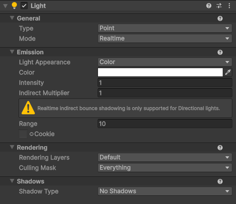
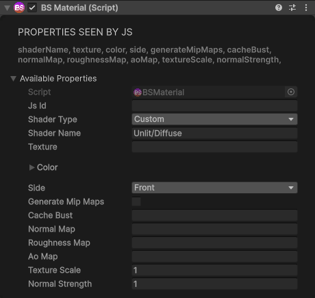
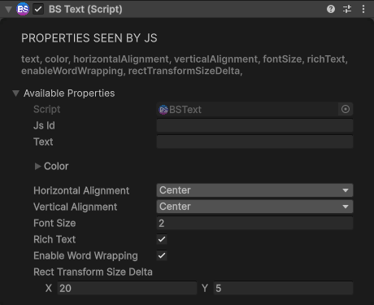
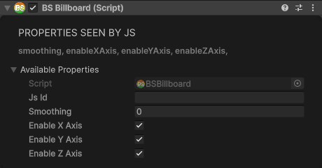
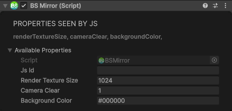
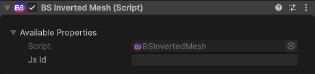
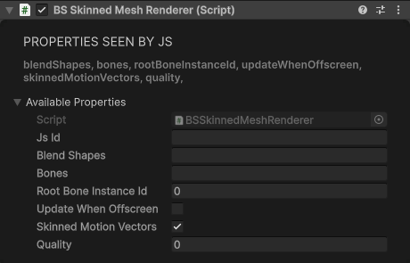

# Rendering & Visual Components

## Light

Adds lighting to the scene.

<div class="docs-tabs">

```js
obj.AddComponent(new BS.Light({
    type: BS.LightType.Point,           // Point, Directional, Spot
    color: new BS.Vector4(1, 1, 1, 1),  // RGBA
    intensity: 1,                        // Brightness
    range: 10,                           // Distance (Point/Spot)
    spotAngle: 30,                       // Cone angle (Spot only)
    innerSpotAngle: 21.8,               // Inner cone (Spot only)
    shadows: BS.LightShadows.None       // None, Hard, Soft
}));
```



</div>

## Material

Applies a material/shader to the object.

<div class="docs-tabs">

```js
obj.AddComponent(new BS.Material({
    shaderName: "Unlit/Diffuse",        // Shader name
    texture: "https://example.com/texture.png",
    color: new BS.Vector4(1, 1, 1, 1),  // RGBA tint
    side: BS.MaterialSide.Front,        // Front, Back, Double
    generateMipMaps: false,
    normalMap: "",                      // Optional maps: empty = off (URL, asset id or scheme reference)
    roughnessMap: "",                   //   read from the GREEN channel (white = rough)
    aoMap: "",                          //   read from the RED channel
    textureScale: 1,                    // UV tiling, or tiles per metre on the triplanar shaders
    normalStrength: 1
}));
```



</div>

The bundled diffuse shaders come in two families, each with an opaque and an alpha-blended twin, and
all four tint by `color` (the Transparent twins also honour its alpha):

| Shader | Mapping |
|---|---|
| `Unlit/Diffuse`, `Unlit/DiffuseTransparent` | Mesh UVs, tiled by `textureScale` |
| `Unlit/DiffuseTriplanar`, `Unlit/DiffuseTriplanarTransparent` | World-space triplanar (no UVs needed); `textureScale` = tiles per metre |

Texture references may also use the `cc0:{slug}/{map}/{size}` scheme for CC0 library textures
(map = `basecolor`, `normal` or `mask`; the mask packs R = AO, G = roughness, B = metallic, so
`roughnessMap` and `aoMap` can both point at it). A 256 px preview shows immediately, and the texture
at the requested size replaces it once it has downloaded.

## Text

3D text rendering.

<div class="docs-tabs">

```js
obj.AddComponent(new BS.Text({
    text: "Hello World",
    color: new BS.Vector4(1, 1, 1, 1),
    fontSize: 2,
    horizontalAlignment: BS.HorizontalAlignment.Center,
    verticalAlignment: BS.VerticalAlignment.Middle,
    richText: true,                      // Support formatting tags
    enableWordWrapping: true,
    rectTransformSizeDelta: new BS.Vector2(10, 5)  // Text box size
}));
```



</div>

## Billboard

Makes object always face the camera.

<div class="docs-tabs">

```js
obj.AddComponent(new BS.Billboard({
    smoothing: 0,        // Rotation smoothing (0 = instant)
    enableXAxis: true,   // Rotate on X
    enableYAxis: true,   // Rotate on Y
    enableZAxis: false   // Rotate on Z
}));
```



</div>

## Mirror

Creates a reflective mirror surface.

<div class="docs-tabs">

```js
obj.AddComponent(new BS.Mirror());
```



</div>

**Methods:**

```js
mirror.SetCullingLayer(5);   // Render only this layer in the mirror
mirror.AddCullingLayer(6);   // Also render this layer
```

## InvertedMesh

Inverts mesh normals (renders inside-out).

<div class="docs-tabs">

```js
obj.AddComponent(new BS.InvertedMesh());
```



</div>

## SkinnedMeshRenderer

Controls a skinned mesh's renderer — most usefully its blend shapes on imported models.

| Property | Type | Default | Description |
|----------|------|---------|-------------|
| `blendShapes` | string | "" | Blend shape state as a JSON string |
| `bones` | string | "" | Bone bindings as a JSON string, paths relative to the root bone |
| `rootBoneInstanceId` | number | 0 | Instance ID of the root bone |
| `updateWhenOffscreen` | boolean | false | Keep skinning even when no camera sees the mesh |
| `skinnedMotionVectors` | boolean | true | Motion vectors for the skinned mesh |
| `quality` | number | 0 | Skin quality (0 = auto) |

**Methods:**

<div class="docs-tabs">

```js
const smr = obj.GetComponent(BS.CT.SkinnedMeshRenderer);
smr.SetBlendShapeWeight(0, 100);   // Set the weight of blend shape 0
smr.GetBlendShapeWeight(0);        // Trigger the weight query for blend shape 0
smr.GetBlendShapeIndex("smile");   // Trigger the index lookup for a named blend shape
```



</div>

The `Get*` methods invoke the lookup Unity-side; they do not return the value to JavaScript.
