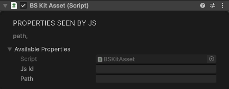
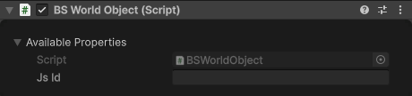
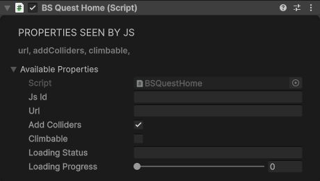
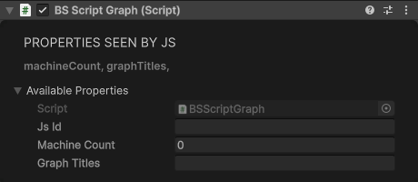
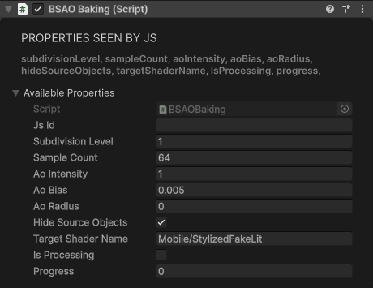

# Special Components

## KitAsset

Places a prefab from the app's built-in library of low-poly assets, addressed by its path in that library. The prefabs ship inside the app, so nothing is downloaded and no per-space registration is needed. The path is relative to the library's Assets root, as in the example. Changing `path` replaces the prefab.

| Property | Type | Default | Description |
|----------|------|---------|-------------|
| `path` | string | "" | Library path of the prefab |

<div class="docs-tabs">

```js
await obj.AddComponent(new BS.KitAsset({
    path: "CartoonCubeWorld/Prefabs/Props/Apple.prefab"
}));
```



</div>

In Play mode a kit asset only appears when the library package (`com.sidequest.low-poly-assets-processed`) is in your project; without it the object stays empty and the Console says the path couldn't be resolved.

## SyncedObject

Shares the object's position and rotation with every player in the space. One player owns the object at a time and everyone else's copy follows theirs. Every player's copy must have the same object id: objects placed in the editor do, while an object your script creates needs the same `networkId` on every player, set before the SyncedObject is added. [Multiplayer](../multiplayer/overview.md#synced-objects) covers ownership and movement in full.

| Property | Type | Default | Description |
|----------|------|---------|-------------|
| `syncPosition` | boolean | true | Ignored: the position is always shared |
| `syncRotation` | boolean | true | Share the rotation too |
| `takeOwnershipOnCollision` | boolean | true | Touching the object makes you its owner |
| `takeOwnershipOnGrab` | boolean | true | Grabbing the object makes you its owner until you let go |
| `kinematicIfNotOwned` | boolean | false | Ignored: copies a player doesn't own are always kinematic |

The app reads these once, a frame after the object starts, so set them when you add the component.

<div class="docs-tabs">

```js
const ball = new BS.GameObject({ name: "Ball", localPosition: new BS.Vector3(0, 1.5, 2) });
await ball.SetNetworkId("ball-1");   // the same on every player, before the SyncedObject
await ball.AddComponent(new BS.Sphere({ radius: 0.2 }));
await ball.AddComponent(new BS.SphereCollider({ radius: 0.2 }));
await ball.AddComponent(new BS.Rigidbody({ mass: 1 }));
const sync = await ball.AddComponent(new BS.SyncedObject({ takeOwnershipOnCollision: true }));
```


</div>

**Methods:**

```js
sync.TakeOwnership();               // Ask to become the owner
const mine = await sync.DoIOwn();   // true if this player owns the object now
```

In SDK Play Mode on its own, `DoIOwn()` always resolves `false`; with [local multiplayer](../multiplayer/local-testing.md) it answers as the app does.

## WorldObject

Marks a physics object the players' hands can hold: while a hand grabs it, the hand stops colliding with the object's colliders, so it doesn't knock the object out of its own grip. Put it on the object with the Rigidbody. You rarely need it yourself: [Grababble](vr-interaction.md#grababble) adds one, and a [GrabHandle](vr-interaction.md#grabhandle) on a Rigidbody adds one if there isn't one.

<div class="docs-tabs">

```js
await obj.AddComponent(new BS.Rigidbody({ mass: 1 }));
await obj.AddComponent(new BS.WorldObject());
```



</div>

## QuestHome

Loads a Meta Quest home environment from an APK URL.

| Property | Type | Default | Description |
|----------|------|---------|-------------|
| `url` | string | "" | URL of the Quest home APK |
| `addColliders` | boolean | true | Add colliders to opaque meshes |
| `climbable` | boolean | false | Put those colliders on the Grabbable layer (20) so surfaces can be climbed |

<div class="docs-tabs">

```js
await obj.AddComponent(new BS.QuestHome({
    url: "https://cdn.sidequestvr.com/file/167567/canyon_environment.apk",
    addColliders: true,
    climbable: false
}));
```



</div>

## ScriptGraph

Hosts Unity Visual Scripting machines on the object and mirrors a small summary to JS; see [Visual Scripting](../visual-scripting/overview.md) for editing the graphs themselves.

| Property | Type | Default | Description |
|----------|------|---------|-------------|
| `machineCount` | number | 0 | Number of script machines on the object (maintained by Unity) |
| `graphTitles` | string | "" | Comma-separated graph titles, by machine index |

<div class="docs-tabs">

```js
const graphs = await obj.AddComponent(new BS.ScriptGraph());
await graphs.CreateMachine();     // Add a machine with an empty Start/Update graph
await graphs.RemoveMachine(0);    // Remove the machine at index 0
await graphs.RefreshMachines();   // Recount machines and resync machineCount/graphTitles
```



</div>

## AOBaking

Merges child meshes and bakes ambient occlusion into vertex colors for improved visual quality with minimal runtime cost. Use this for static geometry like buildings, terrain features, or any collection of primitives that won't move.

**When to use:**
- You have multiple child primitives/meshes under a parent object
- The objects are static (won't move after baking)
- You want soft shadows/ambient occlusion without real-time lighting cost
- Building procedural environments that need better visual depth

**What it bakes:** every child (at any depth) that has both a mesh and a renderer, so give each child a shape and a [BS.Material](rendering.md#material). Children are merged per material, and each merged mesh gets a copy of its material on `targetShaderName`. The originals' renderers are hidden (with `hideSourceObjects`); their colliders keep working.

**Best Practices:**

1. **Use root parents:** When building something out of multiple primitives, always create a root parent GameObject first and add all primitives as children. This keeps the hierarchy clean and organized, and is required for AOBaking to work correctly.

2. **Bake incrementally:** Bake each object as soon as it's finished before building the next one. This ensures proper AO from nearby objects.

3. **Rebake when adding neighbors:** If you add a new object next to or intersecting with an already-baked object, rebake the existing object so it picks up occlusion from the new geometry.

4. **Build in layers:** Construct scenes in this order for best results:
   - **Background** (skyboxes, distant scenery)
   - **Ground** (terrain, floors)
   - **Large elements** (buildings, walls, major structures)
   - **Detail objects** (furniture, props, decorations)

   This layered approach ensures large occluders are in place before baking smaller objects.

<div class="docs-tabs">

```js
// Create the parent, then its children: each with a shape and a material
const building = new BS.GameObject({ name: "Building" });
const stone = new BS.Vector4(0.8, 0.78, 0.72, 1);

const wall = new BS.GameObject({ name: "Wall", parent: building });
await wall.AddComponent(new BS.Box({ width: 5, height: 3, depth: 0.2 }));
await wall.AddComponent(new BS.Material({ color: stone }));

const pillar = new BS.GameObject({ name: "Pillar", parent: building, localPosition: new BS.Vector3(2, 0, 0.5) });
await pillar.AddComponent(new BS.Cylinder({ radiusTop: 0.3, radiusBottom: 0.3, height: 3 }));
await pillar.AddComponent(new BS.Material({ color: stone }));

// Add AO baking to the parent
const aoBaker = await building.AddComponent(new BS.AOBaking({
    subdivisionLevel: 2,              // 0-3, higher = more detail
    sampleCount: 128,                 // 16-256, higher = better quality
    aoIntensity: 1.2,                 // 0-2, strength of shadows
    aoBias: 0.005,                    // Prevents self-shadowing artifacts
    aoRadius: 0,                      // 0 = auto, or set max occlusion distance
    hideSourceObjects: true,          // Hide original meshes after merge
    targetShaderName: "Mobile/StylizedFakeLit"  // Shader with vertex color support
}));

// Bake the AO (merges meshes, subdivides, raycasts for occlusion), and wait for it to finish
const baked = new Promise(resolve => building.On("object-update", () => {
    if (aoBaker.progress === 1) resolve();
}));
await aoBaker.BakeAO();
await baked;

// Later: aoBaker.Preview() merges without AO; aoBaker.Clear() restores the original meshes
```



</div>

**Properties:**

| Property | Type | Default | Description |
|----------|------|---------|-------------|
| `subdivisionLevel` | number | 1 | Subdivision iterations (0-3). Higher = more vertices for smoother AO |
| `sampleCount` | number | 64 | Ray samples per vertex (16-256). Higher = better quality, slower |
| `aoIntensity` | number | 1 | Strength of occlusion effect (0-2) |
| `aoBias` | number | 0.005 | Offset to prevent self-intersection (0.001-0.1) |
| `aoRadius` | number | 0 | Max occlusion check distance (0 = auto based on mesh size) |
| `hideSourceObjects` | boolean | true | Hide original child meshes after baking |
| `targetShaderName` | string | "Mobile/StylizedFakeLit" | Shader name to apply (must support vertex colors) |
| `isProcessing` | boolean | - | Read-only: true while baking |
| `progress` | number | - | Read-only: 0 when a bake starts, 1 when it's done (there are no steps in between) |

Values outside the ranges are clamped. The properties are read when you call `BakeAO()` or `Preview()`, so change them before baking. `isProcessing` and `progress` reach your script when a bake starts and when it ends, each time with an `object-update` event on the GameObject.

**Methods:**

| Method | Description |
|--------|-------------|
| `BakeAO()` | Start merging the child meshes, subdividing, and baking ambient occlusion. The Promise resolves once the bake has started |
| `Preview()` | Merge and subdivide without AO baking (quick preview) |
| `Clear()` | Remove generated mesh and show original child objects |
