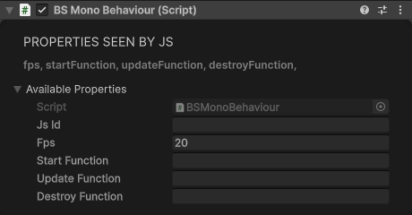

# Special Components

## KitAsset

Instantiates a prefab that ships inside the world build, addressed by its kit-manifest path. Nothing is downloaded and no per-space registration is needed: the prefab is already in the build. The path is the kit manifest's own `path` field, relative to the kit package's Assets root.

| Property | Type | Default | Description |
|----------|------|---------|-------------|
| `path` | string | "" | Manifest path of the prefab |

<div class="docs-tabs">

```js
obj.AddComponent(new BS.KitAsset({
    path: "CartoonCubeWorld/Prefabs/Props/Apple.prefab"
}));
```


</div>

## SyncedObject

Enables network synchronization for the object.

<div class="docs-tabs">

```js
const sync = obj.AddComponent(new BS.SyncedObject());
```


</div>

**Methods:**

```js
sync.TakeOwnership();   // Make the local user the owner of this object
sync.DoIOwn();          // Trigger the ownership check Unity-side (no value is returned to JS)
```

## WorldObject

Marks object as part of the world (non-interactive).

<div class="docs-tabs">

```js
obj.AddComponent(new BS.WorldObject());
```


</div>

## AvatarPedestal

Displays an avatar on a pedestal.

```js
obj.AddComponent(new BS.AvatarPedestal());
```

## QuestHome

Loads a Meta Quest home environment from an APK URL.

| Property | Type | Default | Description |
|----------|------|---------|-------------|
| `url` | string | "" | URL of the Quest home APK |
| `addColliders` | boolean | true | Add colliders to opaque meshes |
| `climbable` | boolean | false | Put those colliders on the Grabbable layer (20) so surfaces can be climbed |

<div class="docs-tabs">

```js
obj.AddComponent(new BS.QuestHome({
    url: "https://cdn.sidequestvr.com/file/167567/canyon_environment.apk",
    addColliders: true,
    climbable: false
}));
```


</div>

## MonoBehaviour

Runs JavaScript source strings on a lifecycle schedule: `startFunction` once on start, `updateFunction` at `fps` calls per second, `destroyFunction` when the component goes away.

| Property | Type | Default | Description |
|----------|------|---------|-------------|
| `fps` | number | 20 | `updateFunction` calls per second |
| `startFunction` | string | "" | JS source run once on start |
| `updateFunction` | string | "" | JS source run at `fps` |
| `destroyFunction` | string | "" | JS source run on destroy |

<div class="docs-tabs">

```js
obj.AddComponent(new BS.MonoBehaviour({
    fps: 10,
    startFunction: "console.log('behaviour up');",
    updateFunction: "console.log('tick');",
    destroyFunction: "console.log('gone');"
}));
```



</div>

## ScriptGraph

Hosts Unity Visual Scripting machines on the object and mirrors a small summary to JS — see [Visual Scripting](../visual-scripting/overview.md) for editing the graphs themselves.

| Property | Type | Default | Description |
|----------|------|---------|-------------|
| `machineCount` | number | 0 | Number of script machines on the object (maintained by Unity) |
| `graphTitles` | string | "" | Comma-separated graph titles, by machine index |

<div class="docs-tabs">

```js
const graphs = await obj.AddComponent(new BS.ScriptGraph());
graphs.CreateMachine();     // Add a machine with an empty Start/Update graph
graphs.RemoveMachine(0);    // Remove the machine at index 0
graphs.RefreshMachines();   // Recount machines and resync machineCount/graphTitles
```


</div>

## AOBaking

Merges child meshes and bakes ambient occlusion into vertex colors for improved visual quality with minimal runtime cost. Use this for static geometry like buildings, terrain features, or any collection of primitives that won't move.

**When to use:**
- You have multiple child primitives/meshes under a parent object
- The objects are static (won't move after baking)
- You want soft shadows/ambient occlusion without real-time lighting cost
- Building procedural environments that need better visual depth

**Best Practices:**

1. **Use root parents:** When building something out of multiple primitives, always create a root parent GameObject first and add all primitives as children. This keeps the hierarchy clean and organized, and is required for AOBaking to work correctly.

2. **Bake incrementally:** Bake each object as soon as it's finished before building the next one. This ensures proper AO from nearby objects.

3. **Rebake when adding neighbors:** If you add a new object next to or intersecting with an already-baked object, rebake the existing object so it picks up occlusion from the new geometry.

4. **Build in layers:** Construct scenes in this order for best results:
   - **Background** (skyboxes, distant scenery)
   - **Ground** (terrain, floors)
   - **Large elements** (buildings, walls, major structures)
   - **Detail objects** (furniture, props, decorations)

   This layered approach ensures large occluders are in place before baking smaller objects.

<div class="docs-tabs">

```js
// Create parent with child primitives
const building = new BS.GameObject({ name: "Building" });

const wall = new BS.GameObject({ name: "Wall", parent: building });
wall.AddComponent(new BS.Box({ width: 5, height: 3, depth: 0.2 }));

const pillar = new BS.GameObject({ name: "Pillar", parent: building });
pillar.AddComponent(new BS.Cylinder({ radiusTop: 0.3, radiusBottom: 0.3, height: 3 }));

// Add AO baking to parent
const aoBaker = building.AddComponent(new BS.AOBaking({
    subdivisionLevel: 2,              // 0-3, higher = more detail
    sampleCount: 128,                 // 16-256, higher = better quality
    aoIntensity: 1.2,                 // 0-2, strength of shadows
    aoBias: 0.005,                    // Prevents self-shadowing artifacts
    aoRadius: 0,                      // 0 = auto, or set max occlusion distance
    hideSourceObjects: true,          // Hide original meshes after merge
    targetShaderName: "Mobile/StylizedFakeLit"  // Shader with vertex color support
}));

// Bake the AO (merges meshes, subdivides, raycasts for occlusion)
aoBaker.BakeAO();

// Preview without AO (just merge)
aoBaker.Preview();

// Clear and restore original meshes
aoBaker.Clear();
```


</div>

**Properties:**

| Property | Type | Default | Description |
|----------|------|---------|-------------|
| `subdivisionLevel` | number | 1 | Subdivision iterations (0-3). Higher = more vertices for smoother AO |
| `sampleCount` | number | 64 | Ray samples per vertex (16-256). Higher = better quality, slower |
| `aoIntensity` | number | 1 | Strength of occlusion effect (0-2) |
| `aoBias` | number | 0.005 | Offset to prevent self-intersection (0.001-0.1) |
| `aoRadius` | number | 0 | Max occlusion check distance (0 = auto based on mesh size) |
| `hideSourceObjects` | boolean | true | Hide original child meshes after baking |
| `targetShaderName` | string | "Mobile/StylizedFakeLit" | Shader name to apply (must support vertex colors) |
| `isProcessing` | boolean | - | Read-only: true while baking |
| `progress` | number | - | Read-only: bake progress 0-1 |

**Methods:**

| Method | Description |
|--------|-------------|
| `BakeAO()` | Merge child meshes, subdivide, and bake ambient occlusion |
| `Preview()` | Merge and subdivide without AO baking (quick preview) |
| `Clear()` | Remove generated mesh and show original child objects |
