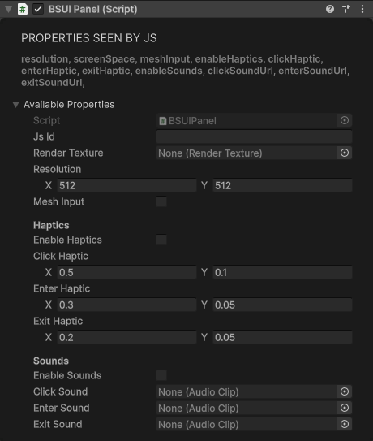

# UI System

Create 2D user interfaces in VR with the UI system.

## UIPanel

Container for UI elements. Must be added to a GameObject first.

<div class="docs-tabs">

```js
const panelObj = new BS.GameObject({ name: "UIPanel" });
const panel = panelObj.AddComponent(new BS.UIPanel({
    resolution: new BS.Vector2(800, 600),
    screenSpace: false,     // World-space UI
    enableHaptics: true,
    clickHaptic: new BS.Vector2(0.1, 0.05),   // amplitude, duration
    enterHaptic: new BS.Vector2(0.05, 0.02),
    exitHaptic: new BS.Vector2(0.05, 0.02),
    enableSounds: false,
    clickSoundUrl: "",
    enterSoundUrl: "",
    exitSoundUrl: ""
}));
```



</div>

**Methods:**

```js
panel.SetBackgroundColor(new BS.Vector4(0, 0, 0, 0.5));   // RGBA, 0-1
```

## UIElement (Base Class)

All UI components inherit from UIElement.

**Properties:**

```js
element.id;           // Unique ID
element.type;         // UIElementType
element.panel;        // Parent UIPanel
element.parent;       // Parent UIElement
element.children;     // Child UIElements
element.enabled;      // Interactive
element.visible;      // Displayed
```

**Hierarchy Methods:**

```js
parent.AppendChild(child);
parent.RemoveChild(child);
parent.InsertBefore(child, referenceChild);
```

**Property Methods:**

```js
element.SetProperty(BS.PN.text, "Hello");
element.GetProperty(BS.PN.text);
element.SetProperties([BS.PN.text, BS.PN.fontSize]);
```

**Style Methods:**

```js
element.SetStyle("backgroundColor", "#FF0000");
element.GetStyle("backgroundColor");
element.SetStyles({
    backgroundColor: "#FF0000",
    padding: "10px",
    borderRadius: "5px"
});

// Or use the style property
element.style.backgroundColor = "#FF0000";
element.style.width = "100px";
element.style.height = "50px";
```

**Event Methods:**

```js
element.OnClick((e) => console.log("Clicked"));
element.OnMouseDown((e) => console.log("Mouse down"));
element.OnMouseUp((e) => console.log("Mouse up"));
element.OnMouseEnter((e) => console.log("Hover start"));
element.OnMouseLeave((e) => console.log("Hover end"));
element.OnMouseMove((e) => console.log("Moving"));
element.OnKeyDown((e) => console.log("Key:", e.key));
element.OnKeyUp((e) => console.log("Key released"));
element.OnFocus((e) => console.log("Focused"));
element.OnBlur((e) => console.log("Lost focus"));
element.OnChange((e) => console.log("Value:", e.value));
element.OnWheel((e) => console.log("Scrolled"));

// Standard event listener API
element.AddEventListener("click", handler);
element.RemoveEventListener("click", handler);
```

**Query Methods:**

```js
const button = element.QuerySelector("#myButton");
const allButtons = element.QuerySelectorAll(".button");
```

## UIButton

Clickable button.

```js
const button = new BS.UIButton();
button.SetProperty(BS.PN.text, "Click Me");
button.style.width = "200px";
button.style.height = "50px";
button.style.backgroundColor = "#4CAF50";
button.style.color = "#FFFFFF";
button.OnClick(() => console.log("Button clicked!"));
panel.root.AppendChild(button);
```

## UILabel

Text display.

```js
const label = new BS.UILabel();
label.SetProperty(BS.PN.text, "Hello World");
label.style.fontSize = "24px";
label.style.color = "#FFFFFF";
panel.root.AppendChild(label);
```

## UISlider

Value slider.

```js
const slider = new BS.UISlider();
slider.style.width = "200px";
slider.OnChange((e) => console.log("Value:", e.value));
panel.root.AppendChild(slider);
```

## UIToggle

Checkbox/toggle.

```js
const toggle = new BS.UIToggle();
toggle.OnChange((e) => console.log("Checked:", e.value));
panel.root.AppendChild(toggle);
```

## UIScrollView

Scrollable container.

```js
const scrollView = new BS.UIScrollView();
scrollView.style.width = "300px";
scrollView.style.height = "200px";
scrollView.style.overflow = "scroll";
panel.root.AppendChild(scrollView);
```

## UIVisualElement

Generic container for layout.

```js
const container = new BS.UIVisualElement();
container.style.flexDirection = "row";
container.style.justifyContent = "space-between";
container.style.padding = "10px";
panel.root.AppendChild(container);
```

## UITextField

Text input field with placeholder, password masking, and read-only support. Constructed with the owning panel: `new BS.UITextField(panel, parent?)`.

| Property | Type | Default | Description |
|----------|------|---------|-------------|
| `value` | string | — | Current text |
| `placeholder` | string | — | Hint shown while empty |
| `maxLength` | number | — | Maximum character count |
| `isPasswordField` | boolean | — | Mask the input |
| `isReadOnly` | boolean | — | Block editing |
| `label` | string | — | Built-in label text |
| `tooltip` | string | — | Hover tooltip |
| `name` | string | — | Element name for queries |

```js
const field = new BS.UITextField(panel);
field.placeholder = "Type a name...";
field.maxLength = 32;
field.OnChange((e) => console.log("Value:", e.value));

field.Focus();               // Give the field keyboard focus
field.Blur();                // Drop focus
field.SelectAll();           // Select the current contents
field.AddClass("wide");      // USS class helpers
field.RemoveClass("wide");
```

## UIEdgeLayer

A canvas element that draws a set of cubic-bezier edges — built for node-graph style UIs. Constructed with the owning panel: `new BS.UIEdgeLayer(panel, parent?)`. Coordinates are in the layer's local pre-transform space, so ancestor pan/zoom transforms apply without resending edge data.

```js
const layer = new BS.UIEdgeLayer(panel);

// setEdges() full-replaces the edge set in a single message
layer.setEdges([
    {
        id: "e1",
        x1: 20, y1: 40,        // Start point
        cx1: 80, cy1: 40,      // First control point
        cx2: 120, cy2: 160,    // Second control point
        x2: 180, y2: 160,      // End point
        color: "#88CCFF",
        width: 2,
        dashed: false,         // Optional
        selected: false,       // Optional
        arrow: true            // Optional arrowhead
    }
]);

layer.edges;   // Read-only view of the current edge set
```

## UIColorPicker

A native colour picker: a hue/saturation wheel with a draggable marker, brightness and opacity bars, editable hex / hsl / rgb fields, preset and recent swatches, and a presets-only mode. Constructed with the owning panel: `new BS.UIColorPicker(panel, parent?)`.

| Property | Type | Default | Description |
|----------|------|---------|-------------|
| `value` | string | `#FFFFFFFF` | The colour as `#RRGGBBAA`. Writing it does not echo a change event |
| `mode` | string | `full` | `full`, or `presets` for the swatch-grid-only picker |
| `presets` | string | — | Comma-separated colour codes for the preset row; empty restores the defaults |
| `recent` | string | — | Comma-separated colour codes for the recent row; empty hides it |
| `showAlpha` | boolean | `true` | Show the opacity bar |
| `theme` | string | — | JSON palette and metrics (`surface`, `accent`, `text`, `wheelDiameter`, `fontSize`, …); a partial document is applied over the defaults |
| `tooltip` | string | — | Hover tooltip |
| `name` | string | — | Element name for queries |

```js
const picker = new BS.UIColorPicker(panel);
picker.value = "#FF2E8CFF";
picker.presets = "#FFFFFF,#000000,#E53935,#1E88E5";
picker.theme = JSON.stringify({ accent: "#4CAF50", wheelDiameter: 240 });
picker.OnChange((e) => console.log("Colour:", e.value));   // live while dragging, then once on release

picker.AddClass("wide");     // USS class helpers
picker.RemoveClass("wide");
```

## UI Factory Helpers

`BS.BanterUI` extends `UIPanel` with creator methods that pass the panel reference for you: `new BS.BanterUI(resolution?, screenSpace?, meshInput?)` (defaults: `new BS.Vector2(512, 512)`, `false`, `false`).

| Method | Returns | Description |
|--------|---------|-------------|
| `CreateButton(parent?)` | UIButton | Button |
| `CreateLabel(text?, parent?)` | UILabel | Text label |
| `CreateElement(innerText?, parent?)` | UILabel | Alias of `CreateLabel` |
| `CreateToggle(parent?)` | UIToggle | Checkbox/toggle |
| `CreateSlider(min = 0, max = 100, parent?)` | UISlider | Slider with range preset |
| `CreateScrollView(parent?)` | UIScrollView | Scrollable container |
| `CreateVisualElement(parent?)` | UIVisualElement | Generic container |
| `CreateEdgeLayer(parent?)` | UIEdgeLayer | Bezier-edge canvas |
| `CreateColorPicker(parent?)` | UIColorPicker | Colour picker (wheel, bars, fields, swatches) |
| `CreateButtonWithText(text, tooltip?, parent?)` | UIButton | Button with text and optional tooltip |
| `CreateToggleWithLabel(labelText, checked = false, parent?)` | { toggle, label } | Toggle beside a label |
| `CreateSliderWithLabel(labelText, min = 0, max = 100, initialValue = 50, parent?)` | { slider, label } | Slider with a value label |
| `CreateVerticalContainer(parent?)` | UIVisualElement | Named container for vertical layout |
| `CreateHorizontalContainer(parent?)` | UIVisualElement | Named container for horizontal layout |
| `CreateCard(title, parent?)` | { container, titleLabel } | Titled card container |

```js
const panelObj = new BS.GameObject({ name: "SettingsPanel" });
const ui = new BS.BanterUI(new BS.Vector2(600, 400));
panelObj.AddComponent(ui);

const card = ui.CreateCard("Settings");
const { toggle } = ui.CreateToggleWithLabel("Mute music", false, card.container);
const { slider } = ui.CreateSliderWithLabel("Volume", 0, 100, 50, card.container);
const apply = ui.CreateButtonWithText("Apply", "Save your changes", card.container);
apply.OnClick(() => console.log("applied"));
```

## Style Properties Reference

**Layout:**
- `alignContent`, `alignItems`, `justifyContent`
- `flexBasis`, `flexDirection`, `flexGrow`, `flexShrink`, `flexWrap`

**Size:**
- `width`, `height`, `minWidth`, `minHeight`, `maxWidth`, `maxHeight`

**Position:**
- `position` (relative, absolute)
- `left`, `top`, `right`, `bottom`

**Spacing:**
- `margin`, `marginLeft`, `marginRight`, `marginTop`, `marginBottom`
- `padding`, `paddingLeft`, `paddingRight`, `paddingTop`, `paddingBottom`

**Borders:**
- `borderWidth`, `borderLeftWidth`, `borderRightWidth`, `borderTopWidth`, `borderBottomWidth`
- `borderRadius`, `borderTopLeftRadius`, `borderTopRightRadius`, `borderBottomLeftRadius`, `borderBottomRightRadius`
- `borderColor`, `borderLeftColor`, `borderRightColor`, `borderTopColor`, `borderBottomColor`

**Background:**
- `backgroundColor`, `backgroundImage`, `backgroundSize`, `backgroundRepeat`, `backgroundPosition`

**Text:**
- `color`, `fontSize`, `fontStyle`, `fontWeight`
- `lineHeight`, `textAlign`, `textOverflow`
- `whiteSpace`, `wordWrap`, `letterSpacing`

**Display:**
- `display`, `visibility`, `overflow`, `opacity`

**Transform:**
- `rotate`, `scale`, `translate`, `transformOrigin`

**Cursor:**
- `cursor`

**Transitions:**
- `transitionProperty`, `transitionDuration`, `transitionTimingFunction`, `transitionDelay`
