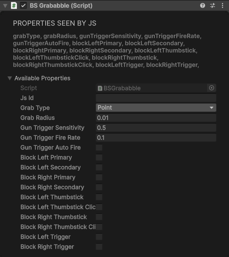
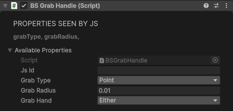
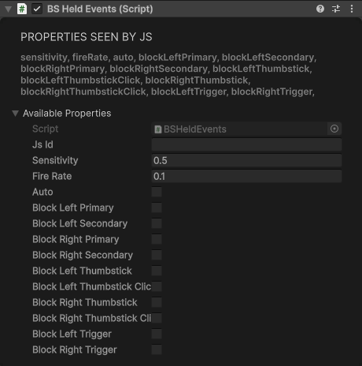
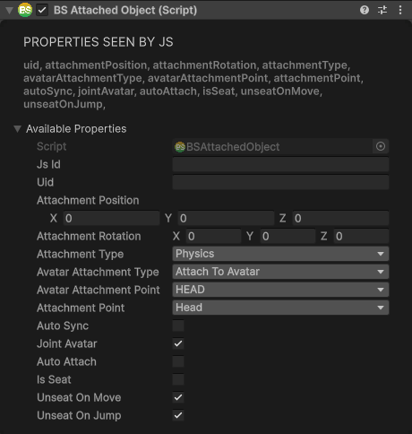

# VR Interaction Components

Grabbing works with colliders on the **Grabbable layer** (20, `BS.L.Grabbable`). Whatever a player grabs, your page gets `grab` and `drop` events on the object (see [GameObject Events](../javascript-api/gameobject-api.md#gameobject-events)). The [grab presets](../building-in-unity/easy-prefabs.md#grab-presets) under **GameObject > BS > Grab** are ready-made grabbable objects.

`grabType` takes a `BS.BSGrabType`:

| Value | How the hand holds it |
|---|---|
| `Point` (0) | Snaps to one pose: the handle object's position and rotation |
| `Cylinder` (1) | Anywhere along the object's Y axis |
| `Ball` (2) | Anywhere on a sphere of `grabRadius` |
| `Soft` (3) | Wherever the hand touches the collider |

## Grababble

Makes an object grabbable in one step. It adds a [GrabHandle](#grabhandle), a [WorldObject](special.md#worldobject) and [HeldEvents](#heldevents), and moves the object to the Grabbable layer. The object needs a collider, and a Rigidbody to be picked up; add them first.

| Property | Type | Default | Description |
|----------|------|---------|-------------|
| `grabType` | number | `Point` | How the hand holds it (see above) |
| `grabRadius` | number | 0.01 | Grab radius, in metres |
| `gunTriggerSensitivity` | number | 0.5 | How far the trigger must be pulled to fire (0 to 1) |
| `gunTriggerFireRate` | number | 0.1 | Seconds between shots with auto fire |
| `gunTriggerAutoFire` | boolean | false | Keep firing while the trigger stays pulled |
| `blockLeftPrimary` … `blockRightTrigger` | boolean | false | While held, stop that button doing its usual job (see [HeldEvents](#heldevents)) |

<div class="docs-tabs">

```js
await obj.AddComponent(new BS.Box({ width: 0.1, height: 0.1, depth: 0.3 }));
await obj.AddComponent(new BS.BoxCollider({ size: new BS.Vector3(0.1, 0.1, 0.3) }));
await obj.AddComponent(new BS.Rigidbody({ mass: 0.5 }));
await obj.AddComponent(new BS.Grababble({
    grabType: BS.BSGrabType.Point,
    grabRadius: 0.01,
    gunTriggerSensitivity: 0.5,
    gunTriggerFireRate: 0.1,
    gunTriggerAutoFire: false,
    // Input blocking while held
    blockLeftPrimary: false,
    blockLeftSecondary: false,
    blockRightPrimary: false,
    blockRightSecondary: false,
    blockLeftThumbstick: false,
    blockRightThumbstick: false,
    blockLeftTrigger: false,
    blockRightTrigger: false
}));
```



</div>

Added in the Inspector, it keeps the settings of a BS Grab Handle or BS Held Events that's already on the object.

To drop a held object from a script, call `await obj.ReleaseGrab()` (or `scene.ReleaseGrab()` for whatever the
local player holds). It lets go as if the player had, so `drop` fires; see
[Letting Go of Held Objects](../javascript-api/scene-api.md#letting-go-of-held-objects). In Visual Scripting,
use the **Release Grab** node.

## GrabHandle

A grab point: says how a collider is held. It uses the collider on its own object, so add the collider first and put it on the Grabbable layer. If the collider belongs to a Rigidbody (on the object or a parent), grabbing moves that body; without one, grabbing holds on to the world, like a climbing handhold.

| Property | Type | Default | Description |
|----------|------|---------|-------------|
| `grabType` | number | `Point` | How the hand holds it (see above) |
| `grabRadius` | number | 0.01 | Grab radius, in metres |

<div class="docs-tabs">

```js
const handle = new BS.GameObject({ name: "Handle", layer: BS.L.Grabbable });
await handle.AddComponent(new BS.CapsuleCollider({ radius: 0.03, height: 0.3 }));
await handle.AddComponent(new BS.GrabHandle({
    grabType: BS.BSGrabType.Cylinder,
    grabRadius: 0.01
}));
```



</div>

## HeldEvents

Reports the controller input of the hand holding the object: grab and release, the trigger (with a gun-style "fire" past `sensitivity`), the primary and secondary buttons, the thumbstick and its click. It adds a grab handle to the object (if there isn't one) and listens through it. The Visual Scripting held events (the **HeldEvents** nodes, see [Event Nodes](../visual-scripting/overview.md#event-nodes)) need this component on the object. The events also go to the UnityEvents of a **BS Player Events** component on the object (added if missing); they don't reach JavaScript.

The `block…` settings stop an input doing its usual job (such as moving with the thumbstick) while the object is held, so it can drive the object instead. Like anything grabbable, the object needs a collider on the Grabbable layer.

| Property | Type | Default | Description |
|----------|------|---------|-------------|
| `sensitivity` | number | 0.5 | How far the trigger must be pulled to fire (0 to 1) |
| `fireRate` | number | 0.1 | Seconds between shots with `auto` |
| `auto` | boolean | false | Keep firing while the trigger stays pulled |
| `blockLeftPrimary`, `blockRightPrimary` | boolean | false | Block the primary button while held |
| `blockLeftSecondary`, `blockRightSecondary` | boolean | false | Block the secondary button while held |
| `blockLeftThumbstick`, `blockRightThumbstick` | boolean | false | Block the thumbstick while held |
| `blockLeftTrigger`, `blockRightTrigger` | boolean | false | Block the trigger while held |
| `blockLeftThumbstickClick`, `blockRightThumbstickClick` | boolean | false | Accepted, but the app doesn't block thumbstick clicks yet |

<div class="docs-tabs">

```js
await obj.AddComponent(new BS.HeldEvents({
    sensitivity: 0.5,
    fireRate: 0.1,
    auto: true,             // a machine gun
    blockRightTrigger: true
}));
```



</div>

## AttachedObject

Attaches the object to the local player (a hat, a tool on the hand), or the local player to the object (a seat or a vehicle). [Attaching Objects to Users](../javascript-api/user-multiplayer.md#attaching-objects-to-users) walks through a full example.

| Property | Type | Default | Description |
|----------|------|---------|-------------|
| `uid` | string | "" | The player to attach; see the note below |
| `avatarAttachmentType` | number | `AttachToAvatar` | A `BS.AvatarAttachmentType`: `AttachToAvatar` (0) puts the object on the player, `AvatarAttachTo` (1) puts the player on the object |
| `avatarAttachmentPoint` | number | `HEAD` | Where the object goes on the player: a `BS.AvatarBoneName`. The app follows the head (`HEAD`, `NECK`), the hands (any hand, finger or forearm bone), and the body for anything else |
| `attachmentPosition` | Vector3 | 0, 0, 0 | Offset from the attachment point |
| `attachmentRotation` | Quaternion | 0, 0, 0, 1 | Rotation offset |
| `attachmentType` | number | `Physics` | With `AvatarAttachTo`: leave it at `Physics` (0), which holds the player on the seat or vehicle. An object attached to a player ignores it |
| `autoSync` | boolean | false | Show the attachment on your avatar to the other players (see [Multiplayer](../multiplayer/overview.md#attachments-and-seats)) |
| `autoAttach` | boolean | false | Attach as soon as the object starts |
| `jointAvatar` | boolean | true | With `AvatarAttachTo`: hold the player to the object |
| `isSeat` | boolean | false | With `AvatarAttachTo`: the player sits |
| `unseatOnMove` | boolean | true | Stand up when the player pushes the move stick (WASD on desktop) |
| `unseatOnJump` | boolean | true | Stand up when the player jumps |

<div class="docs-tabs">

```js
const scene = BS.Scene.GetInstance();
const hat = new BS.GameObject({ name: "Hat" });
await hat.AddComponent(new BS.Cylinder({ radiusTop: 0.1, radiusBottom: 0.12, height: 0.15 }));
await hat.AddComponent(new BS.Material({ color: new BS.Vector4(0.1, 0.1, 0.1, 1) }));
const attached = await hat.AddComponent(new BS.AttachedObject({
    avatarAttachmentPoint: BS.AvatarBoneName.HEAD,
    attachmentPosition: new BS.Vector3(0, 0.15, 0)
}));
await attached.Attach(scene.localUser.uid);
```



</div>

**Methods:**

```js
attached.Attach(scene.localUser.uid); // Attach to the local player
attached.Detach(scene.localUser.uid); // Detach again
```

Attaching only ever moves the local player: you can't attach an object to someone else. Pass the local player's `uid` (`"me"` works too). In the app any `uid` attaches the local player; in SDK Play Mode another player's `uid` does nothing, and only head attachments and seats are acted out (the object is parented to the camera, or the desktop player sits).

An object on a player follows its bone exactly, offset by `attachmentPosition` and `attachmentRotation`, until `Detach`. Attaching an object that is already attached moves it to the new settings. For a seat or vehicle (`AvatarAttachTo`), [Seat](player-setup.md#seat) sets everything up for you.
