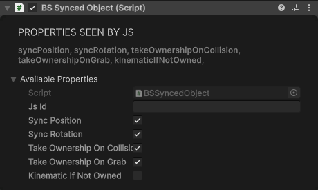

# Multiplayer

Every world is multiplayer. Players who open the same space are put in one room: they see each other's avatars and hear each other without you doing anything. What else they share is up to your world.

## What each player runs

Each player loads their own copy of your scene and runs their own copy of your page, `Assets/WebRoot/index.html`. Nothing is shared by default: an object your script moves, a light it turns on, a score it keeps all change for that player only. To share something, use one of these:

| Tool | What it shares | Use it for |
|---|---|---|
| [Synced objects](#synced-objects) | An object's position and rotation, sent by its owner | Physics props, things players grab, vehicles |
| [One-shots](#one-shots) | A short message to everyone in the room right now | "The button was pressed", "play this sound" |
| [Space state](#space-state) | Named values for the whole space, kept for 24 hours | Scores, the game's phase, a door that is open |
| [User state](#user-state) | Named values for each player | A team, a ready flag, a loadout |
| [Shared time](#shared-time) | A clock every player agrees on | Animation and motion in step, with nothing sent |

Players join the room once the space has loaded, and leave it when they leave the space. The JavaScript calls and events below are listed in full in [User & Multiplayer](../javascript-api/user-multiplayer.md), [Scene API](../javascript-api/scene-api.md#state-management) and [Scene Events](../javascript-api/scene-events.md#state-events).

## Players

`scene.users` holds everyone in the room, keyed by `uid`, and `scene.localUser` is you. `user-joined` fires for every player, including you and the players already in the space when you arrive; `user-left` fires when one leaves.

| Field | What it is |
|---|---|
| `uid` | The player's id: the same on every visit and in every space, and the key of `scene.users`. Use it to tell players apart. |
| `id` | The player's session id for this visit. One-shots name their sender by it (`fromId`). Your own `id` reads `"local"` until you've joined the room, then updates in place. |
| `name` | Display name. |
| `isLocal` | `true` for you. |
| `color` | `"4488FF"` for you and `"AAAAAA"` for everyone else. It isn't the avatar's colour. |

## Synced objects

A **BS Synced Object** shares an object's position and rotation. One player owns the object at a time: their copy is simulated as usual, and everyone else's copy follows it. Add it in the Inspector, or use **GameObject > BS > Objects > Synced Object** (a 0.3 m cube with a Rigidbody). The [grab presets](../building-in-unity/easy-prefabs.md#grab-presets) are synced too.

<div class="docs-tabs">

```js
window.addEventListener("bs-loaded", async () => {
    const scene = BS.Scene.GetInstance();
    scene.On("unity-loaded", async () => {
        const ball = new BS.GameObject({
            name: "Ball",
            layer: BS.L.UI, // so it can be clicked
            localPosition: new BS.Vector3(0, 1.5, 2)
        });
        // Every player's page makes its own ball: give them all the same id, before the SyncedObject.
        await ball.SetNetworkId("ball-1");
        await ball.AddComponent(new BS.Sphere({ radius: 0.2 }));
        await ball.AddComponent(new BS.SphereCollider({ radius: 0.2 }));
        await ball.AddComponent(new BS.Rigidbody({ mass: 1 }));
        const sync = await ball.AddComponent(new BS.SyncedObject());

        // Clicking it makes you the owner, so your physics moves it for everyone.
        ball.On("click", () => sync.TakeOwnership());
    });
});
```



</div>

Every player has to have the object, under the same [BSObjectId](#bsobjectid): that id is how the players' copies find each other.

### Properties

| Property | Default | What it does in the app |
|---|---|---|
| `syncPosition` | `true` | Ignored: the position is always shared. |
| `syncRotation` | `true` | Off: the rotation isn't shared, only the position. |
| `takeOwnershipOnCollision` | `true` | Touching the object with your body, head, hands or feet makes you its owner. |
| `takeOwnershipOnGrab` | `true` | Grabbing the object makes you its owner and holds it until you let go, and the others see it in your hand. The object also has to be grabbable: a [grab handle](../components/vr-interaction.md#grabhandle) on the Grabbable layer, as the grab presets have. |
| `kinematicIfNotOwned` | `false` | Ignored: the copies a player doesn't own are always kinematic (see below). |

The app reads these once, when it sets the object up (a frame after the object starts). Set them in the Inspector, or in the component's config when a script adds it; changing them later has no effect.

**Methods:** `TakeOwnership()` asks to become the owner. `await sync.DoIOwn()` resolves `true` when you own the object.

### How it moves

- The owner sends the object's pose up to 30 times a second while it moves, and once a second while it stays still.
- The other players show it about 100 ms behind the owner (longer on a slow connection), smoothed between updates.
- On the players who don't own it, a physics object's Rigidbody is kinematic: it follows the owner instead of simulating. When ownership moves to you, it turns dynamic again and keeps its speed, so an object you catch doesn't stop dead.
- An object without a Rigidbody, or with a kinematic one, follows the owner's Transform, so the owner's script or animation drives it.
- If the object falls below Y = -250, its owner puts it back where it started.

### Who owns it

The first player in the room owns every synced object, so a player alone in a space owns them all. Ownership moves when:

| What happens | Result |
|---|---|
| A script calls `TakeOwnership()` | You become the owner, unless someone is holding the object. |
| You grab it (`takeOwnershipOnGrab`) | You become the owner and nobody can take it while you hold it. When you let go you stay the owner. If someone else got it first, your hand lets go. |
| You touch it (`takeOwnershipOnCollision`) | When your body, head, hands or feet come within about 0.3 m of it, you become the owner, at most about three times a second, and never while someone holds it. Only players count: objects hitting each other don't move ownership. |
| You sit on a seat that is, or is inside, a synced object | You become the owner, so you drive the vehicle. |
| The owner leaves | About a second later the object passes to the player who owns the fewest objects. |
| Everyone leaves | The object is forgotten. The next player to arrive starts it again from where the scene puts it. |

There is no event when ownership changes.

!> Turn `takeOwnershipOnCollision` off on kinematic objects such as vehicles and moving platforms. Walking into one claims it and turns its Rigidbody dynamic, so it starts to fall and be pushed around.

### Attachments and seats

A [BS Attached Object](../components/vr-interaction.md#attachedobject) attached to your avatar with **Auto Sync** on is shown on your avatar to the other players, and players sitting on a [seat](../building-in-unity/easy-prefabs.md#seat-bsseat) are shown seated. Each player attaches their own copy of the object, so it must be in the scene with a stable [BSObjectId](#bsobjectid), and it shouldn't also be a synced object.

## BSObjectId

The BS components your page can script, everything in [Components](../components/overview.md), need a **BSObjectId** on their GameObject, and Unity adds one when you add the component. It shows in the Inspector as **Unique Object Id**: an **ID** you can't type into and a **Generate** button.

It does two jobs:

- **It registers the object with your page**, so scripts can find it and its components.
- **Its ID is the object's name on the network.** Players match synced objects, attached objects and seats by it. If two players' copies of an object have different IDs, each player gets an object of their own and nothing is shared.

### Where IDs come from

| How the object was made | Its ID |
|---|---|
| Added in the editor | Filled in with a random ID when the component is added, and saved with the scene. |
| Duplicated in the editor (Ctrl+D) | The copy gets a new random ID, saved with the scene (as a prefab override on prefab instances). |
| Placed more than once from a prefab | The first copy keeps the prefab's ID; every further copy in the scene gets a new random ID, saved the same way. |
| **Generate** pressed | A random ID, saved with the scene and kept as a prefab override. |
| Created by a script (`new BS.GameObject`, `scene.Instantiate`) | A number each player's copy picks for itself, so it's different on every player. Set `networkId` to give it one. |

In the published world an ID never changes: whatever was saved is what every player loads, and two objects saved with the same ID keep it.

### Keeping them stable

- Save the scene after adding or duplicating networked objects, so their IDs are kept. The Builder's checklist warns when two objects in the scene share an ID (an older scene, or copies made before this was fixed), and its **Give each a new ID** button fixes them. The [Local Multiplayer](local-testing.md#the-local-multiplayer-window) window also lists IDs that are empty, duplicated or old instance numbers, and **Assign Stable Ids** fixes them all at once.
- For objects your script creates, set a `networkId` before adding the `SyncedObject`, as in the example above. It must be unique in the scene and the same on every player, so build it from something every player's page agrees on, not from a random number.
- Copies made with `scene.Instantiate` get a new per-player ID too. Instantiate an object that has no `SyncedObject`, set the copy's `networkId`, then add the `SyncedObject` to the copy.
- `networkId` only reads back what your script set; it doesn't return the ID an object got in the editor.

## One-shots

A one-shot is a message to everyone else in the room. It isn't stored: players who arrive later never see it.

```js
window.addEventListener("bs-loaded", () => {
    const scene = BS.Scene.GetInstance();

    function throwConfetti(at) { /* your effect */ }

    scene.On("one-shot", (e) => {
        let msg;
        try { msg = JSON.parse(e.detail.data); } catch (err) { return; } // not one of ours
        if (msg.type === "confetti") {
            const sender = Object.values(scene.users).find(u => u.id === e.detail.fromId);
            console.log((sender ? sender.name : "Someone") + " threw confetti");
            throwConfetti(msg.at);
        }
    });

    scene.On("unity-loaded", async () => {
        const button = await scene.Find("ConfettiButton"); // a scene object with a collider on the UI layer
        button.On("click", async () => {
            const msg = { type: "confetti", at: [0, 2, 0] };
            await scene.OneShot(msg); // everyone else
            throwConfetti(msg.at);    // and you: a one-shot never comes back to its sender
        });
    });
});
```

- **Data:** pass a string, or an object, which is sent as JSON. Receivers always get a string in `e.detail.data`, so parse it.
- **Sender:** `fromId` is the sender's session id, their `user.id`. `fromAdmin` is `true` only when the sender is the world's owner, so a receiver can trust an owner's message.
- **Size:** up to 4,089 bytes of text. A bigger message, or one sent before you've joined the room, is dropped.
- The second argument, `allInstances`, is accepted and ignored.
- `await scene.OneShot(...)` resolves once the message is sent; it never says whether anyone received it.

For something that changes every frame, use a synced object instead.

## Space state

Space state is a set of named values that belongs to the space. Every player has a copy, and every change reaches every player.

```js
window.addEventListener("bs-loaded", () => {
    const scene = BS.Scene.GetInstance();

    function setDoor(open) { /* open or close your door */ }

    // Fires for every change, your own included, and with the whole state when you arrive.
    scene.On("space-state-changed", (e) => {
        for (const change of e.detail.changes) {
            if (change.property === "door") setDoor(change.newValue === "open");
        }
    });

    scene.On("unity-loaded", async () => {
        const button = await scene.Find("DoorButton"); // a scene object with a collider on the UI layer
        button.On("click", () => scene.SetPublicSpaceProps({ door: "open" }));
    });
});
```

- **Your own writes come back to you** as changes, so do the work in the change handler, not straight after writing. Then a player who arrives later runs the same code.
- **Arriving players get everything:** when you join, `space-state-changed` fires with every value.
- **It outlives the visit.** Space state is kept until 24 hours after the last change, whether or not anyone is in the space. Reading it, or joining, doesn't extend that.
- **Public** values can be written by anyone in the room. **Protected** values can be written only by the world's owner, an Owner or Moderator of the community hosting it, or a SideQuest admin, and only while signed in. Anyone can read both. Once a key has been written as protected it stays protected; see [What "protected" means](../javascript-api/scene-api.md#what-protected-means).
- `SetPublicSpaceProps` and `SetProtectedSpaceProps` take strings. `SpaceStateSet`, `SpaceStateMerge` and `SpaceStateDelete` take real JSON values and nested paths, and reject with an error you can catch. See [JSON space state](../javascript-api/scene-api.md#json-space-state), [Limits](../javascript-api/scene-api.md#limits) and [State Events](../javascript-api/scene-events.md#state-events).

## User state

User state is a set of named values for each player. Players can write only their own; everyone can read everyone's.

```js
window.addEventListener("bs-loaded", () => {
    const scene = BS.Scene.GetInstance();

    scene.On("user-state-changed", (e) => {
        for (const change of e.detail.changes) {
            if (change.key === "team") console.log(e.detail.user.name, "is on team", change.newValue);
        }
    });

    scene.On("unity-loaded", () => scene.SetUserProps({ team: "red" }));
});
```

- **Only your own:** `SetUserProps` writes yours. Give it no id; if you pass someone else's id, nothing is written.
- **Arriving players get everyone's** current values, as `user-state-changed` events.
- **It ends with the visit:** a player's values are removed 30 seconds after they leave (the grace that lets a dropped connection come back).
- The JSON calls, `UserStateSet`, `UserStateGet` and the rest, are in [JSON user state](../javascript-api/scene-api.md#json-user-state).

## Who can write, and what lasts

| | Who can write | Who gets it | How long it lasts | A player who arrives later gets |
|---|---|---|---|---|
| Synced object | Its owner | Everyone | While anyone is in the room | Its current position |
| One-shot | Anyone in the room | Everyone else in the room now | Not kept | Nothing |
| Public space state | Anyone | Everyone | 24 h after the last change | Every value |
| Protected space state | The world's owner, community Owners and Moderators, SideQuest admins | Everyone | 24 h after the last change | Every value |
| User state | The player it belongs to | Everyone | Until 30 s after the player leaves | Everyone's values |

## Shared time

Every player's device can read the same clock, so things driven by it move in step on every screen with nothing sent at all. It is the time of day in UTC; in the app it is corrected to the multiplayer server's time, so a device whose clock is a little off still agrees. In Play mode it is your computer's clock.

### Sync Loop

**Add Component > BS > Sync > Sync Loop.** Its **On Sync** event fires at the same moment on every player, each time the shared clock passes a multiple of **Interval** (seconds, default 10). Wire it to restart an Animation or a Playable Director, and the animation is in step everywhere; a player who arrives later falls into step at the next interval. **Run Once** fires once and stops.

Use an interval of 2 seconds or more: shorter intervals fire more often than they should.

### Spline Clock Rider

**Add Component > BS > Sync > Spline Clock Rider** moves an object along a spline at a pace set by the shared clock, so every player sees it in the same place. It needs Unity's Splines package (`com.unity.splines`).

| Field | What it does |
|---|---|
| Spline | The Spline Container to ride. Empty: the nearest one on a parent. |
| Loop Seconds | Time for one lap (default 30). |
| Phase Offset | Where on the lap this object is, 0 to 1. Give each car of a train its own offset. |
| Reverse | Travel the other way. |
| Align To Track | Face along the spline. Off: only the position changes. |
| Euler Offset | Extra rotation, for a model whose front isn't +Z. |

A kinematic Rigidbody is moved with physics, so players sitting on a seat on it ride along. Without a Rigidbody, or with a dynamic one, the Transform is set directly.

## Visual Scripting

Graphs have the same tools. See [Visual Scripting](../visual-scripting/overview.md#event-nodes) for every node.

| Tool | Nodes |
|---|---|
| Players | On User Joined, On User Left, Get Users |
| One-shots | Send a One Shot Message; On One Shot (its `Data` is the message, without the sender) |
| Space state | Set Space State Property, Set Space State Value, Get Space State Value, On Space State Properties Changed, On Space State Value Changed |
| User state | Set My User State Value, Get User State Value, On User State Value Changed |
| Synced objects | Search the fuzzy finder for **Take Ownership** and **Do I Own**: the BS Synced Object's own members (see [Codebase Member Nodes](../visual-scripting/overview.md#codebase-member-nodes)). **Do I Own** returns `true` when you own the object. |

## Testing

In Play mode you are the only player, and several of these features do nothing. To test them, run more players in the editor with [local multiplayer](local-testing.md).
