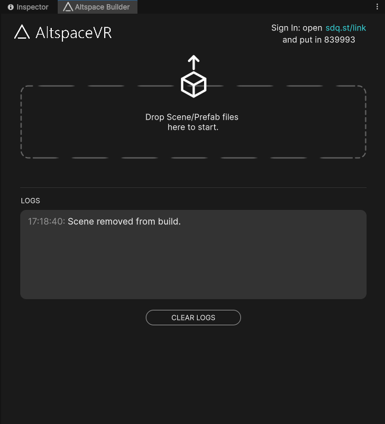

# SideQuest Creator SDK Documentation

Create interactive 3D VR spaces using JavaScript. The SideQuest Creator SDK provides a complete API for building multiplayer virtual reality experiences.

> **The `Banter` prefix is gone from the API.** `BS.BanterBrowser` is now `BS.Browser`,
> `BS.BanterGLTF` is now `BS.GLTF`, and the scene singleton is `BS.Scene.GetInstance()`.
> The examples below use the new names.
>
> Existing scripts keep working. Every previous name remains as a deprecated alias, including
> the `BS.ComponentType` members — `BS.CT.BanterBrowser` still resolves to `BS.CT.Browser`.
> `BS.BanterScene` is a plain alias, so it is literally the same class as `BS.Scene`.
> The component aliases are subclasses that override `Symbol.hasInstance`, so `instanceof`
> holds in both directions there too.
>
> Component ids on the wire are unchanged. Components added after this rename will not get an
> alias.
>
> The Unity Editor menus still use the legacy names (`Altspace`, `Banter`) — these docs quote menu
> paths such as `Altspace/Altspace Builder` and `Banter/Platform Filter` literally.

---

## Table of Contents

- [Installation](#installation)
  - [Installer Package](#installer-package)
  - [Embedded Package](#embedded-package)
  - [Samples](#samples)
- [Quick Start](#quick-start)
- [The Builder Window](#the-builder-window)
  - [Opening & Signing In](#opening--signing-in)
  - [Building a World (Scene Mode)](#building-a-world-scene-mode)
  - [Building a Kit (Kit Mode)](#building-a-kit-kit-mode)
  - [Build Validation & Logs](#build-validation--logs)
- [Core Concepts](#core-concepts)
  - [Scene](#scene)
  - [GameObject](#gameobject)
  - [Components](#components)
  - [Transform](#transform)
  - [Assets](#assets)
  - [Node Graphs](#node-graphs)
- [Scene API](#scene-api)
  - [Getting the Scene](#getting-the-scene)
  - [Properties](#properties)
  - [Waiting for Load](#waiting-for-load)
  - [Finding Objects](#finding-objects)
  - [Creating & Cloning Objects](#creating--cloning-objects)
  - [Batch Operations & Watching](#batch-operations--watching)
  - [State Management](#state-management)
  - [Browser & Page Methods](#browser--page-methods)
  - [Text-to-Speech](#text-to-speech)
  - [AI Generation](#ai-generation)
  - [Utility Methods](#utility-methods)
- [Scene Settings](#scene-settings)
  - [General Settings](#general-settings)
  - [Physics Settings](#physics-settings)
  - [Scene Physics Methods](#scene-physics-methods)
  - [Player Control Methods](#player-control-methods)
  - [Input Blocking & Controller Events](#input-blocking--controller-events)
- [Scene Events](#scene-events)
  - [Core Events](#core-events)
  - [User Events](#user-events)
  - [Keyboard Events](#keyboard-events)
  - [State Events](#state-events)
  - [Voice Events](#voice-events)
  - [AI & File Events](#ai--file-events)
  - [Pose Events](#pose-events)
  - [Component & GameObject Events](#component--gameobject-events)
  - [Browser Events](#browser-events)
  - [UserData Events](#userdata-events)
- [GameObject API](#gameobject-api)
  - [Creating GameObjects](#creating-gameobjects)
  - [GameObjectConfig Interface](#gameobjectconfig-interface)
  - [Properties](#properties-1)
  - [Transform Methods](#transform-methods)
  - [Hierarchy Methods](#hierarchy-methods)
  - [Component Methods](#component-methods)
  - [Other Methods](#other-methods)
  - [GameObject Events](#gameobject-events)
- [Component Base Class & Events](#component-base-class--events)
  - [Component Properties & Methods](#component-properties--methods)
  - [Event Methods (GameEventTarget)](#event-methods-gameeventtarget)
- [Components](#components-1)
- [Physics Components](#physics-components)
  - [Rigidbody](#rigidbody)
  - [BoxCollider](#boxcollider)
  - [SphereCollider](#spherecollider)
  - [CapsuleCollider](#capsulecollider)
  - [MeshCollider](#meshcollider)
  - [ColliderEvents](#colliderevents)
  - [PhysicMaterial](#physicmaterial)
  - [PhysicsMaterial](#physicsmaterial)
- [Joint Components](#joint-components)
  - [CharacterJoint](#characterjoint)
  - [FixedJoint](#fixedjoint)
  - [HingeJoint](#hingejoint)
  - [SpringJoint](#springjoint)
  - [ConfigurableJoint](#configurablejoint)
- [Rendering & Visual Components](#rendering--visual-components)
  - [Light](#light)
  - [Material](#material)
  - [Text](#text)
  - [Billboard](#billboard)
  - [Mirror](#mirror)
  - [InvertedMesh](#invertedmesh)
  - [SkinnedMeshRenderer](#skinnedmeshrenderer)
- [Geometry Primitives](#geometry-primitives)
  - [Box](#box)
  - [Sphere](#sphere)
  - [Plane](#plane)
  - [Cylinder](#cylinder)
  - [Cone](#cone)
  - [Circle](#circle)
  - [Torus](#torus)
  - [TorusKnot](#torusknot)
  - [Capsule](#capsule)
  - [Ring](#ring)
  - [Polyhedra](#polyhedra)
  - [Procedural Geometry](#procedural-geometry)
  - [Parametric Shapes](#parametric-shapes)
- [Audio Components](#audio-components)
  - [AudioSource](#audiosource)
- [Media & Content Components](#media--content-components)
  - [GLTF](#gltf)
  - [AssetBundle](#assetbundle)
  - [VideoPlayer](#videoplayer)
  - [Browser](#browser)
  - [StreetView](#streetview)
  - [Portal](#portal)
- [VR Interaction Components](#vr-interaction-components)
  - [Grababble](#grababble)
  - [GrabHandle](#grabhandle)
  - [HeldEvents](#heldevents)
  - [AttachedObject](#attachedobject)
- [Special Components](#special-components)
  - [KitItem](#kititem)
  - [KitAsset](#kitasset)
  - [SyncedObject](#syncedobject)
  - [WorldObject](#worldobject)
  - [AvatarPedestal](#avatarpedestal)
  - [QuestHome](#questhome)
  - [MonoBehaviour](#monobehaviour)
  - [ScriptGraph](#scriptgraph)
  - [AOBaking](#aobaking)
- [UI System](#ui-system)
  - [UIPanel](#uipanel)
  - [UIElement (Base Class)](#uielement-base-class)
  - [UIButton](#uibutton)
  - [UILabel](#uilabel)
  - [UISlider](#uislider)
  - [UIToggle](#uitoggle)
  - [UIScrollView](#uiscrollview)
  - [UIVisualElement](#uivisualelement)
  - [UITextField](#uitextfield)
  - [UIEdgeLayer](#uiedgelayer)
  - [BanterUI Factory Helpers](#banterui-factory-helpers)
  - [Style Properties Reference](#style-properties-reference)
- [Asset System](#asset-system)
  - [Asset](#asset)
  - [AssetRegistry](#assetregistry)
  - [Asset References & Wrappers](#asset-references--wrappers)
  - [Worked Example](#worked-example)
- [Math Types](#math-types)
  - [Vector2](#vector2)
  - [Vector3](#vector3)
  - [Vector4](#vector4)
  - [Quaternion](#quaternion)
- [Global Functions & Utility Types](#global-functions--utility-types)
  - [Global Functions](#global-functions)
  - [Color](#color)
  - [SoftJointLimit & JointDrive](#softjointlimit--jointdrive)
  - [JointLimits](#jointlimits)
  - [ComponentQuery](#componentquery)
  - [SceneSettings Serialization](#scenesettings-serialization)
- [Enums & Constants](#enums--constants)
  - [ComponentType (BS.CT)](#componenttype-bsct)
  - [ForceMode](#forcemode)
  - [HandSide](#handside)
  - [ButtonType](#buttontype)
  - [GeometryType](#geometrytype)
  - [PropertyName (BS.PN)](#propertyname-bspn)
  - [BanterLayers (BS.L)](#banterlayers-bsl)
  - [MaterialSide](#materialside)
  - [LightType](#lighttype)
  - [LightShadows](#lightshadows)
  - [HorizontalAlignment](#horizontalalignment)
  - [VerticalAlignment](#verticalalignment)
  - [CollisionDetectionMode](#collisiondetectionmode)
  - [ConfigurableJointMotion](#configurablejointmotion)
- [User & Multiplayer](#user--multiplayer)
  - [UserData](#userdata)
  - [Attaching Objects to Users](#attaching-objects-to-users)
  - [State Synchronization](#state-synchronization)
- [Visual Scripting](#visual-scripting)
  - [Overview](#overview)
  - [Setup](#setup)
  - [Your First Graph](#your-first-graph)
  - [Event Nodes](#event-nodes)
  - [BS Node Categories](#bs-node-categories)
  - [Standard Unity Nodes](#standard-unity-nodes)
  - [Codebase Member Nodes](#codebase-member-nodes)
  - [Build Validation](#build-validation)
  - [Sample Graphs](#sample-graphs)
  - [Controlling Graphs from JavaScript](#controlling-graphs-from-javascript)
- [Advanced: ScriptGraphBridge](#advanced-scriptgraphbridge)
- [Snippets (BSSnippet)](#snippets-bssnippet)
  - [Adding a Snippet](#adding-a-snippet)
  - [The Inspector](#the-inspector)
  - [Gizmos](#gizmos)
  - [How the HTML Stays in Sync](#how-the-html-stays-in-sync)
  - [The Snippet Section in index.html](#the-snippet-section-in-indexhtml)
  - [Runtime Behaviour](#runtime-behaviour)
  - [Authoring a Snippet](#authoring-a-snippet)
  - [Housekeeping & Gotchas](#housekeeping--gotchas)
- [Platform Filter (BSPlatformFilter)](#platform-filter-bsplatformfilter)
  - [Build-Time Semantics](#build-time-semantics)
  - [Example: Platform-Specific Detail](#example-platform-specific-detail)
- [Internal & Legacy APIs](#internal--legacy-apis)
  - [Internal Scene Methods](#internal-scene-methods)
  - [Legacy Scene Methods](#legacy-scene-methods)
  - [Internal GameObject & Component Methods](#internal-gameobject--component-methods)
- [Additional Resources](#additional-resources)

---

## Installation

Requires Unity 6000.3.10f1 or newer.

### Installer Package

Download the installer and import it into your Unity project:

**[Install-com.sidequest.creator-sdk-latest.unitypackage](https://altvr.app/files/Install-com.sidequest.creator-sdk-latest.unitypackage)**

Double-click the downloaded file with your project open, or use `Assets > Import Package > Custom Package...`, then import everything it offers.

### Embedded Package

Alternatively, place the `com.sidequest.creator-sdk` folder directly in your project's `Packages/` folder. Unity picks it up as an embedded package on the next refresh.

### Samples

Import samples via `Window > Package Manager > SideQuest Creator SDK > Samples`.

| Sample | Description |
|--------|-------------|
| Basics | Getting-started worlds: Basics (learn how to build worlds), Gadgets (fun tools to add to your world), Gravity Maze (an example space that manipulates gravity), Networking (learn how to use networking components) |
| FlexaWorld | A physics-fuelled playground showcasing the best of the FlexaBody system |

---

## Quick Start

```js
window.addEventListener("bs-loaded", async () => {
    // Get the scene singleton
    const scene = BS.Scene.GetInstance();

    // Wait for the scene to be ready
    scene.On("unity-loaded", () => {

        // Create a simple object with a red sphere
        const sphere = new BS.GameObject({
            name: "MySphere",
            layer: BS.L.UI, // Layer 5 for UI.
            localPosition: new BS.Vector3(0, 1.5, 2)
        });

        // Add visual geometry
        sphere.AddComponent(new BS.Sphere({ radius: 0.5 }));
        sphere.AddComponent(new BS.Material({
            color: new BS.Vector4(1, 0, 0, 1)
        }));

        // Add physics
        sphere.AddComponent(new BS.SphereCollider({ radius: 0.5 }));
        sphere.AddComponent(new BS.Rigidbody({ mass: 1, useGravity: true }));

        // Handle clicks
        sphere.On("click", (e) => {
            console.log("Clicked at:", e.detail.point);
        });
    });
});
```

The `bs-loaded` event is latched: a listener added after the event has already fired is invoked immediately. Deferred scripts (`<script type="module">`) and other late-loading code can register the listener whenever they run — load order is never a race.

---

## The Builder Window

The Builder builds your world and uploads it to SideQuest without leaving Unity. Open it via `Altspace/Altspace Builder` — the window docks next to the Inspector.



### Opening & Signing In

The window header shows a device code: "Sign In: open sdq.st/link and put in `<code>`".

1. Open sdq.st/link in a browser and sign in to your SideQuest account.
2. Enter the code shown in the window.
3. The window polls until the account is linked, then greets you by name.

If polling stops (it gives up after ~10 unsuccessful checks, or on an API error), close and reopen the window to get a fresh code. `Sign out` in the header switches accounts.

Building works while signed out; the world list and every upload action require signing in.

### Building a World (Scene Mode)

Drop a `.unity` scene file onto the drop area to enter Scene mode. The selected scene path is shown in place of the drop area and remembered between sessions; RESET clears it.

Pick a destination from the **World** dropdown — its hosting URL appears underneath, and the last-used world is reselected automatically. No world yet? Click "Create One." to name and create one right in the window.

| Button | Action |
|--------|--------|
| BUILD | Builds the scene into `Assets/WebRoot` as `asset.world`, a single platform-agnostic bundle that every platform loads |
| BUILD & UPLOAD | Same button with **Auto Upload** ticked (and signed in): uploads to the selected world when the build finishes |
| UPLOAD HTML+JS | Uploads just the web files from `Assets/WebRoot` — fast iteration on scripts without rebuilding |
| UPLOAD ALL | Uploads everything: `asset.world` plus the web files |
| WEBROOT FOLDER | Highlights the `Assets/WebRoot` output folder in the Project window |
| ANALYZE BUNDLE | Previews the AssetBundle contents and estimated size of the currently open scene (the scene must be saved to disk) |

The **Auto Upload** toggle is remembered per project.

### Building a Kit (Kit Mode)

Drop one or more prefabs onto the drop area to enter Kit mode. Only GameObject, Material, and Shader assets are accepted — anything else is skipped with a console warning, and duplicates are ignored. REMOVE SELECTED deletes highlighted entries from the item list.

1. Fill in the kit name, description, and category, and pick a cover image — all four are required to upload.
2. Or select one of your existing kits from the dropdown to update it instead of creating a new one.
3. Click **BUILD & UPLOAD**.

The build produces one bundle per platform in `Assets/WebRoot` and uploads both:

```
kitbundle_android_<name>.banter
kitbundle_standalonewindows_<name>.banter
```

### Build Validation & Logs

A confirmation dialog summarizes every build before it runs — build mode, plus the scene file and destination world (Scene mode) or the kit name and item count (Kit mode). CANCEL backs out without building.

Once confirmed, every build first validates the scene's visual scripting graphs (see [Visual Scripting](#visual-scripting)). Disallowed nodes stop the build, with details in the logs.

The LOGS pane at the bottom of the window streams build and upload progress; the status bar mirrors the latest entry, and a progress bar appears above it during uploads. CLEAR LOGS empties the pane.

---

## Core Concepts

### Scene
The scene is the top-level singleton that manages all GameObjects, components, users, and communication with Unity. Access it via `BS.Scene.GetInstance()`.

### GameObject
GameObjects are the basic building blocks - containers that hold components. Create them with `new BS.GameObject({...})`. Every GameObject has a Transform for position, rotation, and scale.

### Components
Components add functionality to GameObjects. Physics, rendering, audio, interaction - all are components. Add them with `gameObject.AddComponent(new BS.ComponentName({...}))`.

### Transform
Every GameObject has a transform controlling its position, rotation, and scale in 3D space. Set these in the constructor or modify later with methods like `SetPosition()`.

### Assets
Large content such as textures, audio, and 3D models is tracked as assets rather than passed inline. See [Asset System](#asset-system).

### Node Graphs
Worlds can also be scripted without JavaScript, using node graphs authored in the Unity Editor. See [Visual Scripting](#visual-scripting).

---

## Scene API

### Getting the Scene

```js
const scene = BS.Scene.GetInstance();
```

### Properties

| Property | Type | Description |
|----------|------|-------------|
| `objects` | Object | All GameObjects in the scene by ID |
| `components` | Object | All Components in the scene by ID |
| `users` | Object | All connected users by UID |
| `localUser` | UserData | The current local user |
| `unityLoaded` | boolean | True when Unity is fully loaded |
| `domLoaded` | boolean | True when the page DOM has finished loading |
| `spaceState` | Object | Current space state (public/protected) |

```js
// Look up by id (ids arrive in events and updates)
const obj = scene.objects[objectId];        // GameObject
const comp = scene.components[componentId]; // Component
const user = scene.users[uid];              // UserData

// Iterate what's currently in the scene
Object.values(scene.objects).forEach(o => console.log(o.name));
console.log(Object.keys(scene.users).length, "users connected");
console.log(scene.localUser.name); // the local user (set once the local user has joined)
```

### Waiting for Load

```js
// Resolve once Unity is fully loaded (fires immediately if it already is)
await scene.WaitForUnityLoaded();

// Resolve once a specific GameObject or Component is linked to its Unity counterpart
const spawner = new BS.GameObject({ name: "Spawner" });
await scene.WaitForUnity(spawner); // same as spawner.Async()
```

### Finding Objects

```js
// Find by name (first match)
const obj = scene.Find("MyObject");

// Find by full hierarchy path
const child = scene.FindByPath("Parent/Child/GrandChild");
```

Component property values are cached JS-side. `QueryComponents` re-reads specific properties from Unity:

```js
// Pull fresh values for chosen properties across any number of components
const query = new BS.ComponentQuery()
    .Add(rigidbody, [BS.PN.velocity, BS.PN.angularVelocity])
    .Add(textComponent, [BS.PN.text]);

await scene.QueryComponents(query); // resolves with the components, values refreshed
console.log(rigidbody.velocity, textComponent.text);

// Single-component shorthand
await rigidbody.GetProperties([BS.PN.velocity]);
```

### Creating & Cloning Objects

```js
// Clone an existing object
const clone = scene.Instantiate(originalObject);

// Clone with position and rotation
const clone = scene.Instantiate(original, new BS.Vector3(0, 1, 0), new BS.Quaternion(0, 0, 0, 1));

// Clone with parent
const clone = scene.Instantiate(original, parentObject, true); // worldPositionStays = true
```

```js
// Register a script-created GameObject and create it Unity-side
// (the BS.GameObject constructor calls this for you)
scene.AddObject(myObject, true); // isUnlinked = true

// Remove an object and all of its components (same as obj.Destroy())
scene.RemoveObject(obj);

// Remove a single component (same as component.Destroy())
scene.RemoveComponent(component);
```

### Batch Operations & Watching

Assigning a component property sends one message per assignment. `SetComponents` pushes several property writes — across any number of components — in a single message:

```js
// Mutate values in place (plain assignment would send immediately), then push once
material.color.x = 1;
material.color.w = 0.5;
rigidbody.velocity.y = 5;

const query = new BS.ComponentQuery()
    .Add(material, [BS.PN.color])
    .Add(rigidbody, [BS.PN.velocity]);

await scene.SetComponents(query);       // fire-and-forget batch
await scene.SetComponents(query, true); // readBack = true: waits for the Unity round trip
```

`WatchProperties` streams changes from Unity back to the JS side. Updated values land on the component and fire `object-update` on its GameObject:

```js
// Per-component form
rigidbody.WatchProperties([BS.PN.velocity]);

// Scene-level form takes { id, properties }
scene.WatchProperties({ id: rigidbody.unityId, properties: [BS.PN.velocity] });

rigidbody.gameObject.On("object-update", (e) => {
    console.log(e.detail);            // ids of the components that changed
    console.log(rigidbody.velocity);  // refreshed
});
```

`CallMethod` invokes a method on a component by name. Arguments are strings prefixed with a type code: `0` = bool, `1` = int, `2` = float, `3` = string, `4` = Vector2, `5` = Vector3, `6` = Vector4 or quaternion (vector values `|`-separated):

```js
scene.CallMethod(audioSource, "PlayOneShotFromUrl", ["3|https://example.com/ding.mp3"]);
scene.CallMethod(rigidbody, "AddForce", ["5|0|10|0", "1|" + BS.ForceMode.Impulse]);
```

The built-in component methods (`rb.AddForce(...)`, `audio.PlayOneShot(...)`, etc.) call this under the hood.

### State Management

```js
// Set public properties (visible to all, persists)
scene.SetPublicSpaceProps({ "score": "100", "level": "3" });

// Set protected properties (admin/mod only can set)
scene.SetProtectedSpaceProps({ "gameMode": "competitive" });

// Set user-specific properties
scene.SetUserProps({ "team": "red" }, userId);

// Send one-shot message to all users
scene.OneShot({ action: "explosion", position: [0, 1, 0] }, true); // allInstances
```

### Browser & Page Methods

```js
// Open a URL in the user's menu browser
scene.OpenPage("https://example.com");

// Send message to browser in menu
scene.SendBrowserMessage("hello from space");

// Deep link with message
scene.DeepLink("https://example.com", "welcome");
```

### Text-to-Speech

```js
// Start voice detection
scene.StartTTS(true); // voiceDetection = true

// Stop and get transcription (provide ID for tracking)
scene.StopTTS("request-1");

// Listen for result
scene.On("transcription", (e) => {
    console.log(e.detail.id, e.detail.message);
});
```

### AI Generation

```js
// Generate an AI image (ratio: _1_1, _3_2, _4_3, _16_9, _21_9, _2_3, _3_4, _9_16, _9_21)
scene.AiImage("a sunset over mountains", BS.AiImageRatio._1_1);

// Generate 3D model from image (simplify: low, med, high)
scene.AiModel(base64ImageData, BS.AiModelSimplify.med, 512);
```

### Utility Methods

```js
// Wait for end of frame (sync with Unity render)
scene.WaitForEndOfFrame();

// Select a file from user
scene.SelectFile(BS.SelectFileType.Image);

// Upload base64 to CDN
scene.Base64ToCDN(base64Data, "myfile.png");

// Get YouTube video info
scene.YtInfo("dQw4w9WgXcQ");
```

```js
// Get the current platform
const platform = await scene.GetPlatform();

// Grab the texture on one of an object's materials as base64
const b64 = await scene.ObjectTextureToBase64(obj, 0); // materialIndex = 0

// Save and restore the whole scene
const saved = scene.Serialise();            // every object + components, as a string
const restored = scene.Deserialise(saved);  // rebuild; returns the created GameObjects in payload order
scene.Deserialise(saved, parentObject);     // adopts anything whose recorded parent isn't in the payload

// Baked lighting data
const lighting = await scene.LightingDataGet(); // persistable string, "" when nothing is baked
await scene.LightingDataSet(lighting);          // apply a previously stored payload
```

`Deserialise` also accepts a single object's `Serialise(true)` output (run it through `JSON.stringify` first — `Serialise(true)` returns an array, and `Deserialise` takes the JSON string), so a subtree can be saved and restored on its own.

Two low-level pipes round out the scene surface:

- `scene.ScriptGraphRequest(payload)` — raw request pipe behind [Advanced: ScriptGraphBridge](#advanced-scriptgraphbridge); prefer the typed wrapper.
- `scene.SendToVisualScripting(returnId, data)` — resolves a waiting [Visual Scripting](#visual-scripting) callback with a JSON payload.

---

## Scene Settings

Configure scene behavior with `SceneSettings`:

```js
const settings = new BS.SceneSettings();

// General settings
settings.EnableDevTools = true;
settings.EnableTeleport = true;
settings.EnableForceGrab = false;
settings.EnableSpiderMan = false;
settings.EnablePortals = true;
settings.EnableGuests = true;
settings.EnableAvatars = true;
settings.MaxOccupancy = 20;
settings.RefreshRate = 72;
settings.ClippingPlane = new BS.Vector2(0.02, 1500);
settings.SpawnPoint = new BS.Vector4(0, 10, 0, 90); // x,y,z position, w = Y rotation

scene.SetSettings(settings);
```

### General Settings

| Setting | Type | Default | Description |
|---------|------|---------|-------------|
| `EnableDevTools` | boolean | false | Show developer console |
| `EnableTeleport` | boolean | true | Allow teleportation |
| `EnableForceGrab` | boolean | false | Grab objects at distance |
| `EnableSpiderMan` | boolean | false | Wall climbing ability |
| `EnableHandHold` | boolean | true | Hand physics enabled |
| `EnableRadar` | boolean | false | Show mini-map |
| `EnableNametags` | boolean | true | Show player names |
| `EnablePortals` | boolean | true | Allow portal travel |
| `EnableGuests` | boolean | true | Allow guest users |
| `EnableQuaternionPose` | boolean | false | Quaternion pose updates |
| `EnableControllerExtras` | boolean | false | Extra controller data |
| `EnableFriendPositionJoin` | boolean | true | Join at friend location |
| `EnableDefaultTextures` | boolean | true | Use default materials |
| `EnableAvatars` | boolean | true | Show avatars |
| `MaxOccupancy` | number | 20 | Maximum players |
| `RefreshRate` | number | 72 | Target FPS |
| `ClippingPlane` | Vector2 | (0.02, 1500) | Near/far clip planes |
| `SpawnPoint` | Vector4 | (0, 0, 0, 0) | Spawn position + Y rotation |
| `SettingsLocked` | boolean | false | Prevent setting changes |

### Physics Settings

| Setting | Type | Default | Description |
|---------|------|---------|-------------|
| `PhysicsMoveSpeed` | number | 4 | Walking speed |
| `PhysicsMoveAcceleration` | number | 4.6 | Walking acceleration |
| `PhysicsAirControlSpeed` | number | 3.8 | Air movement speed |
| `PhysicsAirControlAcceleration` | number | 6 | Air acceleration |
| `PhysicsDrag` | number | 0 | Air resistance |
| `PhysicsFreeFallAngularDrag` | number | 6 | Spin resistance when falling |
| `PhysicsJumpStrength` | number | 1 | Jump power multiplier |
| `PhysicsHandPositionStrength` | number | 1 | Hand tracking position weight |
| `PhysicsHandRotationStrength` | number | 1 | Hand tracking rotation weight |
| `PhysicsHandSpringiness` | number | 10 | Hand smoothing |
| `PhysicsGrappleRange` | number | 512 | Grapple hook distance |
| `PhysicsGrappleReelSpeed` | number | 1 | Grapple pull speed |
| `PhysicsGrappleSpringiness` | number | 10 | Grapple smoothing |
| `PhysicsGorillaMode` | boolean | false | Gorilla-style climbing |
| `PhysicsSettingsLocked` | boolean | false | Prevent physics changes |

### Scene Physics Methods

```js
// Set gravity (default is 0, -9.8, 0)
scene.Gravity(new BS.Vector3(0, -9.8, 0));

// Set time scale (1 = normal, 0.5 = half speed)
scene.TimeScale(1);

// Cast a ray into the scene
scene.Raycast(
    new BS.Vector3(0, 1, 0),  // origin
    new BS.Vector3(0, -1, 0), // direction
    100,                       // distance
    ~0                         // layerMask (~0 = all layers)
);
```

### Player Control Methods

```js
// Enable/disable player abilities
scene.SetCanMove(true);
scene.SetCanRotate(true);
scene.SetCanCrouch(true);
scene.SetCanTeleport(true);
scene.SetCanGrapple(true);
scene.SetCanJump(true);
scene.SetCanGrab(true);

// Teleport the player
scene.TeleportTo(
    new BS.Vector3(0, 5, 0), // position
    90,                       // Y rotation in degrees
    true,                     // stop velocity
    false                     // isSpawn (respects spawn point)
);

// Apply force to player
scene.AddPlayerForce(new BS.Vector3(0, 10, 0), BS.ForceMode.Impulse);

// Set player speed mode
scene.PlayerSpeed(true); // true = fast, false = normal

// Send haptic feedback
scene.SendHapticImpulse(0.5, 0.1, BS.HandSide.LEFT); // amplitude, duration, hand
```

### Input Blocking & Controller Events

Block specific controller inputs to handle them yourself:

```js
// Block thumbstick input (for custom movement/menus)
scene.SetBlockLeftThumbstick(true);
scene.SetBlockRightThumbstick(true);
scene.SetBlockLeftThumbstickClick(true);
scene.SetBlockRightThumbstickClick(true);

// Block button input
scene.SetBlockLeftPrimary(true);
scene.SetBlockRightPrimary(true);
scene.SetBlockLeftSecondary(true);
scene.SetBlockRightSecondary(true);

// Block trigger input
scene.SetBlockLeftTrigger(true);
scene.SetBlockRightTrigger(true);
```

#### Controller Input Events

When inputs are blocked, handle them with these events:

```js
// Button pressed
scene.On("button-pressed", (e) => {
    console.log(e.detail.button, e.detail.side);
    // button: BS.ButtonType (TRIGGER, GRIP, PRIMARY, SECONDARY, THUMBSTICK)
    // side: BS.HandSide (LEFT, RIGHT)
});

// Button released
scene.On("button-released", (e) => {
    console.log(e.detail.button, e.detail.side);
});

// Thumbstick axis (fires continuously while moved)
scene.On("controller-axis-update", (e) => {
    console.log(e.detail.hand, e.detail.x, e.detail.y);
    // hand: BS.HandSide (LEFT, RIGHT)
    // x: number (-1 to 1, left/right)
    // y: number (-1 to 1, down/up)
});

// Trigger axis (fires continuously while pressed)
scene.On("trigger-axis-update", (e) => {
    console.log(e.detail.hand, e.detail.value);
    // hand: BS.HandSide (LEFT, RIGHT)
    // value: number (0 to 1, trigger depression)
});
```

---

## Scene Events

Listen to scene events with `scene.On(eventName, callback)`. All event methods accept an optional third `debounce` argument in milliseconds — see [Event Methods (GameEventTarget)](#event-methods-gameeventtarget):

### Core Events

```js
// Scene has settled, all objects enumerated
scene.On("loaded", () => {
    console.log("Scene loaded");
});

// Unity fully loaded, loading screen gone
scene.On("unity-loaded", () => {
    console.log("Ready to interact");
});
```

### User Events

```js
// User joined the space
scene.On("user-joined", (e) => {
    const user = e.detail; // UserData object
    console.log(user.name, "joined");
});

// User left the space
scene.On("user-left", (e) => {
    const user = e.detail;
    console.log(user.name, "left");
});

// A user's synced props changed (see SetUserProps)
scene.On("user-state-changed", (e) => {
    console.log(e.detail.user.name); // UserData
    e.detail.changes.forEach(change => {
        console.log(change.key, change.newValue, change.oldValue);
    });
});
```

### Keyboard Events

```js
// Keyboard key pressed
scene.On("key-press", (e) => {
    console.log(e.detail.key); // BS.KeyCode value
});
```

### State Events

```js
// Space state property changed
scene.On("space-state-changed", (e) => {
    e.detail.changes.forEach(change => {
        console.log(change.property, change.oldValue, change.newValue);
    });
});
```

The `changes` entries come in two shapes depending on how the update arrived:

```js
// Single property update:
// { property, oldValue, newValue, isPublic: boolean }

// Bulk state diff (full-state refresh):
// { type: "public" | "protected", property, oldValue, newValue }
scene.On("space-state-changed", (e) => {
    e.detail.changes.forEach(change => {
        const isPublic = change.isPublic ?? (change.type === "public");
        console.log(isPublic ? "public" : "protected", change.property, "=", change.newValue);
    });
});
```

```js

// One-shot message received
scene.On("one-shot", (e) => {
    console.log(e.detail.fromId);    // sender user ID
    console.log(e.detail.fromAdmin); // sender is admin
    console.log(e.detail.data);      // message data
});
```

### Voice Events

```js
// TTS started listening
scene.On("voice-started", () => {
    console.log("Listening...");
});

// TTS transcription result
scene.On("transcription", (e) => {
    console.log(e.detail.id, e.detail.message);
});
```

### AI & File Events

```js
// AiImage() finished
scene.On("ai-image", (e) => {
    console.log(e.detail.message); // the generated image
});

// AiModel() finished
scene.On("ai-model", (e) => {
    console.log(e.detail.message); // the generated model (GLB)
});

// Base64ToCDN() upload finished
scene.On("base-64-to-cdn", (e) => {
    console.log(e.detail.fileId); // id of the uploaded file
});

// SelectFile() picker closed
scene.On("select-file-recv", (e) => {
    // base64 contents of the chosen file, or "too-large-over-4mb" past the 4MB limit
    console.log(e.detail.data);
});
```

### Pose Events

```js
// Local player's head and hand poses, streamed from Unity
scene.On("pose-update", (e) => {
    const { head, leftHand, rightHand } = e.detail;
    console.log(head.position);  // Vector3
    console.log(head.rotation);  // Quaternion
    console.log(leftHand.position, rightHand.position);
});
```

### Component & GameObject Events

Components and GameObjects fire their own events you can listen to:

```js
const obj = new BS.GameObject({ name: "Model" });
const gltf = obj.AddComponent(new BS.GLTF({ url: "model.glb" }));

// Component finished loading its asset (GLTF, video, audio, etc.)
gltf.On("loaded", () => {
    console.log("Model loaded!", gltf.isLoaded); // true
});

// Loading progress (0-1 for components that load assets)
gltf.On("progress", (e) => {
    console.log("Loading:", e.detail.progress * 100 + "%");
});

// Component/GameObject linked to Unity engine
gltf.On("unity-linked", (e) => {
    console.log("Unity ID:", e.detail.unityId);
});

// GameObject received update from Unity
obj.On("object-update", (e) => {
    console.log("Updated components:", e.detail); // array of component IDs
});
```

**Component `isLoaded` property:**
```js
// Check if component has finished loading
if (gltf.isLoaded) {
    // Asset is ready
}
```

### Browser Events

```js
// Message from menu browser
scene.On("menu-browser-message", (e) => {
    console.log(e.detail);
});

// Legacy A-Frame trigger
scene.On("aframe-trigger", (e) => {
    console.log(e.detail.data);
});
```

### UserData Events

UserData objects are event targets too — listen on a user directly:

```js
const user = scene.localUser;

// This user's synced props changed
user.On("state-changed", (e) => {
    e.detail.changes.forEach(change => console.log(change.key, change.newValue));
});

// This user's body touched an object that has ColliderEvents
user.On("collision-enter", (e) => {
    console.log(e.detail.object.name);            // the scene object involved
    console.log(e.detail.point, e.detail.normal); // contact point + normal (collision-enter only)
});
user.On("collision-exit", (e) => console.log(e.detail.object.name));
user.On("trigger-enter", (e) => console.log(e.detail.object.name));
user.On("trigger-exit", (e) => console.log(e.detail.object.name));
```

---

## GameObject API

### Creating GameObjects

Use the `BS.GameObject` constructor with a configuration object:

```js
const obj = new BS.GameObject({
    name: "MyObject",                           // Required
    localPosition: new BS.Vector3(0, 1, 0),     // Optional
    localEulerAngles: new BS.Vector3(0, 45, 0), // Optional (degrees)
    localScale: new BS.Vector3(1, 1, 1),        // Optional
    active: true,                               // Optional (default: true)
    layer: 0,                                   // Optional
    tag: "MyTag",                               // Optional
    parent: parentGameObject                    // Optional
});
```

### GameObjectConfig Interface

| Property | Type | Required | Description |
|----------|------|----------|-------------|
| `name` | string | Yes | Object name |
| `id` | string | No | Custom JavaScript ID |
| `layer` | number | No | Layer for physics/rendering |
| `active` | boolean | No | Active state (default: true) |
| `tag` | string | No | Tag for identification |
| `localPosition` | Vector3 | No | Initial local position |
| `localEulerAngles` | Vector3 | No | Initial rotation in degrees |
| `localRotation` | Quaternion | No | Initial rotation as quaternion |
| `localScale` | Vector3 | No | Initial scale |
| `parent` | GameObject | No | Parent object |

### Properties

All properties auto-sync when modified:

Assigning to `name`, `active`, `layer`, `tag`, `parent`, or `networkId` sends the change to Unity immediately — each assignment is a live write, not just a local field update:

```js
obj.name = "NewName";
obj.active = false;
obj.layer = 3;
obj.tag = "Enemy";
obj.parent = otherObject;
obj.networkId = "door-1";

// Read-only
console.log(obj.id);         // Unique ID
console.log(obj.path);       // Hierarchy path: "Parent/Child"
console.log(obj.transform);  // Transform component
console.log(obj.components); // All attached components
console.log(obj.meta);       // Custom metadata object
```

### Transform Methods

Modify position, rotation, and scale after creation:

```js
// World space position
obj.SetPosition(new BS.Vector3(1, 2, 3));
obj.SetPosition(1, 2, 3); // Alternate syntax

// Local space position (relative to parent)
obj.SetLocalPosition(new BS.Vector3(1, 0, 0));

// Rotation in degrees (Euler angles)
obj.SetEulerAngles(new BS.Vector3(0, 90, 0));
obj.SetLocalEulerAngles(new BS.Vector3(45, 0, 0));

// Rotation as quaternion
obj.SetRotation(new BS.Quaternion(0, 0.707, 0, 0.707));
obj.SetLocalRotation(new BS.Quaternion(0, 0, 0, 1));

// Scale (always local)
obj.SetLocalScale(new BS.Vector3(2, 2, 2));

// Set multiple transform properties at once
obj.SetTransform(transformObject);

// Watch for transform changes
obj.WatchTransform([BS.PN.position, BS.PN.rotation], (transform) => {
    console.log("Position:", transform.position);
    console.log("Rotation:", transform.rotation);
});
```

### Hierarchy Methods

```js
// Set parent (worldPositionStays = keep world position)
obj.SetParent(parentObject, true);

// Find child by name or path
const child = obj.Find("ChildName");
const nested = obj.Find("Child/GrandChild");

// Traverse all children recursively
obj.Traverse((childObj) => {
    console.log(childObj.name);
}, false); // false = children, true = ancestors
```

### Component Methods

```js
// Add a component
const rb = obj.AddComponent(new BS.Rigidbody({ mass: 2 }));

// Get an existing component by type
const collider = obj.GetComponent(BS.CT.BoxCollider);
const transform = obj.GetComponent(BS.CT.Transform);
```

### Other Methods

```js
// Set properties
obj.SetLayer(3);
obj.SetActive(false);
obj.SetTag("Pickup");
obj.SetName("RenamedObject");
obj.SetNetworkId("sync-001");

// Get bounding box
const bounds = obj.GetBounds(true); // true = collider bounds
console.log(bounds.center, bounds.size);

// Destroy the object
obj.Destroy();
```

```js
// Wait for the Unity link — resolves with the object once it exists Unity-side
await obj.Async();

// BS.CreateGameObject wraps new GameObject(name).Async() into one call
const ready = await BS.CreateGameObject("Spawned");

// Read back the texture on one of the object's material slots as base64
const base64 = await obj.ObjectTextureToBase64(0);   // materialIndex

// Snapshot the object as plain records — identity, local transform, and every
// component added through AddComponent, one record per object
const records = obj.Serialise();        // includes all descendants (traverse = true)
const single = obj.Serialise(false);    // just this object

// Recompute the cached hierarchy path for this object and everything under it
// (SetName and SetParent already call this for you)
obj.UpdatePath();

// Re-invoke the callback registered with WatchTransform, passing the current transform
obj.WatchTransformCallback();
```

### GameObject Events

```js
// Click/tap on object
obj.On("click", (e) => {
    console.log("Hit point:", e.detail.point);   // Vector3
    console.log("Surface normal:", e.detail.normal); // Vector3
});

// VR grab
obj.On("grab", (e) => {
    console.log("Grabbed at:", e.detail.point);
    console.log("Hand:", e.detail.side); // BS.HandSide
});

// VR drop
obj.On("drop", (e) => {
    console.log("Dropped by:", e.detail.side);
});

// Collision events (requires ColliderEvents component)
obj.On("collision-enter", (e) => {
    console.log("Collided with:", e.detail.name);
    console.log("Tag:", e.detail.tag);
    console.log("Contact point:", e.detail.point);
    console.log("Normal:", e.detail.normal);
    if (e.detail.user) {
        console.log("Hit player:", e.detail.user.name);
    }
});

obj.On("collision-exit", (e) => {
    console.log("Left collision with:", e.detail.name);
});

// Trigger events (collider must have isTrigger = true)
obj.On("trigger-enter", (e) => {
    console.log("Entered trigger:", e.detail.name);
});

obj.On("trigger-exit", (e) => {
    console.log("Exited trigger:", e.detail.name);
});

// Browser component message
obj.On("browser-message", (e) => {
    console.log("Message:", e.detail);
});
```

Loading events (`loaded`, `progress`) fire on components; `object-update` fires on GameObjects; `unity-linked` fires on both GameObjects and components. See [Component & GameObject Events](#component--gameobject-events).

---

## Component Base Class & Events

Every component shares a common base class providing identity, lifecycle state, property round-trips, and events.

### Component Properties & Methods

| Property | Type | Default | Description |
|----------|------|---------|-------------|
| `id` | string/number | auto | Local ID assigned at construction (a generated UUID string) |
| `unityId` | string/number | — | Unity-side ID, set once the component links to Unity |
| `oid` | string/number | — | Unity-side ID of the owning GameObject |
| `componentType` | ComponentType | — | The component's `BS.ComponentType` value |
| `gameObject` | GameObject | — | The GameObject this component is attached to |
| `scene` | Scene | — | The `BS.Scene` singleton |
| `isLoaded` | boolean | false | True once the component has finished loading |
| `hasUnity` | boolean | — | True once the component is linked to Unity |

**Live properties** — assigning to any component property sends the change to Unity automatically. No explicit call is needed; the `Get*`/watch methods exist for reading values back.

```js
rb.mass = 2;              // pushed to Unity immediately
rb.useGravity = false;    // same — every property setter syncs
```

**Reading values back:**

```js
// Read one property from Unity (waits for the Unity link first)
const mass = await rb.GetProperty(BS.PropertyName.mass);

// Read several at once
await rb.GetProperties([BS.PropertyName.mass, BS.PropertyName.drag]);

// Q() is a shorthand alias for GetProperties()
await rb.Q([BS.PropertyName.velocity]);

// After the query resolves, the local properties are up to date
console.log(rb.velocity);
```

**Pushing values:**

```js
// Re-send the current local value(s) of named properties to Unity.
// Normally unnecessary — plain assignment already syncs.
await rb.SetProperty(BS.PropertyName.mass);
await rb.SetProperties([BS.PropertyName.mass, BS.PropertyName.drag]);
```

**Watching, destroying, awaiting:**

```js
// Ask Unity to stream changes to these properties back to JS
rb.WatchProperties([BS.PropertyName.velocity]);

// Remove the component (from Unity too)
rb.Destroy();

// Resolves with the component once it is linked to Unity
await rb.Async();
```

`BS.PN` is a shorthand alias for `BS.PropertyName` (e.g. `BS.PN.mass`).

### Event Methods (GameEventTarget)

`Scene`, `GameObject`, `Component`, and `UserData` all inherit the same event methods.

```js
obj.On("click", handler);                         // add listener
obj.Off("click", handler);                        // remove listener
obj.AddEventListener("click", handler);           // same as On
obj.RemoveEventListener("click", handler);        // same as Off
obj.RemoveAllEventListeners();                    // drop all listeners
obj.DispatchEvent(new CustomEvent("my-event"));   // fire manually
```

**Debounce** — `On` and `AddEventListener` take an optional third argument in milliseconds. Rapid-fire events collapse into a single call with the latest event, fired once the events stop for that long:

```js
scene.On("one-shot", (e) => save(e.detail), 250); // at most one call per quiet 250ms
```

Lowercase DOM-style aliases (`addEventListener`, `removeEventListener`, `dispatchEvent`) exist for compatibility; `addEventListener` does not take the debounce argument.

**Lifecycle events:**

```js
component.On("loaded", () => { /* ... */ });        // finished loading; isLoaded is now true
component.On("unity-linked", (e) => { /* ... */ }); // linked to Unity; e.detail = { id, unityId, oid }
```

Listening for `"unity-loaded"` on the Scene calls the listener immediately if Unity has already loaded.

---

## Components

All components use the constructor pattern with config objects. Add them to GameObjects with `AddComponent()`.

```js
const obj = new BS.GameObject({ name: "MyObject" });
obj.AddComponent(new BS.ComponentName({ property: value }));
```

**Constructor convention:** every component with configurable properties accepts either positional arguments or a single config object as its first argument (components with no properties, such as `BS.ColliderEvents` and `BS.WorldObject`, take no constructor arguments at all). A plain object in the first position is treated as the config bag — set any of the component's properties, omit the rest for their defaults, and include an `id` field to choose the component's JavaScript ID. A few components have long positional lists (`BS.AssetBundle` starts with six platform URLs; `BS.ConfigurableJoint` and `BS.Geometry` run past thirty parameters), so the config-object form is preferred throughout this document.

```js
// Equivalent constructions:
new BS.Rigidbody(2, 0, 0.05, true);                 // Positional: mass, drag, angularDrag, isKinematic
new BS.Rigidbody({ mass: 2, isKinematic: true });   // Config object — order-free
new BS.Rigidbody({ id: "ball-rb", mass: 2 });       // id is honored
```

---

## Physics Components

### Rigidbody

Adds physics simulation to an object.

```js
const rb = obj.AddComponent(new BS.Rigidbody({
    mass: 1,                    // Weight (default: 1)
    drag: 0,                    // Linear drag (default: 0)
    angularDrag: 0.05,          // Rotational drag (default: 0.05)
    useGravity: true,           // Affected by gravity (default: true)
    isKinematic: false,         // Ignore physics forces (default: false)
    centerOfMass: new BS.Vector3(0, 0, 0),
    velocity: new BS.Vector3(0, 0, 0),
    angularVelocity: new BS.Vector3(0, 0, 0),
    collisionDetectionMode: BS.CollisionDetectionMode.Continuous,
    freezePositionX: false,
    freezePositionY: false,
    freezePositionZ: false,
    freezeRotationX: false,
    freezeRotationY: false,
    freezeRotationZ: false
}));
```

**Methods:**

```js
// Apply forces
rb.AddForce(new BS.Vector3(0, 10, 0), BS.ForceMode.Impulse);
rb.AddForceValues(0, 10, 0, BS.ForceMode.Force);
rb.AddRelativeForce(new BS.Vector3(0, 0, 10), BS.ForceMode.Force);
rb.AddForceAtPosition(force, position, BS.ForceMode.Impulse);

// Apply torque (rotation force)
rb.AddTorque(new BS.Vector3(0, 5, 0), BS.ForceMode.Force);
rb.AddTorqueValues(0, 5, 0, BS.ForceMode.Force);
rb.AddRelativeTorque(new BS.Vector3(0, 5, 0), BS.ForceMode.Force);

// Explosion force
rb.AddExplosionForce(100, explosionCenter, 10, 1, BS.ForceMode.Impulse);

// Kinematic movement
rb.MovePosition(new BS.Vector3(0, 5, 0));
rb.MoveRotation(new BS.Quaternion(0, 0, 0, 1));

// Sleep state
rb.Sleep();
rb.WakeUp();

// Reset
rb.ResetCenterOfMass();
rb.ResetInertiaTensor();
```

**Properties (get/set):**

```js
rb.velocity = new BS.Vector3(0, 5, 0);
rb.angularVelocity = new BS.Vector3(0, 1, 0);
rb.mass = 2;
rb.drag = 0.1;
rb.useGravity = false;
rb.isKinematic = true;
```

### BoxCollider

Box-shaped collision volume.

```js
obj.AddComponent(new BS.BoxCollider({
    isTrigger: false,                      // Trigger mode (no physics response)
    center: new BS.Vector3(0, 0, 0),       // Offset from object center
    size: new BS.Vector3(1, 1, 1)          // Box dimensions
}));
```

### SphereCollider

Sphere-shaped collision volume.

```js
obj.AddComponent(new BS.SphereCollider({
    isTrigger: false,
    radius: 0.5        // Sphere radius (default: 0.5)
}));
```

### CapsuleCollider

Capsule-shaped collision volume (cylinder with hemisphere ends).

```js
obj.AddComponent(new BS.CapsuleCollider({
    isTrigger: false,
    radius: 0.5,       // Capsule radius (default: 0.5)
    height: 2          // Total height including caps (default: 2)
}));
```

### MeshCollider

Uses the object's mesh for collision (more expensive).

```js
obj.AddComponent(new BS.MeshCollider({
    isTrigger: false,
    convex: true       // Required for rigidbody interaction
}));
```

### ColliderEvents

Enables collision and trigger events on the GameObject. Required for `collision-enter`, `collision-exit`, `trigger-enter`, `trigger-exit` events.

```js
obj.AddComponent(new BS.ColliderEvents());
```

### PhysicMaterial

Controls surface friction.

```js
obj.AddComponent(new BS.PhysicMaterial({
    dynamicFriction: 0.6,  // Friction when moving
    staticFriction: 0.6    // Friction when stationary
}));
```

### PhysicsMaterial

Full surface material: friction, bounce, and how the two combine between touching surfaces. The older `PhysicMaterial` only exposes the two friction values — use `PhysicsMaterial` when you also need bounciness and combine control.

| Property | Type | Default | Description |
|----------|------|---------|-------------|
| `dynamicFriction` | number | 1 | Friction while the object is moving |
| `staticFriction` | number | 1 | Friction while the object is at rest |
| `bounciness` | number | 1 | How bouncy the surface is |
| `frictionCombine` | number | 0 | How friction of two touching surfaces combines |
| `bounceCombine` | number | 0 | How bounciness of two touching surfaces combines |

```js
obj.AddComponent(new BS.PhysicsMaterial({
    dynamicFriction: 0.4,
    staticFriction: 0.6,
    bounciness: 0.8,
    frictionCombine: 0,     // 0 Average, 1 Multiply, 2 Minimum, 3 Maximum
    bounceCombine: 3
}));
```

---

## Joint Components

### CharacterJoint

Human-like joint with swing and twist limits.

```js
obj.AddComponent(new BS.CharacterJoint({
    anchor: new BS.Vector3(0, 0, 0),
    axis: new BS.Vector3(1, 0, 0),
    swingAxis: new BS.Vector3(0, 1, 0),
    connectedAnchor: new BS.Vector3(0, 0, 0),
    autoConfigureConnectedAnchor: true,
    enableProjection: false,
    projectionDistance: 0.1,
    projectionAngle: 180,
    breakForce: Infinity,
    breakTorque: Infinity,
    enableCollision: false,
    connectedBody: "other-object-id"
}));
```

### FixedJoint

Locks two objects together.

```js
obj.AddComponent(new BS.FixedJoint({
    anchor: new BS.Vector3(0, 0, 0),
    connectedAnchor: new BS.Vector3(0, 0, 0),
    autoConfigureConnectedAnchor: true,
    breakForce: Infinity,
    breakTorque: Infinity,
    enableCollision: false,
    connectedBody: "other-object-id"
}));
```

### HingeJoint

Rotates around a single axis (like a door).

**IMPORTANT:** The `connectedBody` is the `rigidbody.id` on the other GameObject. Without it, the hinge connects to world space. You must link joints and their connected bodies together!

```js
obj.AddComponent(new BS.HingeJoint({
    anchor: new BS.Vector3(0, 0, 0),
    axis: new BS.Vector3(0, 1, 0),
    connectedAnchor: new BS.Vector3(0, 0, 0),
    autoConfigureConnectedAnchor: true,
    useLimits: true,
    limits: new BS.JointLimits({
        bounciness: 0,           // Bounce amount when hitting limit
        bounceMinVelocity: 0,    // Min velocity for bounce
        contactDistance: 0,      // Contact distance
        min: -45,                // Min angle in degrees
        max: 45                  // Max angle in degrees
    }),
    useMotor: false,
    useSpring: false,
    breakForce: Infinity,
    breakTorque: Infinity,
    enableCollision: false,
    connectedBody: otherRigidbody.id  // Always specify this!
}));
```

### SpringJoint

Elastic connection between objects.

```js
obj.AddComponent(new BS.SpringJoint({
    anchor: new BS.Vector3(0, 0, 0),
    connectedAnchor: new BS.Vector3(0, 0, 0),
    autoConfigureConnectedAnchor: true,
    spring: 10,          // Spring force
    damper: 0,           // Damping
    minDistance: 0,
    maxDistance: 1,
    tolerance: 0.025,
    breakForce: Infinity,
    breakTorque: Infinity,
    enableCollision: false,
    connectedBody: "other-object-id"
}));
```

### ConfigurableJoint

Fully customizable joint with per-axis control.

```js
obj.AddComponent(new BS.ConfigurableJoint({
    targetPosition: new BS.Vector3(0, 0, 0),
    targetRotation: new BS.Quaternion(0, 0, 0, 1),
    targetVelocity: new BS.Vector3(0, 0, 0),
    targetAngularVelocity: new BS.Vector3(0, 0, 0),
    xMotion: BS.ConfigurableJointMotion.Free,
    yMotion: BS.ConfigurableJointMotion.Free,
    zMotion: BS.ConfigurableJointMotion.Free,
    angularXMotion: BS.ConfigurableJointMotion.Free,
    angularYMotion: BS.ConfigurableJointMotion.Free,
    angularZMotion: BS.ConfigurableJointMotion.Free,
    anchor: new BS.Vector3(0, 0, 0),
    axis: new BS.Vector3(1, 0, 0),
    secondaryAxis: new BS.Vector3(0, 1, 0),
    connectedAnchor: new BS.Vector3(0, 0, 0),
    autoConfigureConnectedAnchor: true,
    configuredInWorldSpace: false,
    swapBodies: false,
    breakForce: Infinity,
    breakTorque: Infinity,
    enableCollision: false,
    connectedBody: "other-object-id"
}));
```

---

## Rendering & Visual Components

### Light

Adds lighting to the scene.

```js
obj.AddComponent(new BS.Light({
    type: BS.LightType.Point,           // Point, Directional, Spot
    color: new BS.Vector4(1, 1, 1, 1),  // RGBA
    intensity: 1,                        // Brightness
    range: 10,                           // Distance (Point/Spot)
    spotAngle: 30,                       // Cone angle (Spot only)
    innerSpotAngle: 21.8,               // Inner cone (Spot only)
    shadows: BS.LightShadows.None       // None, Hard, Soft
}));
```

### Material

Applies a material/shader to the object.

```js
obj.AddComponent(new BS.Material({
    shaderName: "Unlit/Diffuse",        // Shader name
    texture: "https://example.com/texture.png",
    color: new BS.Vector4(1, 1, 1, 1),  // RGBA tint
    side: BS.MaterialSide.Front,        // Front, Back, Double
    generateMipMaps: false
}));
```

### Text

3D text rendering.

```js
obj.AddComponent(new BS.Text({
    text: "Hello World",
    color: new BS.Vector4(1, 1, 1, 1),
    fontSize: 2,
    horizontalAlignment: BS.HorizontalAlignment.Center,
    verticalAlignment: BS.VerticalAlignment.Middle,
    richText: true,                      // Support formatting tags
    enableWordWrapping: true,
    rectTransformSizeDelta: new BS.Vector2(10, 5)  // Text box size
}));
```

### Billboard

Makes object always face the camera.

```js
obj.AddComponent(new BS.Billboard({
    smoothing: 0,        // Rotation smoothing (0 = instant)
    enableXAxis: true,   // Rotate on X
    enableYAxis: true,   // Rotate on Y
    enableZAxis: false   // Rotate on Z
}));
```

### Mirror

Creates a reflective mirror surface.

```js
obj.AddComponent(new BS.Mirror());
```

**Methods:**

```js
mirror.SetCullingLayer(5);   // Render only this layer in the mirror
mirror.AddCullingLayer(6);   // Also render this layer
```

### InvertedMesh

Inverts mesh normals (renders inside-out).

```js
obj.AddComponent(new BS.InvertedMesh());
```

### SkinnedMeshRenderer

Controls a skinned mesh's renderer — most usefully its blend shapes on imported models.

| Property | Type | Default | Description |
|----------|------|---------|-------------|
| `blendShapes` | string | "" | Blend shape state as a JSON string |
| `bones` | string | "" | Bone bindings as a JSON string, paths relative to the root bone |
| `rootBoneInstanceId` | number | 0 | Instance ID of the root bone |
| `updateWhenOffscreen` | boolean | false | Keep skinning even when no camera sees the mesh |
| `skinnedMotionVectors` | boolean | true | Motion vectors for the skinned mesh |
| `quality` | number | 0 | Skin quality (0 = auto) |

**Methods:**

```js
const smr = obj.GetComponent(BS.CT.SkinnedMeshRenderer);
smr.SetBlendShapeWeight(0, 100);   // Set the weight of blend shape 0
smr.GetBlendShapeWeight(0);        // Trigger the weight query for blend shape 0
smr.GetBlendShapeIndex("smile");   // Trigger the index lookup for a named blend shape
```

The `Get*` methods invoke the lookup Unity-side; they do not return the value to JavaScript.

---

## Geometry Primitives

Simple shape components for quick prototyping.

### Box

```js
obj.AddComponent(new BS.Box({
    width: 1,
    height: 1,
    depth: 1,
    widthSegments: 1,
    heightSegments: 1,
    depthSegments: 1
}));
```

### Sphere

```js
obj.AddComponent(new BS.Sphere({
    radius: 1,
    widthSegments: 16,
    heightSegments: 16,
    phiStart: 0,
    phiLength: Math.PI * 2,
    thetaStart: 0,
    thetaLength: Math.PI
}));
```

### Plane

Plane faces -Z direction (forward).

```js
obj.AddComponent(new BS.Plane({
    width: 1,
    height: 1,
    widthSegments: 1,
    heightSegments: 1
}));
```

### Cylinder

Curved side faces -Z direction (forward).

```js
obj.AddComponent(new BS.Cylinder({
    radiusTop: 1,
    radiusBottom: 1,
    height: 1,
    radialSegments: 8,
    heightSegments: 1,
    openEnded: false,
    thetaStart: 0,
    thetaLength: Math.PI * 2
}));
```

### Cone

```js
obj.AddComponent(new BS.Cone({
    radius: 1,
    height: 1,
    radialSegments: 8,
    heightSegments: 1,
    openEnded: false,
    thetaStart: 0,
    thetaLength: Math.PI * 2
}));
```

### Circle

```js
obj.AddComponent(new BS.Circle({
    radius: 1,
    segments: 32,
    thetaStart: 0,
    thetaLength: Math.PI * 2
}));
```

### Torus

```js
obj.AddComponent(new BS.Torus({
    radius: 1,
    tube: 0.4,
    radialSegments: 8,
    tubularSegments: 16,
    arc: Math.PI * 2
}));
```

### TorusKnot

```js
obj.AddComponent(new BS.TorusKnot({
    radius: 1,
    tube: 0.4,
    tubularSegments: 64,
    radialSegments: 8,
    p: 2,      // Winds around axis
    q: 3       // Winds around interior
}));
```

### Capsule

```js
obj.AddComponent(new BS.Capsule({
    radius: 0.5,
    height: 1,
    radialSegments: 32,
    heightSegments: 1
}));
```

### Ring

Flat ring (annulus).

```js
obj.AddComponent(new BS.Ring({
    innerRadius: 1,
    outerRadius: 2,
    thetaSegments: 32,
    phiSegments: 1,
    thetaStart: 0,
    thetaLength: Math.PI * 2
}));
```

### Polyhedra

`Dodecahedron`, `Icosahedron`, `Octahedron`, and `Tetrahedron` share the same two parameters.

| Property | Type | Default | Description |
|----------|------|---------|-------------|
| `radius` | number | 0.5 | Radius of the solid |
| `detail` | number | 0 | Subdivision detail (0 = the raw solid) |

```js
obj.AddComponent(new BS.Icosahedron({ radius: 0.5, detail: 0 }));
// Same constructor for BS.Dodecahedron, BS.Octahedron, BS.Tetrahedron
```

### Procedural Geometry

Shapes built from point data.

**Extrude** — a 2D outline given thickness, optionally along a curve.

| Property | Type | Default | Description |
|----------|------|---------|-------------|
| `shapePoints` | string | "" | The 2D outline and holes, as JSON — without it no mesh is built |
| `curvePoints` | string | "" | Optional 3D path to extrude along, as JSON; empty extrudes straight along Z |
| `depth` | number | 1 | How far to extrude when there is no extrude path |
| `depthSegments` | number | 1 | Subdivisions along the extrusion axis |
| `segments` | number | 32 | How finely curves in the outline are sampled |

**Lathe** — revolves a 2D profile around the Y axis.

| Property | Type | Default | Description |
|----------|------|---------|-------------|
| `shapePoints` | string | "" | The 2D half-profile to revolve, as JSON — without it no mesh is built |
| `segments` | number | 32 | How finely the profile itself is sampled |
| `radialSegments` | number | 32 | Segments around the axis of revolution |
| `phiStart` | number | 0 | Start angle of the revolution |
| `phiLength` | number | 6.283185 | Swept angle (2π = full revolution; less leaves the solid open) |

**Tube** — tube following a curve.

| Property | Type | Default | Description |
|----------|------|---------|-------------|
| `curvePoints` | string | "" | The 3D curve to sweep along, as JSON — without it no mesh is built |
| `radius` | number | 0.5 | Radius of the tube cross-section |
| `tubularSegments` | number | 32 | Segments along the path |
| `radialSegments` | number | 32 | Segments around the cross-section |

**Shape** — flat filled shape from a 2D outline.

| Property | Type | Default | Description |
|----------|------|---------|-------------|
| `shapePoints` | string | "" | The 2D outline and holes, as JSON — without it no mesh is built |
| `segments` | number | 32 | How finely curves in the outline are sampled |

**Pillow** and **Horn** — parametric surfaces with the standard tessellation pair.

| Property | Type | Default | Description |
|----------|------|---------|-------------|
| `stacks` | number | 5 | Tessellation in one direction |
| `slices` | number | 5 | Tessellation in the other |

```js
obj.AddComponent(new BS.Tube({ curvePoints: points, radius: 0.2 }));
obj.AddComponent(new BS.Pillow({ stacks: 16, slices: 16 }));
```

### Parametric Shapes

Mathematical surfaces. Each is a standalone component taking `stacks` and `slices` tessellation (default 5 × 5), and each is also reachable through the `Geometry` component by enum value.

| Component | BS.ParametricGeometryType | Surface |
|-----------|---------------------------|---------|
| `BS.Klein` | `Klein` | Klein bottle |
| `BS.Mobius` | `Mobius` | Möbius strip |
| `BS.Mobius3d` | `Mobius3d` | Solid Möbius |
| `BS.Catenoid` | `Catenoid` | Catenoid |
| `BS.Helicoid` | `Helicoid` | Helicoid |
| `BS.Fermet` | `Fermet` | Fermat spiral surface |
| `BS.Natica` | `Natica` | Natica shell |
| `BS.Scherk` | `Scherk` | Scherk surface |
| `BS.Snail` | `Snail` | Snail shell |
| `BS.Spiral` | `Spiral` | Spiral surface |
| `BS.Spring` | `Spring` | Spring/coil |

`Pillow` and `Horn` (above) belong to the same family; the enum also carries `Apple` and `Custom`.

```js
// As a standalone component — stacks/slices control tessellation
obj.AddComponent(new BS.Klein({ stacks: 32, slices: 32 }));

// Or through the Geometry component by enum value
obj.AddComponent(new BS.Geometry({
    geometryType: BS.GeometryType.ParametricGeometry,
    parametricType: BS.ParametricGeometryType.Snail,
    stacks: 32,
    slices: 32
}));
```

---

## Audio Components

### AudioSource

Plays audio in 3D space.

```js
const audio = obj.AddComponent(new BS.AudioSource({
    volume: 1,              // 0 to 1
    pitch: 1,               // Playback speed
    mute: false,
    loop: false,
    playOnAwake: true,
    bypassEffects: false,
    bypassListenerEffects: false,
    bypassReverbZones: false,
    spatialBlend: 1         // 0 = 2D, 1 = 3D
}));
```

**Methods:**

```js
audio.Play();
audio.PlayOneShot(0);  // Play clip by index
audio.PlayOneShotFromUrl("https://example.com/sound.mp3");
```

---

## Media & Content Components

### GLTF

Loads 3D models in glTF/GLB format.

```js
obj.AddComponent(new BS.GLTF({
    url: "https://example.com/model.glb",
    generateMipMaps: false,
    addColliders: false,        // Auto-generate colliders
    nonConvexColliders: false,  // Use mesh colliders
    slippery: false,            // Low friction
    climbable: false,           // VR climbing surface
    legacyRotate: false,
    childrenLayer: 0            // Layer for child objects
}));
```

### AssetBundle

Loads Unity asset bundles (for advanced content).

```js
obj.AddComponent(new BS.AssetBundle({
    windowsUrl: "https://example.com/windows.banter",
    androidUrl: "https://example.com/android.banter",
    osxUrl: null,
    linuxUrl: null,
    iosUrl: null,
    vosUrl: null,               // Vision OS
    isScene: false,             // Load as scene vs prefabs
    legacyShaderFix: false
}));
```

### VideoPlayer

Plays video on a surface.

```js
const video = obj.AddComponent(new BS.VideoPlayer({
    url: "https://example.com/video.mp4",
    volume: 1,
    loop: true,
    playOnAwake: true,
    skipOnDrop: true,
    waitForFirstFrame: true
}));
```

**Properties:**

```js
video.time = 30;        // Seek to 30 seconds
video.isPlaying;        // Read current state
video.isLooping;
```

**Methods:**

```js
video.Play();
video.Pause();
video.Stop();
video.PlayToggle();   // Toggle between play and pause
video.MuteToggle();   // Toggle mute
```

### Browser

Embedded web browser on a surface.

```js
const browser = obj.AddComponent(new BS.Browser({
    url: "https://example.com",
    mipMaps: 4,
    pixelsPerUnit: 1200,
    pageWidth: 1280,
    pageHeight: 720,
    actions: ""             // Startup actions
}));
```

**Methods:**

```js
browser.ToggleInteraction(true);
browser.ToggleKeyboard(true);   // Enable or disable keyboard input for the browser
browser.RunActions("click2d,0.5,0.5");
```

### StreetView

Google Street View panorama viewer.

```js
obj.AddComponent(new BS.StreetView({
    panoId: "CAoSLEFGM..."  // Street View panorama ID
}));
```

### Portal

Creates a portal to another space.

```js
obj.AddComponent(new BS.Portal({
    url: "https://space.bant.ing",
    instance: "instance-id"
}));
```

---

## VR Interaction Components

### Grababble

Makes an object grabbable in VR with full input control.

```js
obj.AddComponent(new BS.Grababble({
    grabType: BS.BanterGrabType.Default,
    grabRadius: 0.01,
    gunTriggerSensitivity: 0.5,
    gunTriggerFireRate: 0.1,
    gunTriggerAutoFire: false,
    // Input blocking while held
    blockLeftPrimary: false,
    blockLeftSecondary: false,
    blockRightPrimary: false,
    blockRightSecondary: false,
    blockLeftThumbstick: false,
    blockLeftThumbstickClick: false,
    blockRightThumbstick: false,
    blockRightThumbstickClick: false,
    blockLeftTrigger: false,
    blockRightTrigger: false
}));
```

### GrabHandle

Simple grab point on an object.

```js
obj.AddComponent(new BS.GrabHandle({
    grabType: BS.BanterGrabType.Default,
    grabRadius: 0.01
}));
```

### HeldEvents

Handles input events while an object is held.

```js
obj.AddComponent(new BS.HeldEvents({
    sensitivity: 0.5,
    fireRate: 0.1,
    auto: false,           // Auto-fire
    blockLeftPrimary: false,
    blockLeftSecondary: false,
    blockRightPrimary: false,
    blockRightSecondary: false,
    blockLeftThumbstick: false,
    blockLeftThumbstickClick: false,
    blockRightThumbstick: false,
    blockRightThumbstickClick: false,
    blockLeftTrigger: false,
    blockRightTrigger: false
}));
```

### AttachedObject

Attaches object to player body parts.

```js
const attached = obj.AddComponent(new BS.AttachedObject({
    attachmentType: BS.AttachmentType.RightHand
}));
```

**Methods:**

```js
attached.Attach("user-uid");   // Attach to the user with this uid
attached.Detach("user-uid");   // Detach from that user
```

---

## Special Components

### KitItem

Instantiates a prefab from an asset bundle. For prefabs that ship inside the world build, see [KitAsset](#kitasset).

```js
obj.AddComponent(new BS.KitItem({
    path: "assets/prefabs/myitem.prefab"
}));
```

### KitAsset

Instantiates a prefab that ships inside the world build, addressed by its kit-manifest path. Unlike `KitItem`, which loads out of an uploaded kit asset bundle registered against the space, nothing is downloaded and no per-space registration is needed — the prefab is already in the build. The path is the kit manifest's own `path` field, relative to the kit package's Assets root.

| Property | Type | Default | Description |
|----------|------|---------|-------------|
| `path` | string | "" | Manifest path of the prefab |

```js
obj.AddComponent(new BS.KitAsset({
    path: "CartoonCubeWorld/Prefabs/Props/Apple.prefab"
}));
```

### SyncedObject

Enables network synchronization for the object.

```js
const sync = obj.AddComponent(new BS.SyncedObject());
```

**Methods:**

```js
sync.TakeOwnership();   // Make the local user the owner of this object
sync.DoIOwn();          // Trigger the ownership check Unity-side (no value is returned to JS)
```

### WorldObject

Marks object as part of the world (non-interactive).

```js
obj.AddComponent(new BS.WorldObject());
```

### AvatarPedestal

Displays an avatar on a pedestal.

```js
obj.AddComponent(new BS.AvatarPedestal());
```

### QuestHome

Loads a Meta Quest home environment from an APK URL.

| Property | Type | Default | Description |
|----------|------|---------|-------------|
| `url` | string | "" | URL of the Quest home APK |
| `addColliders` | boolean | true | Add colliders to opaque meshes |
| `climbable` | boolean | false | Put those colliders on the Grabbable layer (20) so surfaces can be climbed |

```js
obj.AddComponent(new BS.QuestHome({
    url: "https://cdn.sidequestvr.com/file/167567/canyon_environment.apk",
    addColliders: true,
    climbable: false
}));
```

### MonoBehaviour

Runs JavaScript source strings on a lifecycle schedule: `startFunction` once on start, `updateFunction` at `fps` calls per second, `destroyFunction` when the component goes away.

| Property | Type | Default | Description |
|----------|------|---------|-------------|
| `fps` | number | 20 | `updateFunction` calls per second |
| `startFunction` | string | "" | JS source run once on start |
| `updateFunction` | string | "" | JS source run at `fps` |
| `destroyFunction` | string | "" | JS source run on destroy |

```js
obj.AddComponent(new BS.MonoBehaviour({
    fps: 10,
    startFunction: "console.log('behaviour up');",
    updateFunction: "console.log('tick');",
    destroyFunction: "console.log('gone');"
}));
```

### ScriptGraph

Hosts Unity Visual Scripting machines on the object and mirrors a small summary to JS — see [Visual Scripting](#visual-scripting) for editing the graphs themselves.

| Property | Type | Default | Description |
|----------|------|---------|-------------|
| `machineCount` | number | 0 | Number of script machines on the object (maintained by Unity) |
| `graphTitles` | string | "" | Comma-separated graph titles, by machine index |

```js
const graphs = await obj.AddComponent(new BS.ScriptGraph());
graphs.CreateMachine();     // Add a machine with an empty Start/Update graph
graphs.RemoveMachine(0);    // Remove the machine at index 0
graphs.RefreshMachines();   // Recount machines and resync machineCount/graphTitles
```

### AOBaking

Merges child meshes and bakes ambient occlusion into vertex colors for improved visual quality with minimal runtime cost. Use this for static geometry like buildings, terrain features, or any collection of primitives that won't move.

**When to use:**
- You have multiple child primitives/meshes under a parent object
- The objects are static (won't move after baking)
- You want soft shadows/ambient occlusion without real-time lighting cost
- Building procedural environments that need better visual depth

**Best Practices:**

1. **Use root parents:** When building something out of multiple primitives, always create a root parent GameObject first and add all primitives as children. This keeps the hierarchy clean and organized, and is required for AOBaking to work correctly.

2. **Bake incrementally:** Bake each object as soon as it's finished before building the next one. This ensures proper AO from nearby objects.

3. **Rebake when adding neighbors:** If you add a new object next to or intersecting with an already-baked object, rebake the existing object so it picks up occlusion from the new geometry.

4. **Build in layers:** Construct scenes in this order for best results:
   - **Background** (skyboxes, distant scenery)
   - **Ground** (terrain, floors)
   - **Large elements** (buildings, walls, major structures)
   - **Detail objects** (furniture, props, decorations)

   This layered approach ensures large occluders are in place before baking smaller objects.

```js
// Create parent with child primitives
const building = new BS.GameObject({ name: "Building" });

const wall = new BS.GameObject({ name: "Wall", parent: building });
wall.AddComponent(new BS.Box({ width: 5, height: 3, depth: 0.2 }));

const pillar = new BS.GameObject({ name: "Pillar", parent: building });
pillar.AddComponent(new BS.Cylinder({ radiusTop: 0.3, radiusBottom: 0.3, height: 3 }));

// Add AO baking to parent
const aoBaker = building.AddComponent(new BS.AOBaking({
    subdivisionLevel: 2,              // 0-3, higher = more detail
    sampleCount: 128,                 // 16-256, higher = better quality
    aoIntensity: 1.2,                 // 0-2, strength of shadows
    aoBias: 0.005,                    // Prevents self-shadowing artifacts
    aoRadius: 0,                      // 0 = auto, or set max occlusion distance
    hideSourceObjects: true,          // Hide original meshes after merge
    targetShaderName: "Mobile/StylizedFakeLit"  // Shader with vertex color support
}));

// Bake the AO (merges meshes, subdivides, raycasts for occlusion)
aoBaker.BakeAO();

// Preview without AO (just merge)
aoBaker.Preview();

// Clear and restore original meshes
aoBaker.Clear();
```

**Properties:**

| Property | Type | Default | Description |
|----------|------|---------|-------------|
| `subdivisionLevel` | number | 1 | Subdivision iterations (0-3). Higher = more vertices for smoother AO |
| `sampleCount` | number | 64 | Ray samples per vertex (16-256). Higher = better quality, slower |
| `aoIntensity` | number | 1 | Strength of occlusion effect (0-2) |
| `aoBias` | number | 0.005 | Offset to prevent self-intersection (0.001-0.1) |
| `aoRadius` | number | 0 | Max occlusion check distance (0 = auto based on mesh size) |
| `hideSourceObjects` | boolean | true | Hide original child meshes after baking |
| `targetShaderName` | string | "Mobile/StylizedFakeLit" | Shader name to apply (must support vertex colors) |
| `isProcessing` | boolean | - | Read-only: true while baking |
| `progress` | number | - | Read-only: bake progress 0-1 |

**Methods:**

| Method | Description |
|--------|-------------|
| `BakeAO()` | Merge child meshes, subdivide, and bake ambient occlusion |
| `Preview()` | Merge and subdivide without AO baking (quick preview) |
| `Clear()` | Remove generated mesh and show original child objects |

---

## UI System

Create 2D user interfaces in VR with the UI system.

### UIPanel

Container for UI elements. Must be added to a GameObject first.

```js
const panelObj = new BS.GameObject({ name: "UIPanel" });
const panel = panelObj.AddComponent(new BS.UIPanel({
    resolution: new BS.Vector2(800, 600),
    screenSpace: false,     // World-space UI
    enableHaptics: true,
    clickHaptic: new BS.Vector2(0.1, 0.05),   // amplitude, duration
    enterHaptic: new BS.Vector2(0.05, 0.02),
    exitHaptic: new BS.Vector2(0.05, 0.02),
    enableSounds: false,
    clickSoundUrl: "",
    enterSoundUrl: "",
    exitSoundUrl: ""
}));
```

**Methods:**

```js
panel.SetBackgroundColor(new BS.Vector4(0, 0, 0, 0.5));   // RGBA, 0-1
```

### UIElement (Base Class)

All UI components inherit from UIElement.

**Properties:**

```js
element.id;           // Unique ID
element.type;         // UIElementType
element.panel;        // Parent UIPanel
element.parent;       // Parent UIElement
element.children;     // Child UIElements
element.enabled;      // Interactive
element.visible;      // Displayed
```

**Hierarchy Methods:**

```js
parent.AppendChild(child);
parent.RemoveChild(child);
parent.InsertBefore(child, referenceChild);
```

**Property Methods:**

```js
element.SetProperty(BS.PN.text, "Hello");
element.GetProperty(BS.PN.text);
element.SetProperties([BS.PN.text, BS.PN.fontSize]);
```

**Style Methods:**

```js
element.SetStyle("backgroundColor", "#FF0000");
element.GetStyle("backgroundColor");
element.SetStyles({
    backgroundColor: "#FF0000",
    padding: "10px",
    borderRadius: "5px"
});

// Or use the style property
element.style.backgroundColor = "#FF0000";
element.style.width = "100px";
element.style.height = "50px";
```

**Event Methods:**

```js
element.OnClick((e) => console.log("Clicked"));
element.OnMouseDown((e) => console.log("Mouse down"));
element.OnMouseUp((e) => console.log("Mouse up"));
element.OnMouseEnter((e) => console.log("Hover start"));
element.OnMouseLeave((e) => console.log("Hover end"));
element.OnMouseMove((e) => console.log("Moving"));
element.OnKeyDown((e) => console.log("Key:", e.key));
element.OnKeyUp((e) => console.log("Key released"));
element.OnFocus((e) => console.log("Focused"));
element.OnBlur((e) => console.log("Lost focus"));
element.OnChange((e) => console.log("Value:", e.value));
element.OnWheel((e) => console.log("Scrolled"));

// Standard event listener API
element.AddEventListener("click", handler);
element.RemoveEventListener("click", handler);
```

**Query Methods:**

```js
const button = element.QuerySelector("#myButton");
const allButtons = element.QuerySelectorAll(".button");
```

### UIButton

Clickable button.

```js
const button = new BS.UIButton();
button.SetProperty(BS.PN.text, "Click Me");
button.style.width = "200px";
button.style.height = "50px";
button.style.backgroundColor = "#4CAF50";
button.style.color = "#FFFFFF";
button.OnClick(() => console.log("Button clicked!"));
panel.root.AppendChild(button);
```

### UILabel

Text display.

```js
const label = new BS.UILabel();
label.SetProperty(BS.PN.text, "Hello World");
label.style.fontSize = "24px";
label.style.color = "#FFFFFF";
panel.root.AppendChild(label);
```

### UISlider

Value slider.

```js
const slider = new BS.UISlider();
slider.style.width = "200px";
slider.OnChange((e) => console.log("Value:", e.value));
panel.root.AppendChild(slider);
```

### UIToggle

Checkbox/toggle.

```js
const toggle = new BS.UIToggle();
toggle.OnChange((e) => console.log("Checked:", e.value));
panel.root.AppendChild(toggle);
```

### UIScrollView

Scrollable container.

```js
const scrollView = new BS.UIScrollView();
scrollView.style.width = "300px";
scrollView.style.height = "200px";
scrollView.style.overflow = "scroll";
panel.root.AppendChild(scrollView);
```

### UIVisualElement

Generic container for layout.

```js
const container = new BS.UIVisualElement();
container.style.flexDirection = "row";
container.style.justifyContent = "space-between";
container.style.padding = "10px";
panel.root.AppendChild(container);
```

### UITextField

Text input field with placeholder, password masking, and read-only support. Constructed with the owning panel: `new BS.UITextField(panel, parent?)`.

| Property | Type | Default | Description |
|----------|------|---------|-------------|
| `value` | string | — | Current text |
| `placeholder` | string | — | Hint shown while empty |
| `maxLength` | number | — | Maximum character count |
| `isPasswordField` | boolean | — | Mask the input |
| `isReadOnly` | boolean | — | Block editing |
| `label` | string | — | Built-in label text |
| `tooltip` | string | — | Hover tooltip |
| `name` | string | — | Element name for queries |

```js
const field = new BS.UITextField(panel);
field.placeholder = "Type a name...";
field.maxLength = 32;
field.OnChange((e) => console.log("Value:", e.value));

field.Focus();               // Give the field keyboard focus
field.Blur();                // Drop focus
field.SelectAll();           // Select the current contents
field.AddClass("wide");      // USS class helpers
field.RemoveClass("wide");
```

### UIEdgeLayer

A canvas element that draws a set of cubic-bezier edges — built for node-graph style UIs. Constructed with the owning panel: `new BS.UIEdgeLayer(panel, parent?)`. Coordinates are in the layer's local pre-transform space, so ancestor pan/zoom transforms apply without resending edge data.

```js
const layer = new BS.UIEdgeLayer(panel);

// setEdges() full-replaces the edge set in a single message
layer.setEdges([
    {
        id: "e1",
        x1: 20, y1: 40,        // Start point
        cx1: 80, cy1: 40,      // First control point
        cx2: 120, cy2: 160,    // Second control point
        x2: 180, y2: 160,      // End point
        color: "#88CCFF",
        width: 2,
        dashed: false,         // Optional
        selected: false,       // Optional
        arrow: true            // Optional arrowhead
    }
]);

layer.edges;   // Read-only view of the current edge set
```

### BanterUI Factory Helpers

`BS.BanterUI` extends `UIPanel` with creator methods that pass the panel reference for you: `new BS.BanterUI(resolution?, screenSpace?, meshInput?)` (defaults: `new BS.Vector2(512, 512)`, `false`, `false`).

| Method | Returns | Description |
|--------|---------|-------------|
| `CreateButton(parent?)` | UIButton | Button |
| `CreateLabel(text?, parent?)` | UILabel | Text label |
| `CreateElement(innerText?, parent?)` | UILabel | Alias of `CreateLabel` |
| `CreateToggle(parent?)` | UIToggle | Checkbox/toggle |
| `CreateSlider(min = 0, max = 100, parent?)` | UISlider | Slider with range preset |
| `CreateScrollView(parent?)` | UIScrollView | Scrollable container |
| `CreateVisualElement(parent?)` | UIVisualElement | Generic container |
| `CreateEdgeLayer(parent?)` | UIEdgeLayer | Bezier-edge canvas |
| `CreateButtonWithText(text, tooltip?, parent?)` | UIButton | Button with text and optional tooltip |
| `CreateToggleWithLabel(labelText, checked = false, parent?)` | { toggle, label } | Toggle beside a label |
| `CreateSliderWithLabel(labelText, min = 0, max = 100, initialValue = 50, parent?)` | { slider, label } | Slider with a value label |
| `CreateVerticalContainer(parent?)` | UIVisualElement | Named container for vertical layout |
| `CreateHorizontalContainer(parent?)` | UIVisualElement | Named container for horizontal layout |
| `CreateCard(title, parent?)` | { container, titleLabel } | Titled card container |

```js
const panelObj = new BS.GameObject({ name: "SettingsPanel" });
const ui = new BS.BanterUI(new BS.Vector2(600, 400));
panelObj.AddComponent(ui);

const card = ui.CreateCard("Settings");
const { toggle } = ui.CreateToggleWithLabel("Mute music", false, card.container);
const { slider } = ui.CreateSliderWithLabel("Volume", 0, 100, 50, card.container);
const apply = ui.CreateButtonWithText("Apply", "Save your changes", card.container);
apply.OnClick(() => console.log("applied"));
```

### Style Properties Reference

**Layout:**
- `alignContent`, `alignItems`, `justifyContent`
- `flexBasis`, `flexDirection`, `flexGrow`, `flexShrink`, `flexWrap`

**Size:**
- `width`, `height`, `minWidth`, `minHeight`, `maxWidth`, `maxHeight`

**Position:**
- `position` (relative, absolute)
- `left`, `top`, `right`, `bottom`

**Spacing:**
- `margin`, `marginLeft`, `marginRight`, `marginTop`, `marginBottom`
- `padding`, `paddingLeft`, `paddingRight`, `paddingTop`, `paddingBottom`

**Borders:**
- `borderWidth`, `borderLeftWidth`, `borderRightWidth`, `borderTopWidth`, `borderBottomWidth`
- `borderRadius`, `borderTopLeftRadius`, `borderTopRightRadius`, `borderBottomLeftRadius`, `borderBottomRightRadius`
- `borderColor`, `borderLeftColor`, `borderRightColor`, `borderTopColor`, `borderBottomColor`

**Background:**
- `backgroundColor`, `backgroundImage`, `backgroundSize`, `backgroundRepeat`, `backgroundPosition`

**Text:**
- `color`, `fontSize`, `fontStyle`, `fontWeight`
- `lineHeight`, `textAlign`, `textOverflow`
- `whiteSpace`, `wordWrap`, `letterSpacing`

**Display:**
- `display`, `visibility`, `overflow`, `opacity`

**Transform:**
- `rotate`, `scale`, `translate`, `transformOrigin`

**Cursor:**
- `cursor`

**Transitions:**
- `transitionProperty`, `transitionDuration`, `transitionTimingFunction`, `transitionDelay`

---

## Asset System

Assets are standalone resources (textures, audio clips, meshes) that live outside the GameObject/Component hierarchy and can be shared by multiple components. Every asset registers itself in the `AssetRegistry` when constructed.

### Asset

Base class for all assets.

| Property | Type | Default | Description |
|----------|------|---------|-------------|
| `assetId` | string | auto | Unique ID, e.g. `asset_Texture2D_<uuid>` |
| `assetType` | AssetType | — | The asset's `BS.AssetType` value |
| `loaded` | boolean | false | True once the asset has loaded in Unity |
| `failed` | boolean | false | True if loading failed |
| `url` | string | — | Source URL, when loaded from one |
| `memorySize` | number | — | Memory used in bytes, when reported |
| `tag` | string | — | Free-form tag for grouping and lookup |

**Methods:**

```js
const ref = asset.createReference();   // type-safe AssetReference to this asset
const ok = await asset.waitForReady(); // true = loaded, false = failed
await asset.Async();                   // resolves with the asset once ready
asset.Destroy();                       // destroy in Unity and unregister
```

**Events:**

```js
asset.On("loaded", (e) => { /* e.detail = the asset */ });
asset.On("failed", (e) => { /* e.detail = { asset, error } */ });
asset.On("destroyed", (e) => { /* e.detail = the asset */ });
```

### AssetRegistry

Singleton tracking every asset in the scene.

```js
const registry = BS.AssetRegistry.GetInstance();
```

**Lookup:**

```js
registry.get(assetId);                 // asset or undefined (synchronous)
await registry.getOrWait(assetId);     // waits for load; rejects if loading fails

// Query fields: type, url, loaded, tag (all optional)
registry.find({ type: BS.AssetType.Texture2D, loaded: true });
registry.findByType(BS.AssetType.AudioClip);  // all assets of a type
registry.findByUrl("https://.../brick.png");  // asset with that URL
```

**Registration** — automatic for assets created through the SDK:

```js
registry.register(asset);       // add to the registry
registry.unregister(assetId);   // remove from the registry only
```

**Reference counting** — track which owners use an asset so it is not destroyed while in use. Owner IDs are any strings you choose:

```js
registry.addReference(assetId, ownerId);
registry.removeReference(assetId, ownerId);
registry.getReferenceCount(assetId);   // number of owners
registry.getDependents(assetId);       // owner IDs that reference this asset
registry.getDependencies(assetId);     // asset IDs this asset references

registry.destroyAsset(assetId);        // refuses (warns) while references remain
registry.destroyAsset(assetId, true);  // force: destroys regardless
```

**Diagnostics:**

```js
registry.getMemoryUsage(); // { totalAssets, assetsByType, totalMemoryBytes, memoryByType }
registry.inspect();        // print a registry summary to the console
```

The registry is a standard DOM `EventTarget` and fires `asset-registered`, `asset-loaded`, `asset-failed`, and `asset-destroyed` events via `registry.addEventListener(...)`.

### Asset References & Wrappers

`AssetReference` is a lightweight, serializable pointer to an asset by ID.

```js
const ref = asset.createReference();  // from an asset
const ref2 = BS.AssetReference.from(assetId, BS.AssetType.Texture2D); // from an ID

await ref.get();     // resolves with the asset (waits for load)
ref.getCached();     // asset if registered, null otherwise
ref.isLoaded();      // true when the asset has loaded
ref.isLoading();     // true while still loading
ref.hasFailed();     // true if loading failed
ref.equals(other);   // same id and type
```

Typed shorthands take just the ID: `BS.TextureReference`, `BS.AudioClipReference`, `BS.MaterialReference`, `BS.MeshReference`.

```js
const texRef = new BS.TextureReference(assetId); // AssetType.Texture2D implied
```

**Asset wrappers** — create an asset from a URL. Loading starts immediately when a URL is given; the optional second argument is a tag.

```js
const tex  = new BS.BanterTexture("https://.../brick.png", "level1");
const clip = new BS.BanterAudioClip("https://.../hit.mp3");
const mesh = new BS.BanterMesh("https://.../rock.mesh");
```

**`BS.AssetType` enum:**

| Member | Value | Member | Value |
|--------|-------|--------|-------|
| `Texture2D` | 0 | `AnimationClip` | 9 |
| `Texture3D` | 1 | `RenderTexture` | 10 |
| `AudioClip` | 2 | `Cubemap` | 11 |
| `Material` | 3 | `AssetBundle` | 100 |
| `Mesh` | 4 | `GLTF` | 101 |
| `Sprite` | 5 | `GameObject` | 200 |
| `Font` | 6 | `Component` | 201 |
| `Shader` | 7 | `Transform` | 202 |
| `PhysicsMaterial` | 8 | | |

### Worked Example

```js
// Create a texture asset from a URL — it registers itself and starts loading.
const tex = new BS.BanterTexture("https://cdn.example.com/brick.png", "level1");

// Wait for it to be ready (true = loaded, false = failed).
const ok = await tex.waitForReady();
if (!ok) throw new Error("texture failed to load");

// Hand out a reference instead of the asset itself.
const ref = tex.createReference();
const same = await ref.get();            // resolves to the loaded asset

// Track who is using it.
const registry = BS.AssetRegistry.GetInstance();
registry.addReference(tex.assetId, "wall-material");
registry.getReferenceCount(tex.assetId); // 1

// Look it up later without keeping a pointer.
registry.findByUrl("https://cdn.example.com/brick.png");
registry.find({ tag: "level1", loaded: true });

// Clean up — refuses while references remain unless forced.
registry.removeReference(tex.assetId, "wall-material");
registry.destroyAsset(tex.assetId);
```

---

## Math Types

### Vector2

2D vector for UV coordinates, UI sizes, etc.

```js
const v = new BS.Vector2(1, 2);

v.x = 3;
v.y = 4;

v.Set(5, 6);
v.Add(new BS.Vector2(1, 1));
v.Subtract(new BS.Vector2(1, 1));
v.Multiply(2);
v.MultiplyVectors(new BS.Vector2(2, 3));
```

### Vector3

3D vector for positions, directions, scales.

```js
const v = new BS.Vector3(1, 2, 3);

v.x = 4;
v.y = 5;
v.z = 6;

// Basic operations
v.Set(1, 2, 3);
v.Add(new BS.Vector3(1, 1, 1));
v.Subtract(new BS.Vector3(1, 1, 1));
v.Multiply(2);
v.MultiplyVectors(new BS.Vector3(2, 3, 4));
v.Divide(2);

// Vector math
const length = v.Length();
v.Normalize();
const normalized = v.NormalizeNew();  // Returns new vector
const sqrMag = v.SqrMagnitude();

// Cross and dot product
v.Cross(new BS.Vector3(0, 1, 0));
const dot = BS.Vector3.Dot(v, other);

// Angles
const angle = v.Angle(other);                    // Unsigned angle in degrees
const signedAngle = v.SignedAngle(other, axis);  // Signed angle around axis

// Quaternion rotation
v.ApplyQuaternion(quaternion);

// Non-mutating versions
const added = v.AddNew(other);
const subtracted = v.SubtractNew(other);
const multiplied = v.MultiplyNew(2);
const divided = v.DivideNew(2);
```

### Vector4

4D vector for colors (RGBA), quaternions, etc.

```js
const v = new BS.Vector4(1, 0, 0, 1);  // Red, full opacity

v.x = 0;  // R
v.y = 1;  // G
v.z = 0;  // B
v.w = 1;  // A

v.Set(0.5, 0.5, 0.5, 1);
v.Add(new BS.Vector4(0.1, 0.1, 0.1, 0));
v.Multiply(0.5);
```

### Quaternion

Rotation representation (avoids gimbal lock).

```js
const q = new BS.Quaternion(0, 0, 0, 1);  // Identity (no rotation)

// Set from Euler angles (degrees)
q.SetFromEuler({ x: 45, y: 90, z: 0 });

// Get Euler angles back
const euler = q.GetEuler();  // Returns Vector3 in degrees

// Components
q.x = 0;
q.y = 0.707;
q.z = 0;
q.w = 0.707;
```

---

## Global Functions & Utility Types

### Global Functions

| Function | Returns | Description |
|----------|---------|-------------|
| `BS.CreateGameObject(name)` | Promise | Create a GameObject and resolve once it is linked to Unity |
| `BS.LoadSceneBundles(android, windows, worldAsset, legacyShaderFixes = false)` | Promise | Load the space's asset bundles; returns the loader GameObject |
| `BS.GetComponentType(type)` | class | Map a `BS.ComponentType` value to its component class |
| `BS.waitFor(parent, property, callback?)` | Promise or void | Poll every 100ms until `parent[property]` is truthy |
| `BS.IsPlayerTag(tag)` | boolean | True if the string is one of the `BS.PlayerTag` values |

```js
// Awaitable GameObject creation — resolves after the Unity link
const obj = await BS.CreateGameObject("MyObject");

// Load scene bundles. Prefers a combined world.asset next to the bundles when
// one exists; otherwise loads the per-platform files. Empty URLs fall back to
// {host}/windows.banter and {host}/android.banter.
await BS.LoadSceneBundles("android.banter", "windows.banter", "world.asset");

// Wait for a property to appear — promise form, or callback form
await BS.waitFor(window, "myGlobal");
BS.waitFor(window, "myGlobal", () => console.log("ready"));

// Player tag check
BS.IsPlayerTag("__BA_PlayerHead"); // true
```

**`BS.PlayerTag` enum:**

| Member | Value |
|--------|-------|
| `HEAD` | `"__BA_PlayerHead"` |
| `TORSO` | `"__BA_PlayerTorso"` |
| `LEGS` | `"__BA_PlayerLegs"` |

`BS.IS_DEV` is a boolean development flag baked into the SDK bundle.

**Enum aliases:** `BS.CT` = `BS.ComponentType`, `BS.PN` = `BS.PropertyName`, `BS.L` = `BS.BSLayers`. Legacy names `BS.BanterScene`, `BS.BanterLayers`, and `BS.BanterGrabType` are true aliases of `BS.Scene`, `BS.BSLayers`, and `BS.BSGrabType` — same classes and values, kept for older spaces.

### Color

RGB color with channels in 0–1. The constructor accepts another Color, a hex number, a CSS-style string, or three channel values.

```js
new BS.Color(1, 0, 0);            // from r, g, b
new BS.Color(0xff0000);           // from hex
new BS.Color("#ff0000");          // from hex string
new BS.Color("rgb(255, 0, 0)");   // from CSS rgb()/hsl()
new BS.Color("red");              // from color keyword

color.setHSL(0.5, 1, 0.5);        // h, s, l in 0–1
color.getHex();                   // 0xff0000
color.getHexString();             // "ff0000"
color.lerp(other, 0.5);           // blend toward another color
color.asVector4(0.5);             // Vector4(r, g, b, opacity)
```

### SoftJointLimit & JointDrive

`Vector4` subclasses (`x`, `y`, `z`, `w`) used by joint component properties.

```js
new BS.SoftJointLimit(0, 0, 0, 0);
new BS.JointDrive(0, 0, 0, 0);
```

### JointLimits

Takes a single destructured object; named accessors map onto the underlying vector components.

```js
const limits = new BS.JointLimits({
    bounciness: 0,          // default: 0
    bounceMinVelocity: 0,   // default: 0
    contactDistance: 0,     // default: 0
    min: -45,               // default: -90
    max: 45                 // default: -90
});
limits.min = -30;           // accessors are read/write
```

### ComponentQuery

Batch query object used with the Scene's component APIs.

```js
// ComponentQuery — chainable Add(component, props)
const query = new BS.ComponentQuery()
    .Add(rb, [BS.PropertyName.mass])
    .Add(collider, [BS.PropertyName.isTrigger]);
await scene.QueryComponents(query);  // read values from Unity
await scene.SetComponents(query);    // push local values to Unity
```

To stream property changes back from Unity, use a component's `WatchProperties(props)` method (see [Component Base Class & Events](#component-base-class--events)); it builds the underlying watch query (`{ id, properties }`) and passes it to `scene.WatchProperties`.

### SceneSettings Serialization

`SceneSettings` converts to and from its wire string.

```js
const settings = new BS.SceneSettings();
const data = settings.Serialize();  // string form sent to Unity
settings.Deserialize(data);         // apply a serialized settings string
```

---

## Enums & Constants

### ComponentType (BS.CT)

Used with `GetComponent()`. Shorthand: `BS.CT`

```js
BS.CT.Transform
BS.CT.Rigidbody
BS.CT.BoxCollider
BS.CT.SphereCollider
BS.CT.CapsuleCollider
BS.CT.MeshCollider
BS.CT.AudioSource
BS.CT.GLTF
BS.CT.Material
BS.CT.Text
BS.CT.Light
// ... and more
```

### ForceMode

Physics force application:

```js
BS.ForceMode.Force          // Continuous force (affected by mass)
BS.ForceMode.Impulse        // Instant force (affected by mass)
BS.ForceMode.VelocityChange // Direct velocity change (ignores mass)
BS.ForceMode.Acceleration   // Continuous acceleration (ignores mass)
```

### HandSide

VR controller hand:

```js
BS.HandSide.LEFT
BS.HandSide.RIGHT
```

### ButtonType

Controller buttons:

```js
BS.ButtonType.TRIGGER
BS.ButtonType.GRIP
BS.ButtonType.PRIMARY    // A/X button
BS.ButtonType.SECONDARY  // B/Y button
```

### GeometryType

Procedural geometry shapes:

```js
BS.GeometryType.BoxGeometry
BS.GeometryType.CircleGeometry
BS.GeometryType.ConeGeometry
BS.GeometryType.CylinderGeometry
BS.GeometryType.PlaneGeometry
BS.GeometryType.RingGeometry
BS.GeometryType.SphereGeometry
BS.GeometryType.TorusGeometry
BS.GeometryType.TorusKnotGeometry
BS.GeometryType.ParametricGeometry
BS.GeometryType.CapsuleGeometry
BS.GeometryType.DodecahedronGeometry
BS.GeometryType.IcosahedronGeometry
BS.GeometryType.OctahedronGeometry
BS.GeometryType.TetrahedronGeometry
BS.GeometryType.LatheGeometry
BS.GeometryType.TubeGeometry
BS.GeometryType.ExtrudeGeometry
BS.GeometryType.ShapeGeometry
```

Every geometry defaults to a mesh that fits inside a 1×1×1m box centred on the pivot, so shapes
can be mixed without rescaling each one by hand.

`radius` is the shape's **overall** radius. For `TorusGeometry` and `TorusKnotGeometry` that means
the outer radius rather than three.js's ring radius, so that one field means the same thing for
every shape.

The last four types are driven by author-supplied geometry rather than scalar parameters:

```js
// A square with a circular hole. "M" starts a contour, "H" switches to holes.
const shapePoints = JSON.stringify({ commands: [
  { type: 'M', x: -0.5, y: -0.5 }, { type: 'L', x: 0.5, y: -0.5 },
  { type: 'L', x: 0.5, y: 0.5 },   { type: 'L', x: -0.5, y: 0.5 }, { type: 'Z' },
  { type: 'H' },
  { type: 'M', x: 0.25, y: 0 },
  { type: 'A', x: 0, y: 0, radiusX: 0.25, radiusY: 0.25, startAngle: 0, endAngle: 6.283185 },
]});

// A closed loop for a tube to sweep along.
const curvePoints = JSON.stringify({
  type: 'CatmullRom', closed: true, curveType: 'centripetal',
  points: [{ x: -0.4, y: 0, z: -0.4 }, { x: 0.4, y: 0.2, z: -0.4 },
           { x: 0.4, y: 0, z: 0.4 },   { x: -0.4, y: -0.2, z: 0.4 }],
});
```

Command letters are `M` moveTo, `L` lineTo, `C` cubic bezier, `Q` quadratic bezier, `S` spline
through, `A` arc/ellipse, `Z` close, `H` begin holes. Curve `type` is `CatmullRom`, `Line` or
`Path`.

`ExtrudeGeometry` does not bevel. `EdgesGeometry` and `WireframeGeometry` are deliberately absent —
both consume an existing geometry and emit line segments rather than triangles, so they do not fit
a component that drives a MeshFilter.

**Note that no numeric property can be `0`.** Every one is read with `||`, so a zero falls back to
that property's default.

### PropertyName (BS.PN)

Property identifiers for watching/querying. Shorthand: `BS.PN`

```js
BS.PN.position
BS.PN.localPosition
BS.PN.rotation
BS.PN.localRotation
BS.PN.localScale
BS.PN.eulerAngles
BS.PN.localEulerAngles
BS.PN.velocity
BS.PN.angularVelocity
BS.PN.text
BS.PN.fontSize
// ... and more
```

### BanterLayers (BS.L)

Physics/rendering layers. Shorthand: `BS.L`

```js
BS.L.UserLayer1    // 3
BS.L.UserLayer2    // 6
BS.L.UserLayer3    // 7
// ... through UserLayer12
BS.L.NetworkPlayer // 17
BS.L.Grabbable     // 20
BS.L.HandColliders // 21
BS.L.PhysicsPlayer // 23
```

### MaterialSide

Which side of geometry to render:

```js
BS.MaterialSide.Front
BS.MaterialSide.Back
BS.MaterialSide.Double
```

### LightType

Light source types:

```js
BS.LightType.Directional  // Sun-like
BS.LightType.Point        // Bulb-like
BS.LightType.Spot         // Flashlight-like
```

### LightShadows

Shadow quality:

```js
BS.LightShadows.None
BS.LightShadows.Hard
BS.LightShadows.Soft
```

### HorizontalAlignment

Text horizontal alignment:

```js
BS.HorizontalAlignment.Left
BS.HorizontalAlignment.Center
BS.HorizontalAlignment.Right
```

### VerticalAlignment

Text vertical alignment:

```js
BS.VerticalAlignment.Top
BS.VerticalAlignment.Middle
BS.VerticalAlignment.Bottom
```

### CollisionDetectionMode

Physics collision quality:

```js
BS.CollisionDetectionMode.Discrete
BS.CollisionDetectionMode.Continuous
BS.CollisionDetectionMode.ContinuousDynamic
BS.CollisionDetectionMode.ContinuousSpeculative
```

### ConfigurableJointMotion

Joint axis constraints:

```js
BS.ConfigurableJointMotion.Locked
BS.ConfigurableJointMotion.Limited
BS.ConfigurableJointMotion.Free
```

---

## User & Multiplayer

### UserData

Information about connected users:

```js
const user = scene.localUser;

user.id;        // User ID
user.uid;       // Session UID
user.name;      // Display name
user.color;     // Avatar color
user.isLocal;   // Is this the local player
user.props;     // Custom properties
```

### Attaching Objects to Users

Attach objects to a user's body with the `AttachedObject` component (see [AttachedObject](#attachedobject)):

```js
// Attach an object to a user's right hand
const attached = await obj.AddComponent(new BS.AttachedObject({
    uid: scene.localUser.uid,
    attachmentType: BS.AttachmentType.RightHand,
    autoAttach: true
}));

// Attach/detach for a specific user at runtime
attached.Attach(scene.localUser.uid);
attached.Detach(scene.localUser.uid);

// Attachment types:
BS.AttachmentType.Head
BS.AttachmentType.LeftHand
BS.AttachmentType.RightHand
BS.AttachmentType.LeftFoot
BS.AttachmentType.RightFoot
BS.AttachmentType.Chest
BS.AttachmentType.Back
```

### State Synchronization

```js
// Set shared public state
scene.SetPublicSpaceProps({
    "gameScore": "100",
    "currentRound": "3"
});

// Listen for changes
scene.On("space-state-changed", (e) => {
    e.detail.changes.forEach(change => {
        console.log(change.property, "changed to", change.newValue);
    });
});

// Send message to all users
scene.OneShot({
    type: "player-action",
    data: { x: 1, y: 2 }
}, true);

// Receive messages
scene.On("one-shot", (e) => {
    console.log("From:", e.detail.fromId);
    console.log("Data:", e.detail.data);
});
```

---

## Visual Scripting

### Overview

The SDK ships Unity Visual Scripting plus its own library of BS nodes: node graphs that run on `Script Machine` components. Graphs execute inside the space at runtime — you can build interactive behaviour (buttons, levers, doors, vehicles, leaderboards) without writing any JavaScript.

An object can carry several Script Machines, each running its own graph. A graph can live in two places:

| Source | Where it lives | Use when |
|--------|----------------|----------|
| Embed | Stored on the Script Machine component itself | One-off behaviour tied to a single object |
| Graph | A `ScriptGraphAsset` file in your project | Reusable behaviour shared across objects and scenes |

### Setup

One-time setup: run the menu item `Altspace/Tools/Configure Visual Scripting`. This configures the project's Visual Scripting settings and rebuilds the node library.

Run it again if the BS nodes described below do not appear in the fuzzy finder, or after updating the SDK.

### Your First Graph

A cube that rotates when clicked:

1. Create a cube: `GameObject > 3D Object > Cube`. It comes with a Box Collider — clickable objects need a collider.
2. Select the cube and click `Add Component > Visual Scripting > Script Machine`.
3. Leave Source set to `Embed` (or choose `Graph` and create a new graph asset), then click `Edit Graph`.
4. In the graph window, right-click an empty spot to open the fuzzy finder. BS nodes appear under `BS` and `Events > BS`.
5. Add `Events > BS > PlayerEvents > On Click`. Leave its object input empty — an empty input means "this object". The node also outputs the click `Point` and `Normal` (world-space position and surface normal of the click).
6. Add a member node: search for `Transform Rotate` and pick `Transform: Rotate (X Angle, Y Angle, Z Angle)`.
7. Wire the control (arrow) output of `On Click` into the control input of `Rotate`, and set `Y Angle` to `15`.
8. Enter Play mode (or upload the space) and click the cube — it rotates 15° per click.

### Event Nodes

Event nodes start a graph's control flow when something happens in the space. All 49 of them live under `Events > BS` in the fuzzy finder.

**Player events** (`Events > BS > PlayerEvents`)

| Node | Purpose |
|------|---------|
| On Click | A user clicked the object. The object input defaults to this object; outputs the click `Point` and `Normal` |

**Held events** (`Events > BS > HeldEvents`) — fire while the object is being held. The object input defaults to this object; every held event outputs `Is Left`, which reports which hand.

| Node | Purpose |
|------|---------|
| On Grab | The object was grabbed. Outputs `Is Left` |
| On Release | The object was released |
| On Trigger | Trigger moved while holding. Outputs `Is Left` and the trigger `Input` (float) |
| On GunTrigger | Trigger fired like a gun trigger while holding. Outputs `Is Left` |
| On PrimaryDown | Primary button pressed while holding |
| On PrimaryUp | Primary button released while holding |
| On SecondaryDown | Secondary button pressed while holding |
| On SecondaryUp | Secondary button released while holding |
| On ThumbClickDown | Thumbstick clicked in while holding |
| On ThumbClickUp | Thumbstick click released while holding |
| On Thumbstick | Thumbstick moved while holding. Outputs `Is Left` and `Input` (Vector2) |

**Controller events** (`Events > BS > Controller`) — global controller input, not tied to a held object.

| Node | Purpose |
|------|---------|
| On Controller Button Pressed | Any controller button pressed. Outputs `Button Type` and `Hand Side` |
| On Controller Button Released | Any controller button released. Outputs `Button Type` and `Hand Side` |
| On Controller Axis Update | Thumbstick axis changed. Outputs `Hand Side`, `X Axis`, `Y Axis` |
| On Trigger Axis Update | Trigger axis changed. Outputs `Hand Side` and `Trigger Value` |

**Trigger events** (`Events > BS > Trigger`)

| Node | Purpose |
|------|---------|
| On BS Trigger Enter Event Received | A collider entered this object's trigger. Outputs the `user` (BSUser) when the collider belongs to a player |

**AI events** (`Events > BS > AI`)

| Node | Purpose |
|------|---------|
| On Ai Image | An AI image generation finished. Outputs `Data` |
| On Ai Model | An AI model generation finished. Outputs `Data` |
| On Ai SpeechToText | A speech-to-text result arrived. Filter by `Return ID`; outputs `Data` |
| On Base64 CDN Link | A Base64 To CDN upload finished. Outputs `Data` |
| On Camera Snap | A camera snapshot is ready. Outputs `Data` |

**Browser events** (`Events > BS > Browser`)

| Node | Purpose |
|------|---------|
| On BullSchript Callback Received | Injected JavaScript returned a value. Filter by `Return ID`; outputs `Data` |
| On Receive Browser Message | A message arrived from a space browser page. Outputs `Message` |
| On Receive Menu Browser Message | A message arrived from the user's menu browser. Outputs `Message` |

**Space events** (`Events > BS > Space`)

| Node | Purpose |
|------|---------|
| On Get User State | A Get User State request completed. Outputs `Data` |
| On Quest Home Loaded | A Quest home finished loading. Takes the `Quest Home Object`; outputs `Success` and `Error Message` |

**Networking events** (`Events > BS > Networking`)

| Node | Purpose |
|------|---------|
| On One Shot | A one-shot network message arrived. Outputs `Data` |
| On Space State Properties Changed | A space state property changed. Filter by `Property Name`; outputs `New Value` and whether it is a public property |

**User events** (`Events > BS > User`)

| Node | Purpose |
|------|---------|
| On User Joined | A user joined the space. Outputs `User Info` (BSUser) |
| On User Left | A user left the space. Outputs `User Info` (BSUser) |

**Utility events** (`Events > BS > Utils`)

| Node | Purpose |
|------|---------|
| On Global Event | A named global event fired (see `Trigger Global Event`). Configurable argument count |
| On Space Browser Texture | A space browser texture is available. Outputs the `Texture` |

**Leaderboard events** (`Events > BS > Leaderboard`)

| Node | Purpose |
|------|---------|
| On Leaderboard Update Received | Leaderboard data arrived. Outputs `Board` and `Scores` |
| On Leaderboard Error Received | A leaderboard request failed. Outputs `Error Data` |

**File events** (`Events > BS > Files`)

| Node | Purpose |
|------|---------|
| On Select File | The user picked a file. Outputs `Data` and `Type` |

**UI events** (`Events > BS > UI`) — fired by UI elements created with the UI nodes below.

| Node | Purpose |
|------|---------|
| On UI Click | A UI element was clicked |
| On UI Change | A UI element's value changed |
| On UI Keyboard Event | A keyboard event occurred on a UI element |
| On UI Mouse Event | A mouse event occurred on a UI element |
| On Toggle Changed | A toggle was switched |
| On Slider Changed | A slider value changed |
| On Slider Int Changed | An integer slider value changed |
| On MinMax Slider Changed | A min-max slider range changed |
| On Dropdown Changed | A dropdown selection changed |
| On Text Field Changed | A text field's text changed |
| On Int Field Changed | An integer field's value changed |
| On Radio Button Changed | A radio button was selected |
| On Radio Button Group Changed | A radio button group's selection changed |

### BS Node Categories

The action-side BS nodes, grouped as they appear in the fuzzy finder.

**Player** (`BS > Player`) — control what the local player can do. Movement toggles live under `BS > Player > Actions`, input blocking under `BS > Player > Input`.

| Node | Purpose |
|------|---------|
| Set Can Move | Enable/disable locomotion |
| Set Can Rotate | Enable/disable snap turning |
| Set Can Jump | Enable/disable jumping |
| Set Can Crouch | Enable/disable crouching |
| Set Can Grab | Enable/disable grabbing |
| Set Can Grapple | Enable/disable grappling |
| Set Can Teleport | Enable/disable teleporting |
| Set Block Left Trigger | Block the left trigger from the platform |
| Set Block Left Primary | Block the left primary button |
| Set Block Left Secondary | Block the left secondary button |
| Set Block Left Thumbstick | Block the left thumbstick |
| Set Block Left Thumbstick Click | Block the left thumbstick click |
| Set Block Right Trigger | Block the right trigger |
| Set Block Right Primary | Block the right primary button |
| Set Block Right Secondary | Block the right secondary button |
| Set Block Right Thumbstick | Block the right thumbstick |
| Set Block Right Thumbstick Click | Block the right thumbstick click |

**Space** (`BS > Space`, `BS > Networking`, `BS > Leaderboard`, `BS > AI`, `BS > Files`) — space-level actions.

| Node | Purpose |
|------|---------|
| Get Space URL | Get the current space URL |
| Get Users | Get the users in the space |
| Is Space Favourited | Whether the local user favourited the space |
| Load Quest Home | Load a Quest home environment |
| Send a One Shot Message | Broadcast a one-shot network message |
| Set Space State Property | Set a public/protected space state property |
| Set a Score on a Leaderboard | Write a score to a leaderboard |
| Get the Current Leaderboard | Fetch leaderboard data |
| Clear Scores on a Leaderboard | Clear a leaderboard |
| Generate Ai Image | Request an AI-generated image |
| Generate Ai Model | Request an AI-generated 3D model |
| Start Speech To Text | Start speech-to-text capture |
| Stop Speech To Text | Stop capture and request the transcription |
| Base64 To CDN | Upload base64 data to the CDN |
| GameObject texture to Base64 | Read an object's texture as base64 |
| Select file (GLB/JPG/PNG) | Ask the user to pick a file |

**User** (`BS > User`) — act on users.

| Node | Purpose |
|------|---------|
| Get User Info | Get info for a given user |
| Get Local User Info | Get info for the local user |
| Get User State | Request a user's state |
| Get Local User State | Get the local user's state |
| Get User Saved Value | Read a saved per-user value |
| Set User Saved Value | Write a saved per-user value |
| Remove User Saved Value | Delete a saved per-user value |
| Get Local User Language | Get the local user's language |
| Get the voice volume of the Local User | Current microphone volume of the local user |
| Add Force To Player | Apply a physics force to the player |
| Teleport To Location | Teleport the player |
| Lock Player Position | Lock the player in place |
| Unlock Player Position | Release the lock |
| Set User Avatar | Set the user's avatar |
| Add Toast Message | Show a toast notification |

**Utils** (`BS > Utils`, `BS > Browser`, `BS > Networking`, `BS > Components`; `Load glTF/glb from URL` and `World Browser Open URL` sit at the `BS` root) — helpers and content loading.

| Node | Purpose |
|------|---------|
| Load Texture from URL | Download an image into a Texture |
| Load Text from URL | Download text |
| Load Audio from URL | Download an audio clip |
| Load glTF/glb from URL | Download and spawn a glTF/glb model |
| Trigger Global Event | Fire a named global event (pairs with `On Global Event`) |
| Trigger VisualScriptingEvent | Invoke a VisualScriptingEvent component's UnityEvent (deprecated — use Trigger Visual Scripting Relay) |
| Trigger Visual Scripting Relay | Invoke a typed visual scripting relay |
| Get Platform | Which platform the user is on |
| Copy Text To Clipboard | Copy a string to the user's clipboard |
| Color: TryParseHtmlString | Parse an HTML color string into a Color |
| String To Float Invariant Culture | Locale-safe string → float |
| Float To String Invariant Culture | Locale-safe float → string |
| UnEscape Url | Decode URL escapes in a string |
| Audio: Get AudioListener Spectrum Data | Sample spectrum data from the listener |
| Audio: Get AudioSource Spectrum Data | Sample spectrum data from an AudioSource |
| Menu Browser Open URL | Open a URL in the user's menu browser |
| World Browser Open URL | Open a URL in an in-space browser |
| Get Menu Browser URL | Current URL of the menu browser |
| Inject BullSchript | Run JavaScript in the space's script context |
| Read BullSchript from File | Load JavaScript source from a file |
| BS glTF is Loaded | Whether a BS glTF component finished loading |
| BS Synced Object Take Ownership | Take network ownership of a synced object |
| BS Synced Object Is Owner | Whether the local user owns a synced object |

**UI** (`BS > UI`) — build UI Toolkit panels from graphs. Elements raise the `Events > BS > UI` events above.

| Node | Purpose |
|------|---------|
| Create UI Panel | Create a UI panel to hold elements |
| Destroy UI Panel | Remove a panel |
| Get UI Panel | Look up an existing panel |
| Create UI Element | Create a generic element |
| Create UI Box | Container: box |
| Create UI Foldout | Container: collapsible foldout |
| Create UI ScrollView | Container: scrollable view |
| Create UI Button | Control: button |
| Create UI Label | Control: text label |
| Create UI Toggle | Control: checkbox toggle |
| Create UI Slider | Control: slider |
| Create UI Dropdown | Control: dropdown |
| Create UI Text Field | Control: text input |
| Create UI Int Field | Control: integer input |
| Create UI Float Field | Control: float input |
| Create UI Image | Display: image |
| Create UI Progress Bar | Display: progress bar |
| Register UI Click | Subscribe an element to click events |
| Register UI Event | Subscribe an element to a named event |
| Attach UI Child | Add an element to a parent |
| Detach UI Child | Remove an element from its parent |
| Set UI Parent | Reparent an element |
| Destroy UI Element | Delete an element |
| Get UI Text / Set UI Text | Read/write an element's text |
| Get UI Value / Set UI Value | Read/write an element's value |
| Get UI Property / Set UI Property | Read/write a named property |
| Set UI Enabled | Enable/disable an element |
| Set UI Visible | Show/hide an element |
| Get UI Style / Set UI Style | Read/write a named style |
| Get UI Size / Set UI Size | Read/write width/height |
| Get UI Position / Set UI Position | Read/write position |
| Get UI Flexbox / Set UI Flexbox | Read/write flexbox layout |
| Get UI Spacing / Set UI Spacing | Read/write margin/padding |
| Get UI Border / Set UI Border | Read/write border styling |
| Get UI Background / Set UI Background | Read/write background styling |
| Get UI Appearance / Set UI Appearance | Read/write appearance styling |
| Get UI Typography / Set UI Typography | Read/write font styling |
| Load UXML Asset | Load a UXML layout asset |
| Process UXML Tree | Instantiate a loaded UXML tree |

### Standard Unity Nodes

The stock Unity Visual Scripting node set is also available:

| Category | What's in it |
|----------|--------------|
| Control | If, Sequence, For/While loops, For Each, Switch, Select |
| Logic | Comparisons, And/Or/Negate |
| Math | Scalar and Vector arithmetic, Lerp, Min/Max, trigonometry |
| Time | Timer, Cooldown, Wait For Seconds, Wait Until |
| Collections | Lists and Dictionaries: create, add, remove, get item |
| Variables | Graph, Object, Scene and Application scoped variables |
| Events | Custom Event / Trigger Custom Event, lifecycle events (Start, Update) |
| Nesting | Subgraphs — reuse a graph inside another graph |

### Codebase Member Nodes

Beyond the dedicated nodes above, graphs can call approved Unity and SDK members directly. Type a class and member name in the fuzzy finder to get get/set/invoke nodes:

```
Transform: Rotate        // invoke a method
Transform: Set Position  // set a property
Debug: Log               // static call
```

Only approved types and members are usable — the fuzzy finder is limited to an approved set of types and assemblies, and builds are validated member-by-member against the platform's allow list (see Build Validation below).

### Build Validation

Building through the `Altspace/Altspace Builder` window validates the graphs in your project — script and state graph assets, plus graphs embedded on prefabs and scene objects. If any graph uses a node or member outside the approved set, the build stops with:

```
Found disallowed visual scripting nodes, please check the logs for more information.
```

The Unity Console then names each offender:

```
[VisualScripting] Element not allowed in Banter: <node identifier>
```

Remove or replace the listed nodes and build again. Sticking to the BS nodes and common `UnityEngine` members (Transform, GameObject, Rigidbody, Debug, ...) keeps graphs valid.

### Sample Graphs

Both SDK samples ship ready-made graphs — import them via `Window > Package Manager > SideQuest Creator SDK > Samples`.

**Basics** (`Basics/ScriptGraphs/`):

| Graph | Purpose |
|-------|---------|
| PhysicButton | A physical push button |
| GrabReleaseEvent | React to an object being grabbed and released |
| HeldEvent | React to controller input while an object is held |
| HeldEventOneSided | One-sided variant of HeldEvent |
| AngularLever | A rotating lever that reports its angle |
| SlidingLever | A sliding lever that reports its position |
| ArmatureAttatchment | Attach an object to an avatar armature |
| BanterPlayerInfo | Read player info into a graph |

**FlexaWorld** (`Assets/Prefabs/ScriptGraphs/`):

| Graph | Purpose |
|-------|---------|
| Gun | A grabbable, firing gun |
| Kart | A drivable kart (with a Set Angular X Drive subgraph) |
| SpaceSettings/* | Small graphs that each apply one space setting (allow guests, portals, teleport, spider-man, radar, max occupancy, refresh rate, clipping plane) |

### Controlling Graphs from JavaScript

The `BS.ScriptGraph` component mirrors an object's Script Machines into JavaScript.

```js
const obj = await scene.Find("MyButton");
const graphs = obj.GetComponent(BS.CT.ScriptGraph);

console.log(graphs.machineCount);   // number of Script Machines on the object
console.log(graphs.graphTitles);    // comma-separated titles of their graphs

graphs.CreateMachine();             // add a new Script Machine (fresh graph with Start/Update events)
graphs.RemoveMachine(0);            // remove the machine at index 0
graphs.RefreshMachines();           // re-sync machineCount / graphTitles
```

For inspecting and editing the graphs themselves from JavaScript, see [Advanced: ScriptGraphBridge](#advanced-scriptgraphbridge).

---

## Advanced: ScriptGraphBridge

`BS.ScriptGraphBridge` is the low-level session API for listing, editing and live-controlling script graphs from JavaScript. It is an advanced API — most creators never need it; use the nodes and `BS.ScriptGraph` instead.

All bridge calls are async and return Promises (the `toBase64` / `fromBase64` helpers are synchronous). Machines are addressed by a target: `{ bid, machineIndex }` — the object's BS id plus the index of the Script Machine on that object. Each row returned by `list()` describes one machine: `bid`, `machineIndex`, `objectName`, `path`, `active`, `source`, `graphTitle`, `unitCount`, `blocked` (the graph contains nodes outside the platform's allow list) and `paused`.

| Function | Returns | Description |
|----------|---------|-------------|
| `list()` | `{ machines }` | Enumerate every Script Machine in the scene (including on inactive objects) |
| `open(target)` | view-model | Open an edit session on a machine; resolves with the full graph view-model (`sessionId`, `rev`, units, connections, warnings) |
| `ops(batch)` | view-model | Apply an op batch `{ sessionId, baseRev, ops }` to the session's staging graph. Validate-all-then-mutate: on failure resolves with `error` / `failedOpIndex` and the staging graph is untouched |
| `save(sessionId)` | envelope | Serialize the session's staging graph into a persistable envelope |
| `apply(sessionId)` | ack | Swap the session's staging graph onto the live machine |
| `applyEnvelope(envelope)` | ack | Push a previously saved envelope straight onto its target machine |
| `close(sessionId)` | ack | Release a session and its staging graph |
| `create(target)` | ack | Add a new Script Machine (fresh graph with Start/Update events) to the target object |
| `removeMachine(target)` | ack | Remove a Script Machine from its object |
| `pause(target, paused)` | ack | Pause or resume a live machine |
| `watch(sessionId, enabled)` | ack | Enable/disable the debug-data sampler for a session |
| `watchPoll(sessionId)` | delta | Poll the sampler: units and connections that fired plus live port values since the last poll |
| `toBase64(text)` | string | Encode a string as base64 of its UTF-8 bytes |
| `fromBase64(b64)` | string | Decode base64 back to a UTF-8 string |

**Edit ops:** an `ops` batch is an array of small operations — `addUnit`, `addMemberUnit`, `removeUnit`, `setPosition`, `connect`, `disconnect`, `setPortDefault`, `clearPortDefault`, `setObjectRef`, `setGraphTitle`, `setGraphVariable`, `removeGraphVariable`. Units are referenced by a client-minted `unitId`. A few op shapes:

```js
// Node by unit type, at a canvas position
{ op: "addUnit", unitId: "u1", type: unitType, pos: { x: 0, y: 0 } }

// Codebase member node: kind is "get", "set", "invoke" or "ctor"
{ op: "addMemberUnit", unitId: "u2", kind: "invoke",
  declaringType: typeName, member: memberName, pos: { x: 300, y: 0 } }

// Connection: kind is "control" or "value"; endpoints are { unitId, port }
{ op: "connect", kind: "control", src: { unitId: "u1", port: srcPort },
                                  dst: { unitId: "u2", port: dstPort } }
```

Unit `type` strings and port keys are exactly as the view-model reports them — each unit in `vm.units` lists its `type` plus `controlIn`, `controlOut`, `valueIn` and `valueOut` ports.

**Flow watching:** `watch(sessionId, true)` turns on the sampler, then each `watchPoll(sessionId)` returns a delta `{ t, units, control, values }` — the units and control connections that fired since the last poll, plus `values` rows of `[unit guid, port key, display string]`.

```js
// Rename the first machine's graph, then push it live.
const { machines } = await BS.ScriptGraphBridge.list();
const target = { bid: machines[0].bid, machineIndex: machines[0].machineIndex };

const vm = await BS.ScriptGraphBridge.open(target);   // vm.sessionId, vm.rev, vm.units...

await BS.ScriptGraphBridge.ops({
    sessionId: vm.sessionId,
    baseRev: vm.rev,                                  // revision the batch is based on
    ops: [{ op: "setGraphTitle", title: "My Button" }]
});

await BS.ScriptGraphBridge.apply(vm.sessionId);       // swap staging graph onto the live machine
await BS.ScriptGraphBridge.close(vm.sessionId);       // always release the session
```

---

## Snippets (BSSnippet)

A snippet is a ready-made feature — a video player, a leaderboard, a jukebox — that you drop into a
world without writing any JavaScript. Each one is a small piece of HTML hosted on altvr.app that
names a script (or an asset bundle) plus the settings it accepts. You add it in Unity by typing its
slug; the settings then appear in the Inspector as ordinary fields, and some of them can be dragged
around in the Scene view.

There are two halves, and they meet in `Assets/WebRoot/index.html`:

- **`BSSnippet`**, a Unity Editor component. It fetches the snippet, writes a `<bs-snippet>` element
  into your `index.html`, and gives you an inspector and gizmos for editing that element's
  attributes. It is an authoring-time component only — it is never part of the built world and is
  invisible to the JS API.
- **`<bs-snippet>`**, a custom element in the runtime. When the space loads, it reads its own
  attributes and loads the snippet's payload. This is what actually does the work in-world.

Because the element in `index.html` is the real artifact, a snippet keeps working even if the
`BSSnippet` component is later removed — and equally, you can hand-write a `<bs-snippet>` element
yourself and skip Unity entirely.

### Adding a Snippet

1. Select the GameObject that should own the snippet. Its transform is the reference frame for the
   snippet's gizmos, so put it where the feature belongs in the world.
2. `Add Component > Banter/Snippet`.
3. Type the snippet's slug (for example `video-player`) into the **Slug** field and press Enter.

The snippet is fetched from `https://altvr.app/api/snippets/<slug>`, given a unique `instance` id,
and appended to the bottom of `<body>` in `Assets/WebRoot/index.html` inside a marked section. The
Inspector fills in with the snippet's settings.

Snippets are fetched **once**. After that the copy in `index.html` is the source of truth, so your
edits are never overwritten by a later fetch and the world builds fine offline. Use **Refresh from
server** when you want the current definition back (it discards this instance's local edits).

The same snippet can be placed as many times as you like — each `BSSnippet` component owns exactly
one element, paired by the `instance` attribute. Duplicating a GameObject (Ctrl+D) copies the
element locally, including any settings you had changed, without going back to the server.

### The Inspector

| Row | Meaning |
|-----|---------|
| Slug | The snippet to use. Changing it fetches the new snippet and replaces the element, keeping the same instance id. |
| Status | Fetch progress, or an error (unknown slug, network failure, malformed snippet). Errors never throw — the world still builds. |
| Title / description | From the snippet definition, read-only. Description is optional; when the snippet has none the row shows a dim "(no description)". |
| name / instance | The snippet's id and this instance's unique id, for cross-referencing `index.html`. |
| Settings | One field per attribute on the element. |
| Refresh from server | Re-fetches the definition (asks first — local edits to this instance are lost). |
| Open index.html | Opens the file in your default editor. |

Field types are inferred from each value's current shape, so a snippet needs no schema:

| Value looks like | Field |
|------------------|-------|
| `true` / `false` | Toggle |
| `1.6` | Float |
| `1.2 1` | Vector2 |
| `0 1.5 0` | Vector3 |
| `0 0 0 1` | Vector4 |
| anything else | Text |

Edits are written to `index.html` as you make them. `script` and `asset` are editable like any other
setting — handy for pointing a snippet at a local build — while `name`, `title`, `description` and
`instance` are managed for you and not shown as fields.

### Gizmos

A snippet can declare `<bs-gizmo>` children that draw in the Scene view while the object carrying
the component is selected. They exist to make invisible settings visible: where a screen will hang,
how big a panel is, which way it faces.

```html
<bs-gizmo type="position" attribute="position"/>
<bs-gizmo type="plane" attribute="position" size="1.6 0.9" rotation="0 0 0"/>
```

| `type` | Draws | Sized by |
|--------|-------|----------|
| `position` | A drag handle. Moving it writes the new value straight back into the bound attribute. | — |
| `plane` | A filled rectangle in local XY, facing +Z. | `size="width height"` (default `1 1`) |
| `box` | A wireframe box. | `size="x y z"` (default `1 1 1`) |
| `sphere` | Three wireframe circles. | `radius="r"` (default `0.5`) |

| Attribute | Applies to | Meaning |
|-----------|------------|---------|
| `attribute` | all | Names a snippet setting holding an `"x y z"` value; the gizmo is drawn there. **Required** for `position` — that setting is what the handle edits. |
| `position` | all | A fixed local offset, used when `attribute` is absent or unparseable. |
| `rotation` | `plane`, `box`, `sphere` | Euler angles in degrees. |

All values are in the owning GameObject's local space. Dragging a `position` handle updates the
Inspector field live, and vice versa. A gizmo with an unknown type, or a `position` gizmo with no
`attribute`, is skipped with one console warning.

### How the HTML Stays in Sync

Edits flow both ways, so you can work in whichever tool suits the moment:

- **Inspector or gizmo → file.** Writes are debounced (about ¾ of a second) so dragging a handle
  doesn't hammer the disk, and flushed on domain reload, on quitting, and when the Inspector closes.
- **File → Inspector.** Editing `index.html` in an external editor updates the Inspector, both when
  Unity regains focus and, while a snippet Inspector is open, within about a second.

Only the marked section is ever rewritten; everything else in the file is preserved byte for byte,
including comments you leave inside the section. If the section is ever left unparseable, the SDK
reports it and refuses to write anything at all until it is fixed, so a half-finished hand edit
cannot be clobbered.

Component fields (slug and the cached title/description) participate in Undo. The contents of
`index.html` do not — it is an ordinary text file, and pretending otherwise would desynchronise the
moment you edited it outside Unity. Undo still behaves sensibly at the seams: undoing a component
deletion or a slug change restores the element, with your edited values intact.

### The Snippet Section in index.html

Elements live between two markers, which the SDK creates the first time it needs them:

```html
<body>
  <!-- snippet section -->
  <bs-snippet name="video-player" instance="a1b2c3…" title="Video Player"
    description="Synced player for YouTube, Twitch and direct video links."
    script="https://example.com/video-player.js"
    position="0 1.5 0" width="1.6" volume="80" autoplay="true">
    <bs-gizmo type="position" attribute="position"/>
    <bs-gizmo type="plane" attribute="position" size="1.6 0.9"/>
  </bs-snippet>
  <!-- end snippet section -->
</body>
```

| Attribute | Required | Meaning |
|-----------|----------|---------|
| `name` | yes | The snippet's id — the same slug you typed in Unity. |
| `title` | yes | Human-readable name, shown in the Inspector. |
| `description` | no | What the snippet does; shown in the Inspector. |
| `script` | either | URL of the snippet's JavaScript. |
| `asset` | either | URL of an asset bundle; the first prefab in it is instantiated. |
| `instance` | added by Unity | Pairs the element with one `BSSnippet` component. Hand-written elements can omit it. |
| anything else | no | The snippet's own settings, editable in the Inspector. |

`position`, `rotation` and `scale` are plain Unity local values in the object's own space — no
A-Frame axis flipping — written as space-separated numbers (`scale` also accepts a single number for
uniform scale).

A snippet must have `script` or `asset`. If it somehow has both, `script` wins and the runtime logs
a warning.

The element names are hyphenated (`bs-snippet`, `bs-gizmo`) because the HTML custom-element standard
requires a hyphen in the name — a bare `<snippet>` cannot be registered as a custom element. If a
snippet definition still arrives using the old unprefixed names, the SDK converts them on the way in.

### Runtime Behaviour

`<bs-snippet>` is a real custom element, so it works the same whether it was parsed from
`index.html` at load or created on the fly:

```js
const el = document.createElement("bs-snippet");
el.setAttribute("name", "video-player");
el.setAttribute("script", "https://example.com/video-player.js");
el.setAttribute("position", "0 1.5 0");
document.body.appendChild(el); // loads immediately
```

**Script snippets** get their JavaScript added to the page as a `<script src>` tag. Each distinct URL
is loaded exactly once no matter how many instances share it — the script serves them all — and a
script that fails to load logs an error without disturbing anything else.

**Asset snippets** create a GameObject named after the snippet, apply the `position`, `rotation` and
`scale` attributes to it, load the bundle, and instantiate the first prefab it contains. Removing the
element from the DOM destroys that object. (Script snippets can't be unloaded — JavaScript, once run,
stays run — so removing one of those elements is up to the snippet to notice.)

### Authoring a Snippet

A snippet script runs once per page and serves every instance of itself, so it should find its own
elements and set each one up:

```js
window.addEventListener("bs-loaded", () => {
    document.querySelectorAll('bs-snippet[name="video-player"]').forEach(el => {
        const scene = BS.Scene.GetInstance();
        const width = parseFloat(el.getAttribute("width") || "1.6");
        const [x, y, z] = (el.getAttribute("position") || "0 0 0").split(/\s+/).map(Number);
        // ...build the feature at that position, at that size
    });
});
```

`bs-loaded` is latched, so a snippet script that arrives after the SDK has started still gets the
callback immediately — load order is never a race.

Design guidance:

- Give every setting a sensible default and read it with a fallback. Creators will delete values.
- Keep settings flat and stringy: numbers, `"x y z"` triples, `true`/`false`, comma-separated lists.
  That is what makes the Inspector able to show good fields without a schema.
- Add a `<bs-gizmo>` for anything positional. A creator who can see the screen rectangle will place
  it correctly the first time.
- Treat attribute values as untrusted creator input — validate before use.

### Housekeeping & Gotchas

- **Removing the component removes its element.** Closing a scene does not: elements owned by scenes
  that are merely unloaded are left alone, because they still belong to that scene. If elements do
  get stranded, `Altspace > Snippets > Remove Orphaned Snippet Elements` lists the unclaimed ones and
  removes them after you confirm.
- **`index.html` is a project file.** It ships with your world and belongs in version control; the
  snippet section is a normal part of its diff.
- **Hand-written elements are first-class.** An element with no `instance` attribute is never touched
  by the Unity side — useful for pasting a local copy of a snippet definition to test against without
  a round trip. A new `BSSnippet` whose slug matches an existing element clones that element instead
  of fetching, so a local copy is what gets used.
- **A failed fetch does not retry in a loop.** The error stays on the component until you change the
  slug or press Refresh.

---

## Platform Filter (BSPlatformFilter)

A Unity Editor component that includes or excludes a GameObject per platform at build time. Add it via `Add Component > Banter/Platform Filter` (one per GameObject). It is not part of the JS API — the component never ships and is invisible to scripts by design.

| Property | Type | Default | Description |
|----------|------|---------|-------------|
| `includeOnMobile` | bool | `true` | Ship this GameObject and all its children in mobile (Quest/Android) builds |
| `includeOnDesktop` | bool | `true` | Ship this GameObject and all its children in desktop (Windows) builds |

### Build-Time Semantics

- Platform unchecked: the GameObject **and its entire subtree** are stripped from that platform's build.
- Platform checked: only the filter component itself is stripped — the marker never ships.
- A filter nested under an excluded ancestor cannot re-include anything; the whole ancestor subtree is already gone.
- Both boxes unchecked: the object ships on no platform.
- Filtering happens only at build time. Play mode in the editor always shows everything.

### Example: Platform-Specific Detail

Keep an expensive decoration on desktop and a cheap stand-in on mobile with two sibling GameObjects at the same position:

1. `FountainHighPoly` — the full model. Add `Banter/Platform Filter`, untick **includeOnMobile**.
2. `FountainMobile` — a low-poly mesh with a baked texture. Add `Banter/Platform Filter`, untick **includeOnDesktop**.

Windows builds ship only `FountainHighPoly`; Android (Quest) builds ship only `FountainMobile`. In the editor you see both — deactivate one while working if you like, since filters apply even to inactive objects.

---

## Internal & Legacy APIs

### Internal Scene Methods

These keep the SDK running and are documented for completeness; spaces should not call them.

| Method | Description |
|--------|-------------|
| `SetLoadPromise(promise)` | Registers the promise that gates the scene `loaded` event; warns and ignores a second call. |
| `FireUnityLoaded()` | Waits for Unity load plus one frame, then dispatches `unity-loaded` on the scene. Called once from the constructor. |
| `SetJsObjectID(obj)` | Reports a GameObject's JS-side id to Unity so the two sides stay linked. |
| `SetJsComponentID(comp)` | Reports a Component's JS-side id to Unity so the two sides stay linked. |
| `UpdateObject(unityId)` | Asks Unity to re-send an object's full state. |
| `InlineCrawl(gameObject)` | Asks Unity to enumerate an existing native object's children into the JS scene graph. |
| `InlineObject(gameObject, path)` | Links one existing native child at `path` under the object; resolves with its GameObject. |
| `Emit(message)` | Writes a raw message to the Unity message bus, bypassing request tracking. |
| `EnableLegacy()` | Switches on the legacy message pipeline for old spaces. |
| `GetLegacyBanterScene()` | Returns the event target that legacy A-Frame messages are dispatched on. |
| `SetProp(propType, props, id?)` | Shared implementation behind `SetPublicSpaceProps`, `SetProtectedSpaceProps` and `SetUserProps`. |
| `_t(eventName, props)` | Sends a telemetry event. |
| `getUIMessageHandler()` | Returns the internal UI-system message handler. |
| `getInstance()` | Deprecated alias of `GetInstance()`; logs a warning and forwards. |

### Legacy Scene Methods

These predate the current component APIs and are kept so old spaces keep working; prefer the modern equivalent named per row.

| Method | Description |
|--------|-------------|
| `LegacyAttachObject(object, whoToShow, part)` | Attaches an object to a player body position (`BS.LegacyAttachmentPosition`); `whoToShow` selects the user. Prefer the `AttachedObject` component. |
| `LegacySetChildColor(object, color, path)` | Tints a child renderer found by path. Prefer the `Material` component. |
| `LegacyLockPlayer()` | Freezes player movement. Prefer `SetCanMove(false)`. |
| `LegacyUnlockPlayer()` | Restores player movement. Prefer `SetCanMove(true)`. |
| `LegacySetRefreshRate(rate)` | Sets the headset refresh rate. Prefer `SceneSettings.RefreshRate`. |
| `LegacySitPlayer(object)` | Seats the player on an object. |
| `LegacyUnsitPlayer()` | Stands the player back up. |
| `LegacyGorillaPlayer()` | Enables gorilla-style arm locomotion. Prefer `SceneSettings.PhysicsGorillaMode`. |
| `LegacyUngorillaPlayer()` | Disables gorilla-style arm locomotion. |
| `LegacyEnableControllerExtras()` | Enables the extra controller event stream. Prefer `SceneSettings.EnableControllerExtras`. |
| `LegacyEnableQuaternionPose()` | Enables quaternion pose updates. Prefer `SceneSettings.EnableQuaternionPose`. |
| `LegacySetVideoUrl(object, url)` | Points an object's video playback at a URL. Prefer the `VideoPlayer` component. |
| `LegacySendAframeEvent(id, isOn, path)` | Sends an A-Frame style event into the app. |
| `PlayAvatar(object, session, audio, avatar)` | Plays a recorded avatar performance on an object (current command name, legacy pipeline). |
| `LegacyPlayAvatar(object, session, audio, avatar)` | Same as `PlayAvatar` via the older command name. |
| `LegacyRequestOwnership(id)` | Requests network ownership of a synced object. See the `SyncedObject` component. |
| `LegacyDoIOwn(id)` | Asks whether the local user owns a synced object. |
| `LegacyResetNetworkObject(id)` | Resets a networked object to its original state. |

### Internal GameObject & Component Methods

| Method | Description |
|--------|-------------|
| `GameObject.AddInlineObject(path)` | Instance wrapper for `scene.InlineObject(this, path)`. |
| `GameObject.CrawlInlineObjects()` | Instance wrapper for `scene.InlineCrawl(this)`. |
| `Component.Clone(toClone?)` | Copies another component's serialised state into this one. |
| `Component.Serialise(properties, all)` | Writes the named properties (or all of them) to the wire format; each component type provides its own implementation. |
| `Component.Deserialise(data, shouldUpdate?)` | Applies wire-format data to the component; each component type provides its own implementation. |
| `createDelegate()` | Lazily creates the listener map behind `On`/`Off`/`dispatchEvent`; present on every event target (Scene, GameObject, Component, UserData). |

---

## Additional Resources

- [Download the SDK installer](https://altvr.app/files/Install-com.sidequest.creator-sdk-latest.unitypackage) — import into a Unity 6000.3+ project
- Built-in samples — `Window > Package Manager > SideQuest Creator SDK > Samples` (Basics, FlexaWorld)
- [Unity Getting Started](https://www.youtube.com/watch?v=j48LtUkZRjU&list=PLPV2KyIb3jR5QFsefuO2RlAgWEz6EvVi6)
- [JavaScript Tutorials](https://www.javascript.com/)
- [Blender Tutorials](https://www.youtube.com/watch?v=B0J27sf9N1Y)
- [Banter Discord](https://discord.gg/mPAjUEcwad)
- [Service Portal](https://sdq.st/banter-help)
