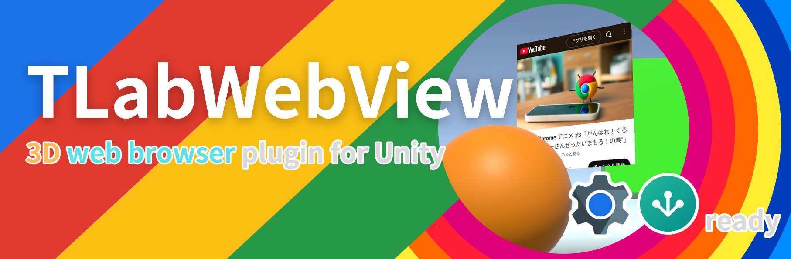
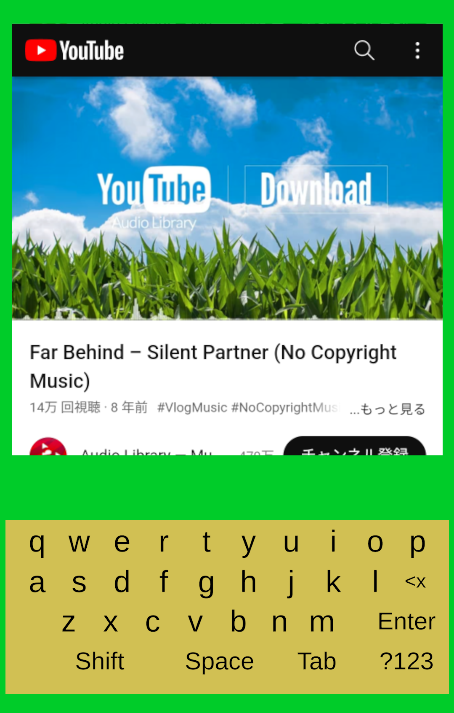
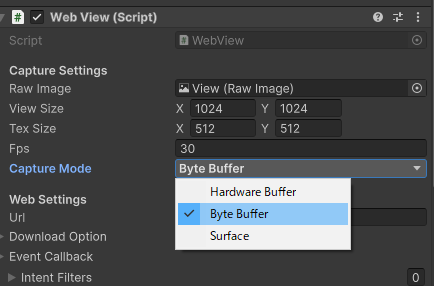

# TLabWebView  

Android で使用可能なブラウザコンポーネント ([```WebView```](https://developer.android.com/reference/android/webkit/WebView) / [```GeckoView```](https://mozilla.github.io/geckoview/)) を uGUI (Texture2D) として利用するためのプラグイン．3Dウェブブラウザ (3D WebView) の実装が可能になります．

- [x] キーボード入力
- [x] タッチ操作
- [x] ファイルダウンロード (blob, data urlを含む)
- [x] リサイズ
- [x] Javascriptの実行
- [x] 複数インスタンスの同時実行をサポート
- [x] 複数のブラウザエンジンをサポート
  - [x] [```WebView```](https://developer.android.com/reference/android/webkit/WebView): 安定していて，javascriptインターフェースが充実
  - [x] [```GeckoView```](https://mozilla.github.io/geckoview/): WebViewと比べて，拡張性が高い（ポップアップ等）
- [x] 複数のレンダリング方法をサポート
  - [x] ```HardwareBudder```: Androidの低レイヤー機能を使用した実装．パフォーマンス⭕️
  - [x] ```ByteBuffer```: C＃側でbyte配列として結果を取得するためフレームへのアクセスが容易．安定性⭕️．**デフォルトではこのオプションが使用されています．**
  - [x] ```Surface```: Androidの ```Surface``` クラスに直接レンダリングを行う．[```CompositionLayers```](https://docs.unity3d.com/Packages/com.unity.xr.compositionlayers@0.5/manual/usage-guide.html)などを活用する際に利用することを想定

[ドキュメントはこちら](https://tlabgames.gitbook.io/tlabwebview)  
[スニペットはこちら](https://gist.github.com/TLabAltoh/e0512b3367c25d3e1ec28ddbe95da497#file-tlabwebview-snippets-md)  
[Javaプラグインのソースコードはこちら](https://github.com/TLabAltoh/TLabWebViewPlugin)

[](https://www.buymeacoffee.com/tlabaltoh)

## 対応しているUnityのバージョン
- [x] Unity 2021
- [x] Unity 2022
- [x] Unity 6000 (`WebView`のみテスト済みです．`GeckoView`はまだテストしていません．)

## 対応するグラフィックスAPI
- [x] OpenGLES
- [x] Vulkan

## スクリーンショット  
Android13, Adreno 619で実行した画面  

</img>  

VR サンプル  
<a href="https://github.com/TLabAltoh/TLabWebViewVR"></img></a>

## 動作環境

|       |                          |
| ----- | ------------------------ |
| OS    | Android 10 ~ 14          |
| GPU   | Qualcomm Adreno 505, 619 |
| Unity | 2021.3                   |

## スタートガイド

### 依存するライブラリ

- [TLabVKeyborad](https://github.com/TLabAltoh/TLabVKeyborad) ```v1.0.1```

### インストール
<details><summary>こちらをご覧ください</summary>

#### Submodule
以下のコマンドでリポジトリをクローンしてください
```
git clone https://github.com/TLabAltoh/TLabWebView.git
```
or
```
git submodule add https://github.com/TLabAltoh/TLabWebView.git
```

#### UPM
Unity Package Managerで```add package from git ...```から以下のurlでパッケージをダウンロードしてください
```
https://github.com/TLabAltoh/TLabWebView.git#upm
```

#### アプリストア互換性
このプラグインを使用したアプリをアプリストアに出した場合，以下のような警告を受ける場合があります．

> ### Unsafe SSL override in WebViews
> Your application may contain an unsafe implementation of the WebView's [onReceivedSslError() method](https://www.oculus.com/lynx/?u=https%3A%2F%2Fdeveloper.android.com%2Freference%2Fandroid%2Fwebkit%2FWebViewClient.html%23onReceivedSslError(android.webkit.WebView%2C%2520android.webkit.SslErrorHandler%2C%2520android.net.http.SslError)&e=AT0HN6RWgLynCRtwcCSOzSVvlpMDUhi7C5saZwaY5p4unt4S4-GxIACJX_OPzTQp1Fn4oADk7Q_rwvZvRiF5XstftUzyuAWAolfkkk_WAtDpvOgW0Llcn_BXIEpgYobFNELMZ31ntKzTQXflaLkeRA) with a call to `handler.proceed() with insufficient validations. This may cause the WebView to ignore SSL certificate validation errors, making the application vulnerable to man-in-the-middle attacks.  
> 
> https://www.meta.com/experiences/


> ### Security and trust
> #### onReceivedSslError
> your app is using an unsafe implementation of [```WebviewClient.onReceivedSslError```](https://developer.android.com/reference/android/webkit/WebViewClient#onReceivedSslError(android.webkit.WebView,%20android.webkit.SslErrorHandler,%20android.net.http.SslError)) handler
> 
> https://developer.android.com/distribute/console

その場合は，アプリストアに対応したバージョンのパッケージに切り替えてください．

```add package from git URL ...```
```
https://github.com/TLabAltoh/TLabWebView.git#appstore-compatible-upm
```

アプリストア対応バージョンはセキュアではないウェブサイトを読み込むことができない点をあらかじめご了承ください．

</details>

### セットアップ

<details><summary>こちらをご覧ください</summary>

- Build Settings

| Property | Value   |
| -------- | ------- |
| Platform | Android |

- Project Settings

| Property          | Value                                 |
| ----------------- | ------------------------------------- |
| Color Space       | Linear                                |
| Minimum API Level | 26                                    |
| Target API Level  | 30 (Unity 2021), 31 ~ 32 (Unity 2022) |


- Project Settings --> Player --> Other Settings に以下のシンボルを追加(ビルド時に使用)

```
UNITYWEBVIEW_ANDROID_USES_CLEARTEXT_TRAFFIC
```
```
UNITYWEBVIEW_ANDROID_ENABLE_CAMERA
```
```
UNITYWEBVIEW_ANDROID_ENABLE_MICROPHONE
```

- Scene

```BrowserManager```をシーン内のいずれかのGameObjectにアタッチしてください．(EventSystemにアタッチするのが一番望ましいかも ...)．

#### ```GeckoView``` をブラウザエンジンとして使用したい場合

PluginsフォルダーをAssets以下に作成し，以下のファイルを置いてください．また，```BrowserContainer.browser```に```WebView```の代わりに```GeckoView```をアタッチしてください．また，```GeckoView```の使用には API level ```33``` ~ が求められます．```Project Settings```からターゲットAPIレベルを33以上に設定してください．

1. gradleTemplate.properties

```properties
org.gradle.jvmargs=-Xmx**JVM_HEAP_SIZE**M
org.gradle.parallel=true
# android.enableR8=**MINIFY_WITH_R_EIGHT**
unityStreamingAssets=**STREAMING_ASSETS**
**ADDITIONAL_PROPERTIES**
android.useAndroidX=true
# android.enableJetifier=true
```

2. mainTemplate.gradle

```gradle
    ...

    dependencies {
        implementation "androidx.annotation:annotation-jvm:1.9.1"

        def collection_version = "1.4.3"
        implementation "androidx.collection:collection:$collection_version"

        def lifecycle_version = "2.6.1"
        implementation "androidx.lifecycle:lifecycle-viewmodel-ktx:$lifecycle_version"
        implementation "androidx.lifecycle:lifecycle-viewmodel-compose:$lifecycle_version"
        implementation "androidx.lifecycle:lifecycle-livedata-ktx:$lifecycle_version"
        implementation "androidx.lifecycle:lifecycle-runtime-ktx:$lifecycle_version"
        implementation "androidx.lifecycle:lifecycle-runtime-compose:$lifecycle_version"
        implementation "androidx.lifecycle:lifecycle-viewmodel-savedstate:$lifecycle_version"
        implementation "androidx.lifecycle:lifecycle-common-java8:$lifecycle_version"
        implementation "androidx.lifecycle:lifecycle-service:$lifecycle_version"
        implementation "androidx.lifecycle:lifecycle-process:$lifecycle_version"
        implementation "androidx.lifecycle:lifecycle-reactivestreams-ktx:$lifecycle_version"
    }

    ...
```

3. GeckoView plugin (```.aar```) (現在 [125.0.20240425211020 version](https://mvnrepository.com/artifact/org.mozilla.geckoview/geckoview/125.0.20240425211020) のみで開発・テストを行っているので，同じバージョンのものをダウンロードしてください．)

</details>

### Prefab
以下に置いてあるプレハブをCanvasに追加することでWebViewを実装できます
```
/Resources/TLab/WebView/Browser.prefab
```

### Keyborad
このパッケージでは，デフォルトでuGUIをベースに実装されたバーチャルキーボードが利用できます．しかし，uGUIをベースにしたバーチャルキーボードはデザインなどの拡張性の点で利点がありますが，場合によってはOS標準のシステムキーボードを利用したい場面もあるかもしれません．その場合は，各プラットフォームの設定に従って，アプリ側でパーミッション等を使用してシステムキーボードを有効にしてください (例: Meta Quest での設定は[こちら](https://developers.meta.com/horizon/documentation/unity/unity-keyboard-overlay/))．アプリ側での設定が完了すると，WebViewでのシステムキーボードの利用が可能になります．

## 
> [!NOTE]
> 外部ストレージ(```/Download```や```/Picture```など)にファイルをダウンロードしたい場合，以下のパーミッションを```AndroidManifest.xml```に追加してください．これは，Android 11以降のデバイスで必要になります (詳細は[こちら](https://developer.android.com/training/data-storage/manage-all-files?hl=ja))．
> ```.xml
> <uses-permission android:name="android.permission.MANAGE_EXTERNAL_STORAGE" />
> ```

> [!WARNING]
> このプラグインはAndroidデバイス上でのみ動作します．Unity Editor上で実行してもWebページは表示されないことに注意してください．

> [!WARNING]
> `HardwareBuffer` モードは，プラグインを実行するデバイスによっては正常に動作しない場合があるかもしれません. その場合は，プロジェクトの`Graphics API`を`Vulkan`から`OpenGLES`に変更する (`HardwareBuffer`モードにおける問題は，ほとんどが，プロジェクトで`Vulkan` APIを使用している場合に報告されています)．もしくは，`HardwareBuffer` から `ByteBuffer` へ `CaptureMode` を切り替えてください (安定したレンダリングオプションです).
> 
> </img>

> [!WARNING]
> Android WebViewは [WebXR API](https://developer.mozilla.org/ja/docs/Web/API/WebXR_Device_API/Fundamentals) をサポートしません．

> [!WARNING]
> OculusQuestはいくつかのHTML5 input タグをサポートしていません(下記参照)．それらを使用したい場合，```GeckoView```を```WebView```の代わりに```Browser```として使用してください．uGUIで実装したウィジェットを表示します．以下は，このプラグインによる，HTML5 inpu タグの対応状況です．
> 
> - [x] [datetime-local](https://developer.mozilla.org/ja/docs/Web/HTML/Element/input/datetime-local)
> - [x] [date](https://developer.mozilla.org/ja/docs/Web/HTML/Element/input/date)
> - [x] [time](https://developer.mozilla.org/ja/docs/Web/HTML/Element/input/time)
> - [x] [color](https://developer.mozilla.org/ja/docs/Web/HTML/Element/input/color)
> - [ ] [week](https://developer.mozilla.org/ja/docs/Web/HTML/Element/input/week)
> - [ ] [month](https://developer.mozilla.org/ja/docs/Web/HTML/Element/input/month)
> - [ ] [image](https://developer.mozilla.org/ja/docs/Web/HTML/Element/input/image)
> - [ ] [file](https://developer.mozilla.org/ja/docs/Web/HTML/Element/input/file)

> [!WARNING]
> このプラグインは，```OpenGLES```と```Vulkan```の両方をサポートしていますが，```Vulkan API``` を使用する場合は，デバイスが```OpenGLES 3.1```以上をサポートしている必要があることに留意してください．
