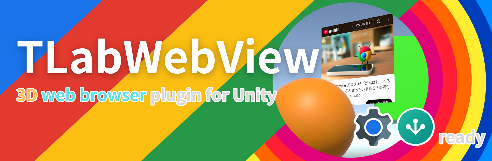
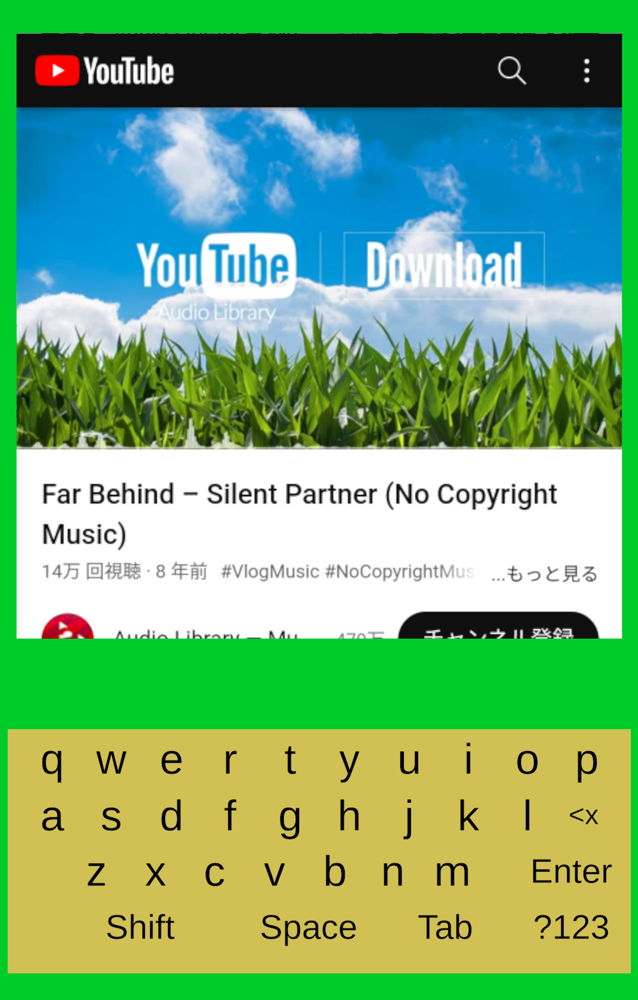
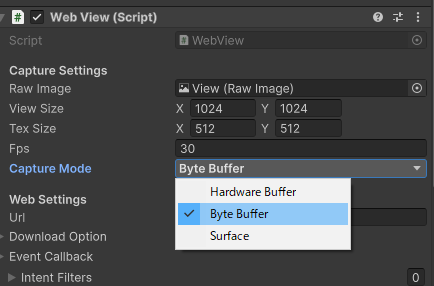

# TLabWebView

[日本語版READMEはこちら](README-ja.md)

A Unity plugin that enables the use of Android’s web browser component ([```WebView```](https://developer.android.com/reference/android/webkit/WebView) / [```GeckoView```](https://mozilla.github.io/geckoview/)) as a uGUI (Texture2D). This plugin makes it possible to implement a 3D web browser (3D WebView) within Unity.

- [x] Keyboard Input
- [x] Touch Interaction
- [x] File download (include blob, data url)
- [x] Resize
- [x] Run Javascript
- [x] Support for multiple instances running concurrently
- [x] Support for multiple browser engines
  - [x] [```WebView```](https://developer.android.com/reference/android/webkit/WebView): Stable and powerful javascript interface
  - [x] [```GeckoView```](https://mozilla.github.io/geckoview/): Highly extensible to pop-ups and other areas that cannot be controlled by WebView
- [x] Support for multiple rendering method
  - [x] ```HardwareBudder```: implemented using a low-level feature of Android. Best performance
  - [x] ```ByteBuffer```: Easy access to frames, since the results are obtained as byte arrays on the C# side. High stability. **This option is used by default**.
  - [x] ```Surface```: Direct rendering to Android's ```Surface``` class, used for active use of features such as [```CompositionLayers```](https://docs.unity3d.com/Packages/com.unity.xr.compositionlayers@0.5/manual/usage-guide.html)

[Document is here](https://tlabgames.gitbook.io/tlabwebview)  
[Snippets is here](https://gist.github.com/TLabAltoh/e0512b3367c25d3e1ec28ddbe95da497#file-tlabwebview-snippets-md)  
[The Java plugin source code is here](https://github.com/TLabAltoh/TLabWebViewPlugin)

[](https://www.buymeacoffee.com/tlabaltoh)


## Unity version this plugin supports
- [x] Unity 2021
- [x] Unity 2022
- [x] Unity 6000 (Only `WebView` tested, Not yet tested in `GeckoView`.)


## Graphics api this plugin supports
- [x] OpenGLES
- [x] Vulkan

## Screenshot  
Screenshot run on Android 13, Adreno 619  

</img>  

VR sample  
<a href="https://github.com/TLabAltoh/TLabWebViewVR"></img></a>

## Operating Environment

|       |                          |
| ----- | ------------------------ |
| OS    | Android 10 ~ 14          |
| GPU   | Qualcomm Adreno 505, 619 |
| Unity | 2021.3                   |

## Getting Started

### Requirements
- [TLabVKeyborad](https://github.com/TLabAltoh/TLabVKeyborad) ```v1.0.1+```

### Installing

<details><summary>Please see here</summary>

#### Submodule
Clone this repository with the following command
```
git clone https://github.com/TLabAltoh/TLabWebView.git
```
or
```
git submodule add https://github.com/TLabAltoh/TLabWebView.git
```

#### UPM
```add package from git URL ...```
```
https://github.com/TLabAltoh/TLabWebView.git#upm
```

#### For App-Store compatibility
When you publishing your app that using this plugin. Sometimes you get bellow warning.

> ### Unsafe SSL override in WebViews
> Your application may contain an unsafe implementation of the WebView's [onReceivedSslError() method](https://www.oculus.com/lynx/?u=https%3A%2F%2Fdeveloper.android.com%2Freference%2Fandroid%2Fwebkit%2FWebViewClient.html%23onReceivedSslError(android.webkit.WebView%2C%2520android.webkit.SslErrorHandler%2C%2520android.net.http.SslError)&e=AT0HN6RWgLynCRtwcCSOzSVvlpMDUhi7C5saZwaY5p4unt4S4-GxIACJX_OPzTQp1Fn4oADk7Q_rwvZvRiF5XstftUzyuAWAolfkkk_WAtDpvOgW0Llcn_BXIEpgYobFNELMZ31ntKzTQXflaLkeRA) with a call to `handler.proceed() with insufficient validations. This may cause the WebView to ignore SSL certificate validation errors, making the application vulnerable to man-in-the-middle attacks.  
> 
> https://www.meta.com/experiences/


> ### Security and trust
> #### onReceivedSslError
> your app is using an unsafe implementation of [```WebviewClient.onReceivedSslError```](https://developer.android.com/reference/android/webkit/WebViewClient#onReceivedSslError(android.webkit.WebView,%20android.webkit.SslErrorHandler,%20android.net.http.SslError)) handler
> 
> https://developer.android.com/distribute/console

Than, please switch repository's branch to app store compatible version.

```add package from git URL ...```
```
https://github.com/TLabAltoh/TLabWebView.git#appstore-compatible-upm
```

Please note that this version will not be able to load insecure websites (URL starting with ```http://```).

</details>

### Set Up

<details><summary>Please see here</summary>

- Build Settings

| Property | Value   |
| -------- | ------- |
| Platform | Android |

- Project Settings

| Property          | Value                                 |
| ----------------- | ------------------------------------- |
| Color Space       | Linear                                |
| Minimum API Level | 26                                    |
| Target API Level  | 30 (Unity 2021), 31 ~ 32 (Unity 2022) |

- Add the following symbols to Project Settings --> Player --> Other Settings (to be used at build time)

```
UNITYWEBVIEW_ANDROID_USES_CLEARTEXT_TRAFFIC
```
```
UNITYWEBVIEW_ANDROID_ENABLE_CAMERA
```
```
UNITYWEBVIEW_ANDROID_ENABLE_MICROPHONE
```

- Scene

Please add the ```BrowserManager``` to any GameObject (maybe EventSystem is best).

#### If you want to use ```GeckoView``` as a browser engine.

Please create a Plugins folder in your Assets folder and create files in it. And please set the ```BrowserContainer.browser``` to ```GeckoView``` instead of ```WebView```. Also ```GeckoView``` needs Android ```13``` ~ (API level ```33``` ~). Please set tartget level to API level ```33``` in the ```Project Settings```.

1. gradleTemplate.properties

```properties
org.gradle.jvmargs=-Xmx**JVM_HEAP_SIZE**M
org.gradle.parallel=true
# android.enableR8=**MINIFY_WITH_R_EIGHT**
unityStreamingAssets=**STREAMING_ASSETS**
**ADDITIONAL_PROPERTIES**
android.useAndroidX=true
# android.enableJetifier=true
```

2. mainTemplate.gradle

```gradle
    ...

    dependencies {
        implementation "androidx.annotation:annotation-jvm:1.9.1"

        def collection_version = "1.4.3"
        implementation "androidx.collection:collection:$collection_version"

        def lifecycle_version = "2.6.1"
        implementation "androidx.lifecycle:lifecycle-viewmodel-ktx:$lifecycle_version"
        implementation "androidx.lifecycle:lifecycle-viewmodel-compose:$lifecycle_version"
        implementation "androidx.lifecycle:lifecycle-livedata-ktx:$lifecycle_version"
        implementation "androidx.lifecycle:lifecycle-runtime-ktx:$lifecycle_version"
        implementation "androidx.lifecycle:lifecycle-runtime-compose:$lifecycle_version"
        implementation "androidx.lifecycle:lifecycle-viewmodel-savedstate:$lifecycle_version"
        implementation "androidx.lifecycle:lifecycle-common-java8:$lifecycle_version"
        implementation "androidx.lifecycle:lifecycle-service:$lifecycle_version"
        implementation "androidx.lifecycle:lifecycle-process:$lifecycle_version"
        implementation "androidx.lifecycle:lifecycle-reactivestreams-ktx:$lifecycle_version"
    }

    ...
```

3. GeckoView plugin (```.aar```) (please install the [125.0.20240425211020 version](https://mvnrepository.com/artifact/org.mozilla.geckoview/geckoview/125.0.20240425211020), as this package is only developed and tested with it)

</details>

### Prefab
Prefab is here. Just add prefab to the canvas to implement webview
```
/Resources/TLab/WebView/Browser.prefab
```

### Keyborad
By default, a virtual keyboard based on uGUI is available in this package. However, while the uGUI-based virtual keyboard has advantages in terms of extensibility of design, etc., there may be situations where you prefer to use the OS standard system keyboard. In such a case, please enable the system keyboard using permissions, etc. on the app side according to the settings of each platform (e.g., see [here](https://developers.meta.com/horizon/documentation/unity/unity-keyboard-overlay/) for settings on Meta Quest). Once the app has been configured, the system keyboard can be used in WebView.

## 
> [!NOTE]
> If you want to download the file to external storage (like ```/Download```, ```/Picture```), please add the following permission to the manifest. This is required for Android 11+ (see [here](https://developer.android.com/training/data-storage/manage-all-files?hl=en) for more details).
> ```.xml
> <uses-permission android:name="android.permission.MANAGE_EXTERNAL_STORAGE" />
> ```

> [!WARNING]
> Note that this plugin only works on Android devices; it will not display web pages when run on the Unity Editor.

> [!WARNING]
> `HardwareBuffer` mode may not work properly for some devices. In such cases, Please change the project's `Graphics API` from `Vulkan` to `OpenGLES` (Problems in `HardwareBuffer` mode are most often reported when using the `Vulkan` API in a project). Or switch `CaptureMode` from `HardwareBuffer` to `ByteBuffer` (This is a stable rendering option).
> 
> </img>

> [!WARNING]
> Android WebView doesn't support the [WebXR API](https://developer.mozilla.org/en-US/docs/Web/API/WebXR_Device_API/Fundamentals).

> [!WARNING]
> OculusQuest doesn't support some HTML5 input tags (see below). If you want to use them, please use ```GeckoView``` as ```Browser``` instead of ```WebView```. It will display a widget implemented by uGUI. Below is the status of HTML5 input tag support by this plugin's custom widget.
> 
> - [x] [datetime-local](https://developer.mozilla.org/en-US/docs/Web/HTML/Element/input/datetime-local)
> - [x] [date](https://developer.mozilla.org/en-US/docs/Web/HTML/Element/input/date)
> - [x] [time](https://developer.mozilla.org/en-US/docs/Web/HTML/Element/input/time)
> - [x] [color](https://developer.mozilla.org/en-US/docs/Web/HTML/Element/input/color)
> - [ ] [week](https://developer.mozilla.org/en-US/docs/Web/HTML/Element/input/week)
> - [ ] [month](https://developer.mozilla.org/en-US/docs/Web/HTML/Element/input/month)
> - [ ] [image](https://developer.mozilla.org/en-US/docs/Web/HTML/Element/input/image)
> - [ ] [file](https://developer.mozilla.org/en-US/docs/Web/HTML/Element/input/file)

> [!WARNING]
> This plugin supports both ```Vulkan``` and ```OpenGLES```, but if you are building an application that uses a ```Vulkan``` graphics API, the Android device must support ```OpenGLES (3.1+)``` as well as ```Vulkan```.

